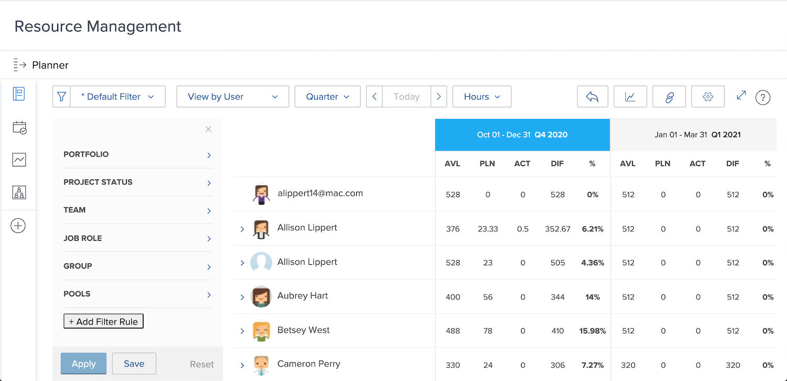

# Het gebruik weergeven en de functie Bronnen filteren

Met de Planner van het Middel, krijgt u een duidelijke mening van de projecten u in geinteresseerd bent en een blik in real time kijkt hoe uw personeel omhoog stapelt om hen uit te voeren.

* U wilt bijvoorbeeld weten wat er met capaciteit gebeurt wanneer het laatste serverupdateinitiatief uw hoogste prioriteit wordt.

* De Planner van het Middel toont de beschikbaarheid van uw mensen en hoe het toewijzen van middelen aan één project de beschikbaarheid op laag-prioritaire projecten zal beïnvloeden.

U zult niet alleen kunnen zien hoe de toewijzing van middelen het werk van vandaag beïnvloedt, maar aangezien u voorbij uw directe middelen het plannen behoeften kijkt kunt u middeltoewijzingen op langere termijn evalueren om te begrijpen als de individuen over (of onder) toegewezen zijn.

## De bronnenplanner filteren

De functie Bronnen wordt automatisch geopend met een standaardset filters. U wilt deze filters bewerken door:

* Tijdskader
* Portfolio/Programma
* Brongroepen, enz.

Hierdoor kunt u zich concentreren op welke bronnen beschikbaar zijn en wanneer.
