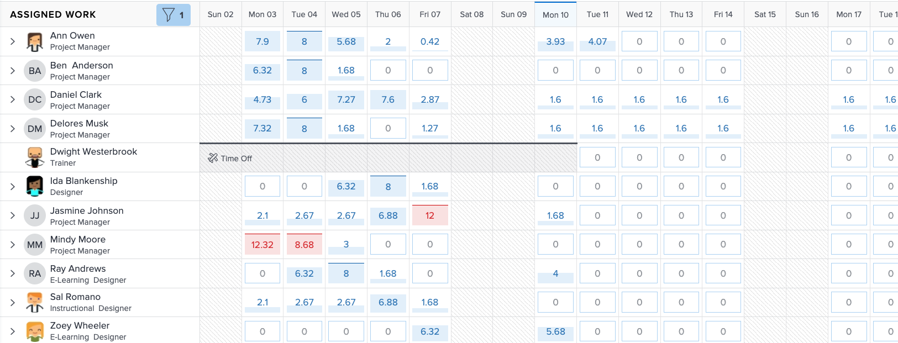

# Zoek de [!DNL Workload Balancer]

Het is voor iedereen een uitdaging om te weten welke bronnen beschikbaar zijn en hoe deze te verdelen. Daarom heeft Workfront de [!DNL Workload Balancer].

Het doel is om u meer inzicht te geven in en beheer van de dagelijkse en wekelijkse werklasten van de mensen die u beheert. Dit helpt u betere taken maken, die op rol en beschikbaarheid, over veelvoudige projecten worden gebaseerd.

* Klikken [!UICONTROL Resourcing] in de [!UICONTROL Main Menu].
* Ga naar de [!UICONTROL Scheduling] in het gebied Bronbeheer.
* Klik op de knop [!UICONTROL “Switch to Workload Balancer”] koppeling.

De [!DNL Workload Balancer] is de standaardoptie wanneer u naar het gebied Bronbeheer van het Workfront-hulpprogramma gaat.

## Gebieden binnen de werklastbalans

Er worden twee secties weergegeven in de [!DNL Workload Balancer]: Toegewezen werk en niet toegewezen werk.

In het gebied Toegewezen werk ziet u een lijst met gebruikers en het werk waaraan zij al zijn toegewezen in Workfront. Standaard wordt dit gebied gefilterd naar gebruikers die deel uitmaken van de Workfront-teams waartoe u behoort. Op deze manier kunt u zien welke teamleden zijn toegewezen om aan te werken.

Het niet toegewezen gebied van het Werk toont het werk dat nog moet worden toegewezen, of aan een persoon, een baanrol, of een team. In eerste instantie wordt echter niets weergegeven in dit gebied.

Door met Unassigned het gebied van het Werk leeg te beginnen, hebt u de kans om zich op de huidige werkbelasting van uw gebruikers, in het Toegewezen gebied van het Werk, alvorens taken te maken te concentreren.
