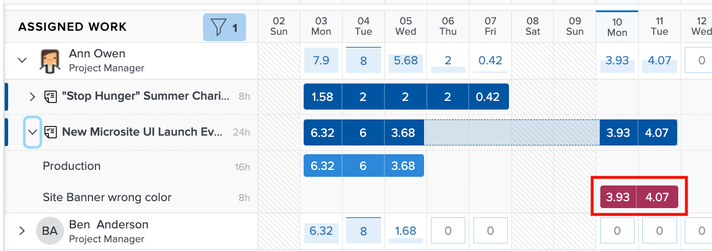

# In overweging te nemen instellingen voor werklastverdeling

Er zijn een aantal instellingen voor werklastbalans die u in de afzonderlijke werklasten van uw gebruikers wilt opnemen:

* Toewijzingen van problemen
* Geprojecteerde datums
* Voltooid werk

U kunt deze in- of uitschakelen via het pictogram Instellingen werklastverdeling.

## Uren opnemen uit uitgaven

Standaard worden in Workload Balancer alleen taken weergegeven. Gebruikers kunnen echter wel worden toegewezen aan verzoeken en problemen die moeten worden opgelost of afgehandeld en die zich in de tijd bevinden die ze aan projectwerk kunnen besteden.

Voor een beter inzicht in de volledige werklast van een gebruiker raadt Workfront aan om problemen op te nemen in de lijst met toegewezen gebruikerswerk.

Controleer gewoon de optie Inclusief uren van uitgaven in het gedeelte Instellingen werklastverdeling.

In het gedeelte Toegewezen werk worden de problemen weergegeven als lichte maroon-balken.

### Projectdatums

Een andere optie die beschikbaar is via de instellingen voor werklastverdeling is het weergeven van werklasten op basis van de verwachte datums.

De standaardinstelling toont toegewezen werk op basis van de geplande datums die in het project zijn ingevoerd.

Omdat de geplande datums zijn gebaseerd op de voortgang en voltooiing van eerdere taken in het project, kunt u in real-time een weergave krijgen van het tijdstip waarop een taak wordt gestart of voltooid. Dit is vooral handig wanneer u naar werklasten kijkt.

U kunt schakelen tussen het weergeven van geplande en geplande datums met de optie Geprojecteerde datums weergeven in de instellingen voor werklastverdeling.

### Voltooide taken

Voltooide taken worden samen met de taken die momenteel worden uitgevoerd of op het punt staan te beginnen, weergegeven in Workload Balancer. Om een beter inzicht te krijgen in wat extra het werk gebruikers kunnen nemen, kunt u voltooid werk willen uitsluiten.

Schakel de optie Voltooid werk tonen uit in de instellingen voor werklastverdeling.

