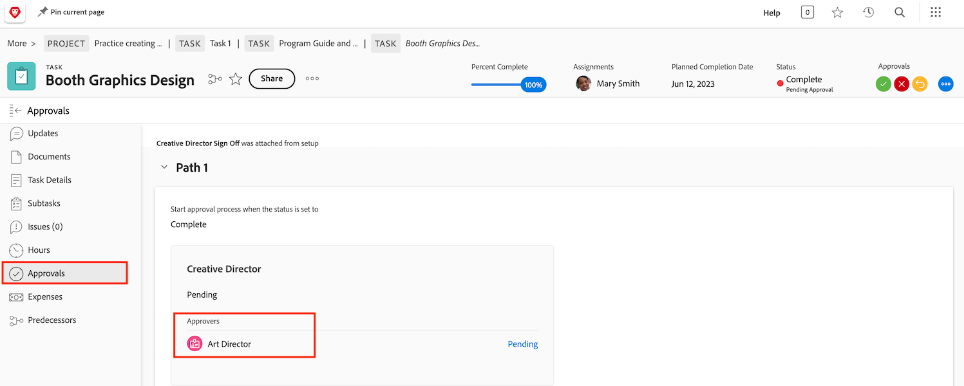

# Goedkeuring voltooien

De taken en geven goedkeuringen uit maken deel uit van vele werkschema&#39;s. Maar onopgeloste goedkeuringen zullen u verhinderen de projectstatus aan Voltooid te plaatsen.

Op de [!UICONTROL Task] selecteert u een [!UICONTROL View] die de [!UICONTROL Status] kolom. Een snelle blik onderaan die kolom zal tonen als er een onvolledige goedkeuring op een taak met &quot;[!UICONTROL - Pending Approval]&quot; na de naam van de status.

U hebt een aantal opties:

* **Voltooi de goedkeuring —** Dit kan betekenen dat anderen moeten herinneren aan de openstaande goedkeuring. U kunt zien wie als fiatteur door de taak te openen en op het lusje van Goedkeuringen te klikken wordt toegewezen.
* **De goedkeuring verwijderen —** Als de goedkeuring niet nodig is, zou het gemakkelijker kunnen zijn om het enkel te schrappen. Uw vermogen om dit te doen hangt van uw af [!DNL Workfront] machtigingen.
* **Wijzig de status —** Als goedkeuring niet nodig is, kunt u een status selecteren waaraan geen goedkeuring is gekoppeld. Zorg gewoon dat de status gelijk is aan Voltooien.

Als uw organisatie problemen gebruikt om problemen te volgen, orden te veranderen, of andere gebeurtenissen tijdens projecten, volg de zelfde stappen op [!UICONTROL Issues] van uw project.
