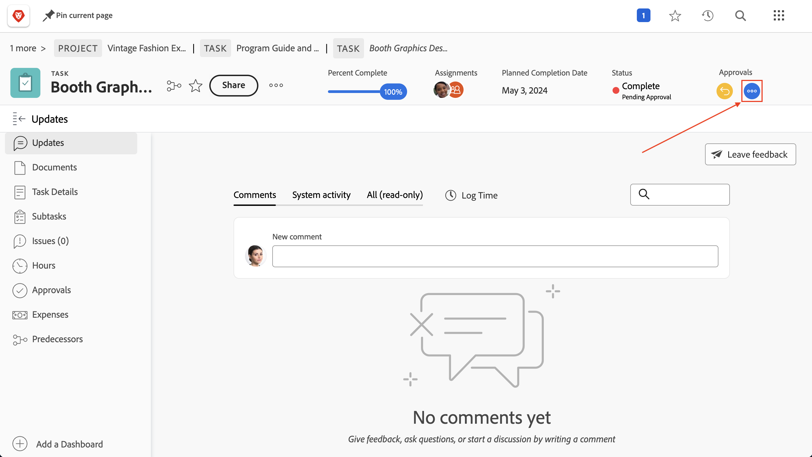

# Goedkeuring voltooien

De taken en de afgifte van goedkeuringen maken deel uit van vele projecten. Maar onopgeloste goedkeuringen zullen u verhinderen de projectstatus aan Voltooid te plaatsen.

Hier is hoe je ze vindt en ermee omgaat.

Selecteer in de sectie [!UICONTROL Task] van uw project een [!UICONTROL View] die de kolom [!UICONTROL Status] bevat, zoals de weergave [!UICONTROL Status] . Een snelle blik onderaan die kolom zal tonen als er een onvolledige goedkeuring op een taak met de woorden &quot;[!UICONTROL - Pending Approval]&quot;na de naam van de status is.

Wanneer u een taak vindt die nog op goedkeuring wacht, hebt u twee keuzen van wat te doen:

## De goedkeuring voltooien

Dit kan betekenen dat de persoon aan wie de nog niet verleende goedkeuring is toegewezen, eraan moet worden herinnerd. U kunt zien wie als fiatteur wordt toegewezen door de taak te openen en op het menu met drie puntjes in het goedkeuringsgebied te klikken.

 toont

Er verschijnt een vakje met de toegewezen fiatteur.

## De goedkeuring verwijderen

Als goedkeuring niet nodig is, kunt u het willen verwijderen. U kunt dit doen door de goedkeuring eerst te herinneren. Klik op de knop [!UICONTROL Recall] in het goedkeuringsgebied. Hierdoor wordt de status teruggezet naar de vorige status en kunt u het goedkeuringsproces verwijderen.

 toont

Klik nu op de tab [!UICONTROL Approvals] aan de linkerkant en klik vervolgens op de knop [!UICONTROL Remove] aan de rechterbovenhoek.

 toont

## Afhandeling van goedkeuringen voor uitgaven

Als uw organisatie problemen gebruikt om problemen te volgen, orden te veranderen, of andere gebeurtenissen tijdens projecten, volg de zelfde stappen op de [!UICONTROL Issues] sectie van uw project.
