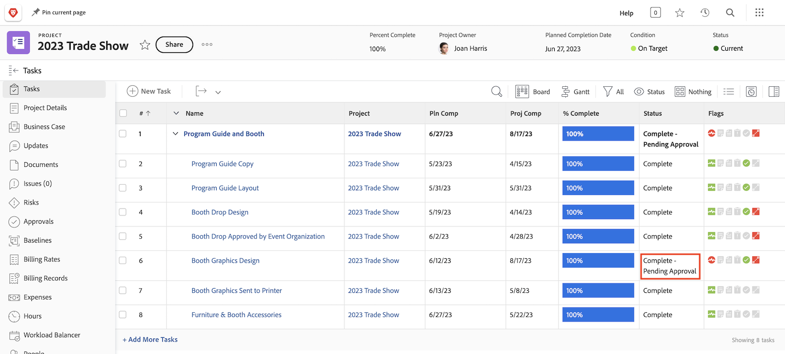

# Goedkeuring voltooien

De taken en geven goedkeuringen uit maken deel uit van vele werkschema's. Maar onopgeloste goedkeuringen zullen u verhinderen de projectstatus aan Voltooid te plaatsen.

Selecteer in de sectie [!UICONTROL Task] van uw project een [!UICONTROL View] die de kolom [!UICONTROL Status] bevat. Een snelle blik onderaan die kolom zal tonen als er een onvolledige goedkeuring op een taak met "[!UICONTROL - Pending Approval]"na de naam van de status is.

U hebt een aantal opties:

* **voltooi de goedkeuring —** dit kan het herinneren van anderen aan de opmerkelijke goedkeuring betekenen. U kunt zien wie als fiatteur door de taak te openen en op het lusje van Goedkeuringen te klikken wordt toegewezen.
* **verwijder de goedkeuring -** als de goedkeuring niet nodig is, zou het gemakkelijker kunnen zijn om het enkel te schrappen. Uw vermogen om dit te doen hangt van uw [!DNL Workfront] toestemmingen af.
* **verander de status -** als de goedkeuring niet nodig is, kon u een status selecteren die geen goedkeuring in bijlage heeft. Zorg gewoon dat de status gelijk is aan Voltooien.

 tonen

Als uw organisatie problemen gebruikt om problemen te volgen, orden te veranderen, of andere gebeurtenissen tijdens projecten, volg de zelfde stappen op de [!UICONTROL Issues] sectie van uw project.
