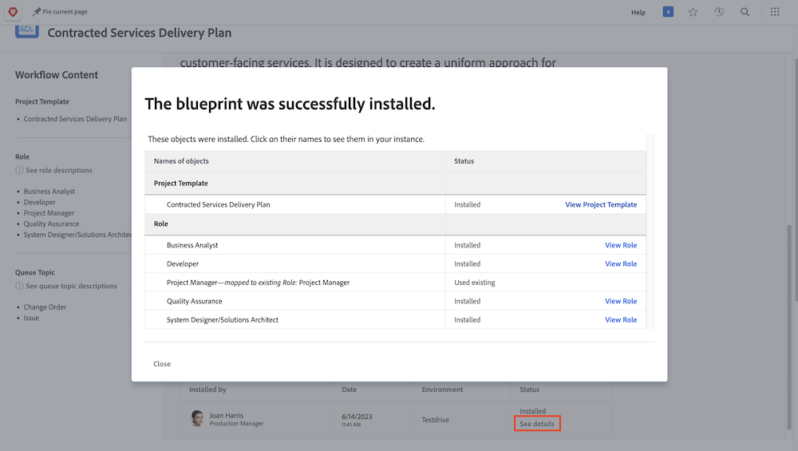

# Een projectsjabloon maken en verkennen

Leer een geheel nieuw projectmalplaatje en van een bestaand project tot stand te brengen, en begrijpen hoe [!UICONTROL Blueprints] u toegang tot een wereld van nuttige projectmalplaatjes kan geven die door de deskundigen van Workfront worden gecreeerd.

## Een projectsjabloon maken

* De video biedt een stapsgewijze gids voor het maken en gebruiken van sjablonen voor het op de markt brengen van videoproductie. Het begint met het uitleggen hoe u een nieuwe sjabloon kunt maken, deze een nieuwe naam kunt geven en opslaan. &#x200B; Het proces bestaat uit drie hoofdstappen: het maken van taken, het instellen van de tijdlijn met tijdsduur en voorgangers en het toewijzen van taken aan taakrollen in plaats van aan individuele gebruikers. &#x200B; De video benadrukt het organiseren van taken gebruikend ouder-kind verhoudingen voor betere samenvatting en efficiency. &#x200B;
* Zodra het malplaatje wordt gecreeerd, kan het worden gebruikt om nieuwe projecten te produceren. De video toont aan hoe te om een nieuw project van het malplaatje tot stand te brengen, noodzakelijke aanpassingen te maken, en taken toe te voegen of duur zonodig te wijzigen. &#x200B; Het toont ook hoe te om baanrollen aan taken toe te wijzen gebruikend middel het plannen en planningsfunctionaliteit. &#x200B;
* In de video wordt uitgelegd hoe u een bestaand project opslaat als een nieuwe sjabloon, zodat updates en verbeteringen mogelijk zijn in de workflow. &#x200B; Het benadrukt het belang van het beheren van malplaatjes om verwarring te vermijden en gestroomlijnde projectuitvoering te verzekeren. &#x200B;

>[!VIDEO](https://video.tv.adobe.com/v/335210/?quality=12&learn=on&enablevpops=0)

## Toetsen

* **Creërend een Malplaatje:** leer hoe te om een nieuw malplaatje van kras tot stand te brengen door het te noemen, opstellingstaken, chronologie, en het maken van taken aan baanrollen. &#x200B;
* **Organisatie van de Taak:** de ouder-kind taakverhoudingen van het Gebruik om taken efficiënt te organiseren, die een duidelijke samenvatting en een structuur voor het project verstrekken. &#x200B;
* **Opstelling van de Chronologie:** de chronologie van de opstellingstaak die duur en predecessors gebruiken om het tijdkader en de opeenvolging van taken nauwkeurig te schatten. &#x200B;
* **Op rol-Gebaseerde Toewijzingen:** wijs taken aan baanrollen eerder dan individuele gebruikers toe om middel het plannen en planningsfunctionaliteit effectief te gebruiken. &#x200B;
* **Beheer van het Malplaatje:** sparen bestaande projecten als nieuwe malplaatjes om verbeteringen op te nemen en malplaatjes te beheren om verwarring te vermijden en efficiënte projectuitvoering te verzekeren. &#x200B;

## Sjablonen die zijn gemaakt met [!UICONTROL Blueprints]

Workfront-gebruikers kunnen [!UICONTROL Blueprints] gebruiken om projectsjablonen samen te stellen. Met deze functie in het hoofdmenu hebt u toegang tot vooraf gebouwde gebruiksklare sjablonen die zijn gericht op een afdeling en een specifiek ontwikkelingsniveau. Deze malplaatjes geven gebruikers een hoofdbegin aan herhaalbare projectverwezenlijking en de hulp handhaaft consistentie over projecten gelijkend in werkingsgebied.

Elke gebruiker met licentie kan bladeren in de lijst met blauwdrukken die beschikbaar is in Workfront. U kunt een blauwdruk niet direct toepassen wanneer het creëren van een nieuw project (zoals het omzetten van een taak of een verzoek in een project). Een zeer belangrijk verschil tussen een blauwdruk en een projectmalplaatje is dat een blauwdruk wordt gebruikt om een malplaatje te maken, terwijl een malplaatje wordt gebruikt om een project tot stand te brengen. **de blauwdruk moet door een systeembeheerder voor het overeenkomstige malplaatje worden geïnstalleerd om worden gecreeerd.**

Als u een interessante blauwdruk vindt, kunt u op **[!UICONTROL Details]** klikken voor meer informatie.

In het scherm [!UICONTROL Details] wordt meer uitleg gegeven over de blauwdruk, inclusief de installatiegeschiedenis als de blauwdruk is geïnstalleerd.

Als de blauwdruk is geïnstalleerd, kunt u op **[!UICONTROL See details]** klikken om koppelingen te maken naar de sjabloon die is gemaakt en naar andere objecten die zijn gemaakt ter ondersteuning van de sjabloon.

Als de blauwdruk nog niet is geïnstalleerd, kunt u deze aanvragen bij de systeembeheerder.

## Aanbevolen zelfstudies over dit onderwerp

* [Een project rechtstreeks vanuit een sjabloon maken](/help/manage-work/create-and-manage-project-templates/create-a-project-directly-from-a-template.md)
* [Een projectsjabloon delen](/help/manage-work/create-and-manage-project-templates/share-a-project-template.md)
* [Een bestaand project kopiëren](/help/manage-work/manage-projects/copy-an-existing-project.md)
* [Een projectsjabloon deactiveren](/help/manage-work/create-and-manage-project-templates/deactivate-a-project-template.md)
* [Bewerk het projectteam in een projectsjabloon](/help/manage-work/create-and-manage-project-templates/edit-the-project-team-in-a-project-template.md)
