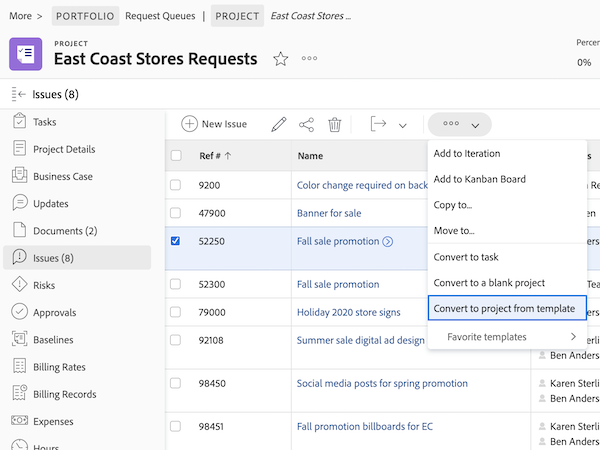

# Uitgaven converteren naar andere werkitems

## Een uitgave converteren naar een taak

Een kwestie kan belangrijk genoeg zijn dat de tijd en de inspanning om het op te lossen in de projectchronologie moeten worden rekenschap gegeven en de aangewezen middelen toewijzen. In dit geval kan de uitgave worden geconverteerd naar een taak.

![Een afbeelding van de [!UICONTROL Convert to Task] optie van een uitgave in [!UICONTROL Workfront].](assets/15-convert-issue-to-task-menu-option.png)

1. Ga naar de [!UICONTROL Issues] sectie van het project of de taak de kwestie wordt het programma geopend. Of zoek het probleem in een rapport waartoe u toegang hebt.
1. Klik op de naam van de uitgave om deze te openen.
1. Selecteer in het menu met drie punten rechts van de naam van de uitgave de optie **[!UICONTROL Convert to task]**.
1. Vul de [!UICONTROL Convert to task] formulier. Begin door de nieuwe taak een naam en een beschrijving te geven.
1. Als de nieuwe taak deel van een verschillend project zou moeten uitmaken, ga de projectnaam in.
1. In de [!UICONTROL Options] , schakelt u de selectievakjes in om de oorspronkelijke uitgave te behouden, toegang tot de nieuwe taak toe te staan en de voltooiingsdatum te handhaven. Volg de workflow van uw organisatie bij het maken van deze selecties. Voeg een aangepast formulier toe als u aangepaste formuliergegevens van de uitgave naar de taak wilt overbrengen. (Alle velden in zowel het uitgifteformulier als het taakformulier worden automatisch naar het taakformulier overgebracht.)
1. Vul het aangepaste formulier in als er een bijgevoegd formulier is.
1. Klikken **[!UICONTROL Convert to task]** om af te ronden.

![Een afbeelding van de [!UICONTROL Convert to Task] vorm van een uitgifte in [!UICONTROL Workfront].](assets/16-convert-to-task-options.png)

Afhankelijk van de [!DNL Workfront] Als u de taak converteert, kunt u de instellingen in de sectie Opties wijzigen. Deze opties zijn van invloed op zowel het oorspronkelijke probleem als de nieuwe taak.

* **&quot;Behoud het oorspronkelijke probleem en koppel zijn resolutie aan deze taak&quot;** de oorspronkelijke uitgave en de bijbehorende informatie (uren, documenten, enz.) behouden. Als deze optie is geselecteerd, wordt het probleem gemarkeerd als opgelost wanneer de taak is voltooid. Als deze optie niet is geselecteerd, wordt de oorspronkelijke uitgave na voltooiing van de taak verwijderd. Dit kan van invloed zijn op de manier waarop uw organisatie problemen bijhoudt en rapporteert.
* De **&quot;Toestaan dat (naam van gebruiker) toegang heeft tot deze taak&quot;** de persoon die de uitgave heeft gemaakt , krijgt toegang tot deze nieuwe taak .
* De **&quot;Behoud de geplande einddatum van de uitgifte&quot;** Met deze optie kunt u de geplande voltooiingsdatum die al voor het probleem is ingesteld, behouden. Hiermee wordt de taakbeperking ingesteld op [!UICONTROL Finish No Later Than]. Als de doos niet wordt gecontroleerd, zullen de data van de taak worden geplaatst alsof een nieuwe taak binnen het project wordt gecreeerd.

De nieuwe taak wordt geplaatst bij de bodem van de taaklijst op uw project. Verplaats de taak naar de gewenste locatie, wijs een gebruiker of team toe aan het werk, voeg geplande uren en duur toe, enz.

>[!NOTE]
>
>U kunt geen kwesties aan de projectchronologie toevoegen, aangezien zij &quot;ongeplande werk&quot;vertegenwoordigen. De tijdlijn van het project is voor &quot;gepland werk,&quot;betekenend taken.

## Een uitgave converteren naar een project

Er zijn momenten waarop een probleem niet kan worden opgelost door het probleem zelf aan te pakken of om te zetten in een taak, omdat het proces om het probleem op te lossen ingewikkelder moet worden gecoördineerd. In dit geval kunt u de uitgave converteren naar een project.

1. Navigeer aan de sectie van Kwesties van het project of de taak de kwestie het programma wordt geopend. Of zoek het probleem in een rapport waartoe u toegang hebt.
1. Klik op de naam van de uitgave om deze te openen.
1. Klik op het menu met drie punten rechts van de naam van de uitgave om het menu Meer weer te geven.
1. Selecteer vervolgens of u een nieuw project wilt maken dat volledig leeg is of een projectsjabloon wilt gebruiken waarin taken en tijdlijngegevens vooraf worden ingevuld.
1. Vul de informatie in Converteren naar projectvenster in, beginnend met de naam van het project.
1. Vul andere projectdetails in zoals vereist door uw team of organisatie.
1. In de sectie van Opties, controleer de vakjes om de originele kwestie te houden en toegang tot het nieuwe project toe te staan. Volg de workflow van uw organisatie bij het maken van deze selecties.
1. Vul het aangepaste formulier in als er een bijgevoegd formulier is. Voeg een aangepast formulier toe als u aangepaste formuliergegevens van de uitgave naar het project wilt overbrengen. (Alle velden in zowel het uitgifteformulier als het projectformulier worden automatisch overgedragen naar het projectformulier.)
1. Klikken **Omzetten in project** om af te ronden.

De gebieden van projectdetails die in Converteren aan projectvenster verschijnen hangen van de methode af u gebruikte om het project tot stand te brengen. U zult meer informatie in het linkermenu zien als u Converteren naar project van malplaatjeoptie gebruikte.

>[!NOTE]
>
>Sommige secties, zoals de sectie Opties, zijn weliswaar zichtbaar, maar zijn mogelijk niet toegankelijk, afhankelijk van de Workfront-systeeminstellingen van uw organisatie.

* Klik op ‘**Behoud de oorspronkelijke kwestie en koppel zijn resolutie aan dit project**&quot;. Met deze optie blijven het oorspronkelijke probleem en de bijbehorende informatie (uren, documenten, enz.) behouden. Wanneer het nieuwe project wordt voltooid, is het probleem gemarkeerd als opgelost. Als deze optie niet is geselecteerd, wordt de oorspronkelijke uitgave na voltooiing van het project verwijderd. Dit kan van invloed zijn op de manier waarop uw organisatie problemen bijhoudt en rapporteert.
* De &quot;**(naam van gebruiker) toegang tot dit project geven**&quot; optie staat de persoon die de kwestie creeerde toe om toegang tot het project te hebben dat wordt gecreeerd.

## Informatie bijhouden tijdens het conversieproces

<!-- Need link to wf one doc article below 

To learn about what information transfers when you convert an issue to a task or project, we recommend you read through the conversion considerations in the article, Convert issues. This lists what information is kept when converting issues and what isn’t. Workfront recommends you become familiar with these considerations so you don’t lose important information when converting issues to tasks or projects.

-->

Voor de overdracht van de aangepaste formuliergegevens is het volgende vereist:

* Meerdere kopieën van hetzelfde aangepaste formulier, één voor de uitgave en één voor de taak of het project. De velden op deze aangepaste formulieren moeten exact overeenkomen, zodat de gegevens van het ene aangepaste formulier naar het andere kunnen worden overgebracht.

* Of één aangepast formulier waarin de uitgave, taak en/of projectobjecten zijn geselecteerd. Met deze methode hoeft u alleen aangepaste velden te maken en te onderhouden in één aangepast formulier. Dit is een recente verbetering en is veel gemakkelijker dan het hebben van veelvoudige exemplaren van de zelfde vorm, maar één van beide methode zal werken.

<!-- Need link to wf one doc article below

Learn more in the article, Transfer custom form data to a larger work item.

-->

<!-- Pro tips graphic -->

Als u een aangepast formulier opneemt in een projectsjabloon, wordt het automatisch toegewezen wanneer de sjabloon tijdens het conversieproces wordt geselecteerd.

<!-- Learn more graphic and documentation article links 

* Convert issues
* Transfer custom form data to a larger work item
* Overview of resolving and resolvable objects
* Understanding resolving and resolvable objects
* Unlink issues from their resolvable objects

-->

## Een uitgave omzetten in een taak of project vanuit een lijst met uitgaven

Om de efficiency van uw werk te verhogen en het gemakkelijker te maken om kwesties in een snel-afgehandelde milieu om te zetten, hebt u de capaciteit om een kwestie in een taak of een project van om het even welke voorwaardenlijst in een project, een rapport, of een dashboard om te zetten. Selecteer een probleem en klik op het menu met drie punten dat wordt weergegeven.

