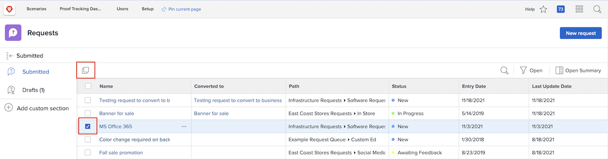

# Een aanvraag indienen

In veel organisaties is de eerste stap bij het opstarten van een nieuw project, het ontwikkelen van een nieuw product of het maken van een te leveren product het indienen van een verzoek in [!DNL Workfront]. U kunt de voortgang van het verzoek volgen en aanvullende informatie verstrekken wanneer dat nodig is.

In deze video leert u hoe u:

* Ga naar het aanvraaggebied
* Een aanvraag indienen
* Verzonden verzoeken weergeven
* Een concept van een verzoek zoeken

>[!VIDEO](https://video.tv.adobe.com/v/336092/?quality=12)

## Snelle en eenvoudige toegang tot wachtrijpaden voor aanvragen

Wanneer u in het dialoogvenster [!UICONTROL Request Type] veld, de laatste drie aanvraagpaden die u onlangs hebt verzonden om automatisch boven aan de lijst weer te geven. Selecteer een optie om een andere aanvraag in te dienen bij dezelfde wachtrij.

Onder aan de lijst staan alle wachtrijen voor aanvragen die u kunt openen. Als u niet zeker bent welke rij voor uw verzoek te gebruiken, gebruik het sleutelwoordonderzoek om snel en gemakkelijk te vinden u wenst.

Terwijl u in trefwoorden typt, [!DNL Workfront] brengt gelijken omhoog zodat kunt u de weg van de verzoekrij vinden die uw behoeften aanpast. Als u bijvoorbeeld een aanvraag wilt indienen voor een bericht op een sociale media, typt u &quot;sociale media&quot; in het dialoogvenster [!UICONTROL Request Type] en de lijst worden dynamisch bijgewerkt om overeenkomsten weer te geven.

Selecteer de gewenste optie, vul het aanvraagformulier in en verzend de aanvraag.

## Kopieer een ingediend verzoek om een nieuw verzoek in te dienen

Wanneer u regelmatig hetzelfde type aanvraag verzendt, kost het veel tijd om elke nieuwe aanvraag te maken en dezelfde gegevens telkens opnieuw in te vullen. Versnelt het proces door een bestaand verzoek te kopiëren, enkel de informatie te veranderen die moet worden bijgewerkt, en het voor te leggen als nieuw verzoek.

1. Klik op Verzoeken in het hoofdmenu.
1. Controleer of u in de sectie Verzenden werkt via het menu van het linkerdeelvenster.
1. Zoek en selecteer de aanvraag die u wilt kopiëren. U kunt slechts één verzoek tegelijk kopiëren.
1. Klik op het pictogram Kopiëren en verzenden als nieuw pictogram linksboven in de lijst met aanvragen.
1. Het nieuwe verzoekvenster opent, met het Onderwerp benadrukt gebied zodat kunt u het nieuwe verzoek noemen.
1. Werk indien nodig andere informatie in het verzoek bij.
1. Klik op Verzenden om te voltooien.
1. Het gekopieerde verzoek wordt verzonden als een nieuw verzoek en wordt weergegeven in de lijst Verzenden.

U kunt een verzoek kopiëren dat u eerder hebt verzonden, maar u kunt geen concept van een verzoek kopiëren. U kunt een verzoek kopiëren dat door iemand anders is ingediend zolang u toegang tot het verzoek hebt.

<!---
Learn more
Requests area overview
Create and submit Workfront requests
Guides
Make a work request
--->
