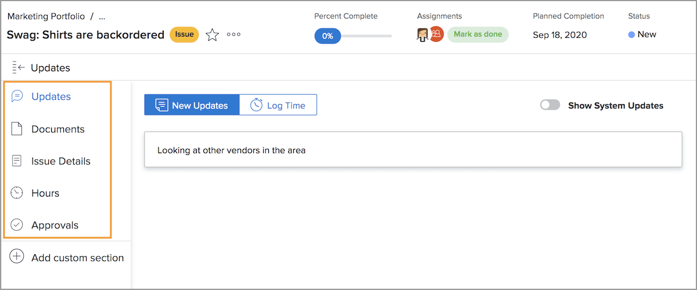

# Uitgave-toewijzingen beheren

## Een probleem toewijzen

Logboekregistratie van het probleem in [!DNL Workfront] is de eerste stap naar het oplossen van problemen die zich voordoen. In de volgende stap wordt het probleem toegewezen aan een individuele gebruiker, meerdere gebruikers of een team, zodat alle bijbehorende werkzaamheden kunnen worden voltooid en het probleem is opgelost.

Het toewijzen van een uitgave is net als het toewijzen van een taak: het invullen van [!UICONTROL Assignments] veld. De kwestie verschijnt vervolgens in de [!UICONTROL Work List] in [!DNL Workfront] [!UICONTROL Home]. Indien toegewezen aan een team, verschijnt het in [!UICONTROL Team Requests] van de [!UICONTROL Team] pagina.

Alle kwesties die op taken worden geregistreerd en het project zelf kan van worden betreden [!UICONTROL Issues] op de projectpagina. Hierdoor kunnen projectmanagers, planners en anderen snel problemen met betrekking tot het project toewijzen.

Er zijn verschillende manieren om problemen toe te wijzen in [!DNL Workfront].

* Ga naar de [!UICONTROL Issue] van het project of de taak. Klik in de [!UICONTROL Assignments] om de inline bewerking te activeren en voer vervolgens de naam in van de gebruiker, gebruikers of team die het werk moet voltooien.
U kunt ook de functie voor in-line bewerken gebruiken wanneer u problemen bekijkt op een [!DNL Workfront] verslag.

* Klik op de naam van het probleem in een rapport of in het dialoogvenster **[!UICONTROL Issues]** van het project of de taak. Klik vervolgens in het dialoogvenster **[!UICONTROL Assignments]** in de koptekst, rechtsboven in het venster. Vergeet niet op de knop **[!UICONTROL Save]** na het invoeren van een gebruiker- of teamnaam.

![Een afbeelding van de optie voor inline bewerken wanneer u op de knop [!UICONTROL Assignments] gebied van een uitgave](assets/04-issue-assign-issue-list-assignments-field.png)

<!--
Learn more graphic and documentation article links
Assign issues
Edit user assignments for multiple issues
-->

## Uitgiftetoewijzing ontvangen

De aan u toegewezen problemen vindt u in het dialoogvenster [!UICONTROL Work List] in [!UICONTROL Home].

![Een afbeelding van een uitgiftetoewijzing in het dialoogvenster [!UICONTROL Work List] in [!UICONTROL Home]](assets/05-workfront-home-work-list.png)

Gebruik de [!UICONTROL Filter] om de lijst te versmallen, zodat u desgewenst alleen problemen kunt bekijken.

![Een afbeelding van de [!UICONTROL Filter] in het menu [!UICONTROL Work List] in [!UICONTROL Home]](assets/06-workfront-home-issue-filter.png)

Wanneer een kwestie aan een team wordt toegewezen, verschijnt het in [!UICONTROL Team Requests] van de [!UICONTROL Team] pagina. Een teamlid kan op de knop [!UICONTROL Work On It] om de taak of een teamlead te accepteren, klikt u op [!UICONTROL Reassign] pictogram om het verzoek aan een specifieke persoon te geven.

![Een afbeelding van de [!UICONTROL Team Requests] van de [!UICONTROL Team] page](assets/07-team-page-work-on-it.png)

De kwesties die aan het team worden toegewezen verschijnen ook op de [!UICONTROL Schedule] sectie. Hierdoor kunnen teamleiders en anderen zien aan welke teamleden werken voordat ze het werk toewijzen. Sleep de releasebalk vanuit de [!UICONTROL Unassigned] gebied aan de kalender van een teamlid om het toe te wijzen.

![Een afbeelding van teamtoewijzingen in het dialoogvenster [!UICONTROL Schedule] sectie.](assets/08-issue-assignment-team-schedule.png)

Afhankelijk van hoe uw organisatie werkt [!DNL Workfront] opstelling, kunt u kwesties ook zien die aan u of uw team aan een rapport worden toegewezen dat deel van een dashboard uitmaakt.

<!-- Learn more graphic and documentation article links

* Display items in the [!UICONTROL Work List] in the [!UICONTROL Home] area
* Manage work and team requests in the [!UICONTROL Home] area

-->

## Voortgang van problemen bijwerken

U en uw teamleden kunnen updates en logboekuren voor problemen plaatsen om zichtbaarheid te geven aan het werk dat wordt uitgevoerd en om alle betrokkenen op de hoogte te houden van de voortgang van het werk.

Omdat er meerdere manieren zijn om updates te posten in [!DNL Workfront]volgt u de specifieke aanwijzingen van uw team met betrekking tot de aanbevolen manier waarop u met uw systeemconfiguraties en workflows werkt.

Updates en uren kunnen vanaf [!UICONTROL Home]. Klikken **[!UICONTROL New Updates]** om een opmerking te plaatsen.

![Een afbeelding van het posten van een update van een uitgave van [!UICONTROL Home].](assets/09-workfront-home-update.png)

Wanneer u een opmerking maakt over een probleem, kunt u het bericht naar andere gebruikers of teams sturen met de functie @name, net als op sociale media.

Klik op de knop **[!UICONTROL Log Time]** om de uren te registreren u aan de kwestie werkte.

![Een afbeelding van loguren op een uitgave van [!UICONTROL Home].](assets/10-workfront-home-log-hours.png)

U kunt ook het probleem openen (klik op de naam) en uw gegevens daar opnemen.

## Abonneren op een uitgave

Iedereen die toegang heeft tot de kwestie kan [!UICONTROL Subscribe] aan de Commissie, die hen telkens een bericht stuurt wanneer een update/opmerking over de kwestie wordt gemaakt. U krijgt geen berichten wanneer de uren worden geregistreerd, de statusveranderingen, of andere veranderingen worden aangebracht.

Abonneren is een goede manier voor andere teamleden of projectmanagers om hun werk bij te houden waarin ze geïnteresseerd zijn, maar die niet zijn toegewezen aan of actief werken aan.

<!-- Learn more graphic and link to documentation article

* Update or edit a work item in the Home area

-->

## De status van het probleem bijwerken

Vergeet niet om de status van het probleem te wijzigen en niet alleen opmerkingen of logboekuren te plaatsen, maar ook om aan te geven dat u eraan werkt. Wijzig het weer om aan te geven dat het werk is voltooid.

De status in de koptekst wijzigen vanuit [!UICONTROL Home] of wanneer u de uitgavepagina hebt geopend.

### Onopgeloste problemen

Een probleem wordt als &quot;onopgelost&quot; beschouwd wanneer de status niet is bijgewerkt om te voltooien of een equivalent hiervan.

Niet-opgeloste problemen verhinderen dat de taak waaraan de taak is gekoppeld, wordt gemarkeerd zoals deze is uitgevoerd, en dat de projectstatus wordt ingesteld op voltooid.

<!-- Learn more graphic and documentation article link

* Mark a work item as done in the Home area

-->

## Aanvullende functies voor problemen

De uitgiftepagina biedt toegang tot aanvullende informatie en functies die teamleden en projectmanagers nodig kunnen hebben om de kwestie naar behoren vast te leggen en te beheren om deze op te lossen.

Naast [!UICONTROL Updates] en [!UICONTROL Hours]Andere informatie kunt u openen via het menu van het linkerdeelvenster nadat u de uitgave hebt geopend.

* **[!UICONTROL Documents]**—Documenten die verband houden met het probleem uploaden en reviseren.
* **[!UICONTROL Issue Details]**—Wijzig de informatie over kwesties, zoals beschrijving, prioriteit, ernst en geplande voltooiingsdatum.
* **[!UICONTROL Approvals]**—Een goedkeuringsproces voor eenmalig gebruik instellen voor de uitgave of een algemeen goedkeuringsproces toepassen. U kunt de voortgang van de goedkeuring ook in deze sectie volgen.

Zoek de opties voor het kopiëren, verwijderen of delen van een uitgave onder het menu met drie punten rechts van de naam van de uitgave.

<!-- Learn more graphic and documentation article links

* Edit issues
* Copy issues
* Share an issue
* Move issues
* Grant access to an issue

-->
