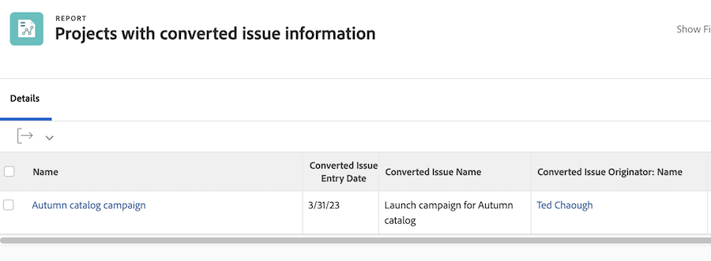

# Verslag over kwesties

## Problemen centraliseren door een rapport te maken

Vele verkeer en projectmanagers leiden tot een [!UICONTROL Workfront] aangepast rapport om alle binnenkomende problemen te centraliseren. Hierdoor is het gemakkelijk om te volgen wat nieuw is en aandacht nodig heeft.

Het rapport kan dan aan een dashboard worden toegevoegd, die alles plaatst u uw werk in één [!UICONTROL Workfront] venster.

![Een afbeelding van de [!UICONTROL Resolving Object] kolom van een uitgifterapport.](assets/18-resolving-object-report.png)

Als u de naam wilt weergeven van de taak of het project waarnaar de uitgave is geconverteerd, neemt u &quot;[!UICONTROL Resolving Object]&quot; in de weergave. A &quot;[!UICONTROL Resolving Object]&quot; is de taak of het project dat u maakt wanneer u een uitgave omzet. Als een uitgave niet is omgezet, [!UICONTROL Resolving Object] veld wordt leeg weergegeven. Met dit rapport kunt u snel zien welke problemen al zijn omgezet, zodat u niet eindigt met duplicaten. Klik op de naam van het oplossende object om het te openen, zodat u de voortgang van het werk kunt volgen.

## Oorspronkelijke probleemgegevens tonen in rapporten

Wanneer een kwestie in een project of een taak wordt omgezet kunnen veel van de originele uitgiftedetails in project of taakrapporten worden gemeld. De oorspronkelijke uitgave wordt de &quot;[!UICONTROL Converted Issue]&quot;.

Een project of taakrapport kan deze informatie tonen gebruikend [!UICONTROL Converted Issue Originator] samen met twee speciale velden. Deze kolommen kunnen aan een douanemening zonder de behoefte aan tekstwijze worden toegevoegd:

* [!UICONTROL Converted Issue Entry Date]
* [!UICONTROL Converted Issue Name]
* [!UICONTROL Converted Issue Originator > Name]

>[!NOTE]
>
>Voor instructies over het maken van een weergave raadpleegt u [Een basisweergave maken](https://experienceleague.adobe.com/docs/workfront-learn/tutorials-workfront/reporting/basic-reporting/create-a-basic-view.html?lang=en).

