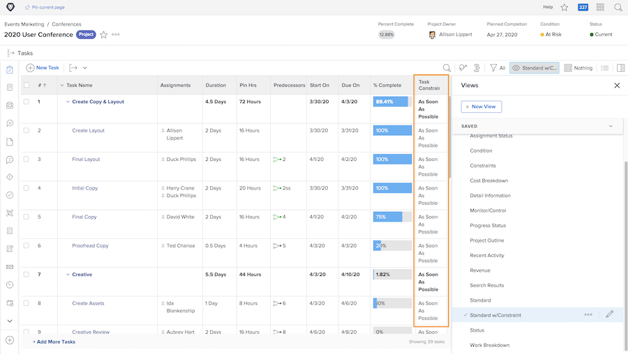

# Voortgang bijhouden vanaf de projecttijdlijn

Zorg ervoor dat de taken vooruitgang boeken op de manier waarop ze projectdeadlines moeten halen. Terwijl u door de [!UICONTROL Task] list, er zijn verschillende functies in [!DNL  Workfront] waarmee u de voortgang en de status van het werk kunt volgen.

## Percentage voltooid

Het percentage voltooide werktaken wordt soms gebruikt om te meten hoe het werk vordert. Het is belangrijk om op te merken...dit gebied moet manueel worden aangepast, aangezien het de schattingen van de ontvanger van hoe ver zij zijn.

>[!TIP]
>
>Hoewel het percentage voltooide werktaken handmatig moet worden bijgewerkt, wordt het percentage voltooid van een bovenliggende taak berekend door Workfront op basis van het percentage voltooid en de duur of de geplande uren van elke onderliggende taak. Dit betekent dat je een betere procentuele volledige nauwkeurigheid krijgt als je grote taken opsplitst in kleinere subtaken.

![Lijst met projecttaken weergeven [!UICONTROL Percent Complete] kolom](assets/planner-fund-task-percent-complete.png)

Er zijn drie keer wanneer het percentage voltooide automatisch verandert:

* Wanneer de taak [!UICONTROL Status] is ingesteld op Voltooien, verandert het percentage dat is voltooid in 100.
* Als de taak [!UICONTROL Status] Als u terugdraait naar New, wordt het percentage voltooid teruggezet naar 0.
* In een oudertaak wanneer het percentage voltooide van een kindtaak verandert.

## Status

Inclusief de [!UICONTROL Status] kolom in een [!UICONTROL View] snel te zien welke taken zijn gestart , welke in uitvoering zijn en welke voltooid zijn . U kunt zelfs voorwaardelijke opmaak instellen in een [!UICONTROL View] om elke status een kleur te geven, zodat de informatie gemakkelijker kan worden ontcijferd.

## Taaktoewijzingen

Terwijl u het project bekijkt, controleert u de taaktoewijzingen. Misschien is het werk achterop geraakt omdat niemand aan de taak was toegewezen. Of misschien had de toegewezen persoon niet de juiste vaardigheden om het werk te voltooien. Voeg meer mensen toe aan een taak of wijs taken opnieuw toe om ervoor te zorgen dat het werk wordt gedaan.

## Taakbeperking

Soms worden de taakbeperkingen veranderd en je realiseert het niet. Restricties kunnen het gedrag van uw tijdlijn beïnvloeden, dus u moet ervoor zorgen dat deze zijn ingesteld op de gewenste manier.

Een aangepaste weergave maken die de opdracht [!UICONTROL Task Constraint] kolom om deze informatie in uw takenlijst te zien. Als u het project van een begindatum plant, wilt u uw taken hebben [!UICONTROL As Soon As Possible] ([!UICONTROL ASAP]) beperking.

Zie voor meer informatie over taakbeperkingen [Werken en beheren van de soorten duur en taakbeperkingen](https://experienceleague.adobe.com/docs/workfront-learn/tutorials-workfront/manage-work/intermediate-projects/understand-and-manage-duration-types-and-task-constraints.html).
