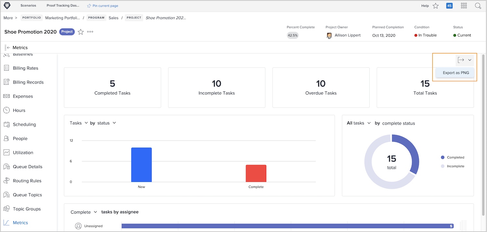

# Voortgang van het werk bijhouden met projectmetriek

In deze video leert u hoe u:

* Toegang krijgen tot de metrische diagrammen van het project
* De gegevens in de grafieken aanpassen

>[!VIDEO](https://video.tv.adobe.com/v/336667/?quality=12&learn=on)

U kunt het volledige dashboard van projectmetriek als .png dossier met uitvoeren [!UICONTROL Export] knop. Zo kunt u de gegevens eenvoudig met anderen delen via e-mails of presentaties.

<!---
Overview of project metrics
--->
