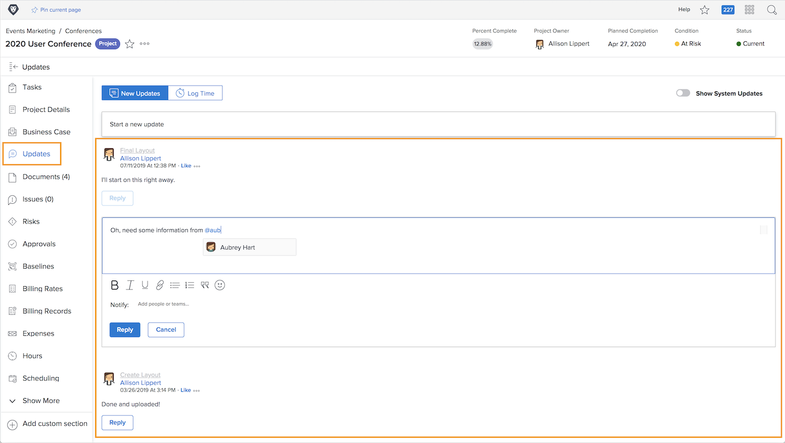

# Projectcommunicatie begrijpen

Zoals het gezegde luidt, is 90 procent van het beheer van een project communicatie. Communicatie met het projectteam, uw managers, en projectbelanghebbenden.

Maar wanneer de projectteams e-mail, onmiddellijk overseinen, vergaderingen, en kleverige nota&#39;s voor projectmededeling gebruiken, wordt de informatie verspreid... of erger, vergeten. Houd de communicatie over het projectwerk in het project zelf [!DNL Workfront] updates gebruiken.

Aangezien de leden van het projectteam aan taken werken, kunnen zij updates van maken [!DNL Workfront] [!UICONTROL Home] over de hun toegewezen taken.

De updates van taken, kwesties, en documenten rollen tot het project-niveau [!UICONTROL Updates] , zodat informatie snel en gemakkelijk te bekijken is.

Vervolgens kunt u op updates reageren door gewoon op de knop te klikken. Dit houdt al gesprek op één plaats, die u toestaat om naar het later terug te verwijzen.

<!---
learn more urls
Communicate about work in Home
Subscribe to items in Workfront
Update work
--->
