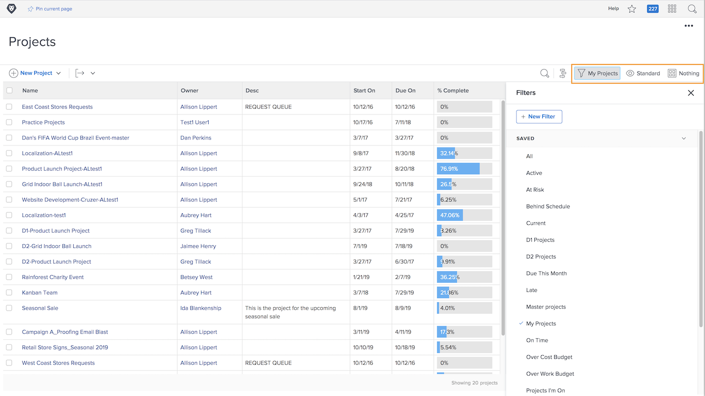

# Projectinformatie weergeven

Of je naar het hoofdartikel kijkt [!UICONTROL Projects] pagina of bij een afzonderlijk project, verfijn uw lijst om de informatie te zien u met nodig hebt [!UICONTROL Filters], [!UICONTROL Views], en [!UICONTROL Groupings].

U kunt op hoog niveau bekijken hoe al uw projecten vooruitgang boeken op het [!UICONTROL Projects] pagina.

Gebruik de [!UICONTROL Filters] de lijst op basis van bepaalde criteria te beperken. Selecteer vervolgens een [!UICONTROL View] om de kolommen van informatie te tonen die voor uw projecten relevant zijn. Selecteer ten slotte een [!UICONTROL Grouping] om de projecten zo te organiseren dat u er goed aan doet.

Wanneer je op de [!UICONTROL Tasks] deel van een project, gebruik [!UICONTROL Filters], [!UICONTROL Views], en [!UICONTROL Groupings] om u te helpen het werk te controleren dat wordt gedaan. Omdat je naar taken kijkt in plaats van naar projecten, heb je een heel andere set keuzes.

Veel [!DNL Workfront] klanten maken aangepaste weergaven die aangepaste formulierinformatie en andere velden die relevant zijn voor het werk dat wordt uitgevoerd, beschikbaar maken.

## Leer hoe u aangepaste filters, weergaven en groepen maakt

[Een basisfilter maken](https://experienceleague.adobe.com/docs/workfront-learn/tutorials-workfront/reporting/basic-reporting/create-a-basic-filter.html?lang=en)

[Een basisweergave maken](https://experienceleague.adobe.com/docs/workfront-learn/tutorials-workfront/reporting/basic-reporting/create-a-basic-view.html?lang=en)

[Een basisgroep maken](https://experienceleague.adobe.com/docs/workfront-learn/tutorials-workfront/reporting/basic-reporting/create-a-basic-grouping.html?lang=en)
