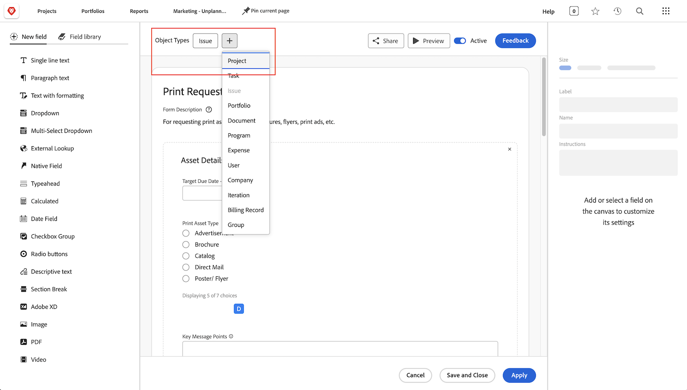

# Antwoorden op veelgestelde vragen over aanvraagwachtrijen

**waarom kan ik een verzoekrij zien, maar mijn gebruiker kan niet?**

Zorg ervoor dat de gebruiker op het tabblad [!UICONTROL Queue Details] van de wachtrij of het project van uw aanvraag voldoet aan de criteria van &quot;Wie kan aanvragen aan deze wachtrij toevoegen?&quot; veld.

Bekijk deze video voor meer informatie:

>[!VIDEO](https://video.tv.adobe.com/v/3434156/?quality=12&learn=on)

**ik gaf gebruikers toegang tot de rij, maar nu kunnen zij het project van de verzoekrij ook zien. Waarom?**

In &quot;wie kan verzoeken aan deze rij toevoegen?&quot; lijst, als u &quot;Mensen met meningstoegang tot dit project&quot;koos dan zal iedereen u meningsrechten aan voor het gebruiken van de verzoekrij ook de verzoekrij in een projectlijst kunnen bekijken. U kunt dit voorkomen door de optie &quot;Personen in dit project&quot; of &quot;Personen in groep van dit project&quot; te gebruiken.

**kan ik een verzoek in een project veranderen?**

Ja. U kunt uitgaven in taken of projecten omzetten afhankelijk van wat nodig is.

Deze zelfstudies laten u zien hoe:

* [Een uitgave/verzoek omzetten in een project](/help/manage-work/issues-requests/create-a-project-from-a-request.md)

* [Een uitgave/verzoek omzetten in een taak](/help/manage-work/issues-requests/convert-issues-to-other-work-items.md)

**waar vind ik een verzoekrij om uit te geven?**

U kunt het veld [!UICONTROL Search] in de navigatiebalk gebruiken of in het [!UICONTROL Projects] -gebied zoeken.

Als u een verzoek van de verzoekrij opent kunt u op de projectnaam in het broodkruimelgebied klikken.

**kan ik de informatie van een vorm van de verzoekdouane aan een vorm van de projectdouane overbrengen?**

Ja. Wanneer u een aangepast formulier maakt, selecteert u zowel [!UICONTROL Project] als [!UICONTROL Issue] als de objecttypen. U kunt een project ook uitgeven douanevorm om het type van uitgiftobjecten en vice versa te omvatten.

 toont

 toont

Voeg het aangepaste formulier toe aan de aanvraag. Wanneer u het verzoek in een project omzet zal het douaneformulier automatisch aan het nieuwe project vastmaken en de waarden in om het even welke gebieden zullen in zowel het verzoek als de projecten douaneformulieren verschijnen.

**ik bekijk een project of taakrapport. Hoe kan ik te weten komen welk verzoek dit voorwerp voortkwam?**

U hebt toegang tot velden in de velden **[!UICONTROL Converted Issue]** en **[!UICONTROL Converted Issue Originator]** om die informatie toe te voegen aan uw project- en taakrapporten.

Bekijk deze video voor meer informatie:

>[!VIDEO](https://video.tv.adobe.com/v/3434176/?quality=12&learn=on)

**wat is de beste manier om voor verzoekrijen in een rapport te filtreren?**

Als uw projectfilter **Rij>>Is Openbaar >>Gelijk>>niets** omvat zal uw rapport slechts projecten tonen die **** verzoekrijen {zijn.

Als uw projectfilter **Rij>>Is Openbaar>>Niet Gelijk>>niets** omvat zal uw rapport slechts projecten tonen die **** verzoekrijen zijn.

Bekijk deze video voor meer informatie:

>[!VIDEO](https://video.tv.adobe.com/v/3434329/?quality=12&learn=on)

**is het een goed idee om een douanestatus van de Rij van het Verzoek tot stand te brengen?**

Sommige klanten creëren een douanestatus van de Rij van het Verzoek die met Huidig vergelijkt. Zij kunnen dan een rapport in werking stellen dat alle verzoekrijen toont of eenvoudig verzoekrijen van een rapport uitsluiten. Terwijl dit het voordeel heeft om gebruikersvriendelijker te zijn dan het gebruiken van **Rij>>Is Openbaar>>Niet Gelijk>>niets**, heeft het het nadeel dat de mensen die verzoekrijen creëren het kunnen vergeten te gebruiken, aangezien de Huidige status net zo goed werkt en is wat zij in het grootste deel van het trainingsmateriaal zullen zien. Om die reden kiezen veel klanten ervoor geen douanestatus van de Rij van het Verzoek te gebruiken.

Nochtans, als u reeds de status van de Rij van het Verzoek in uw organisatie gebruikt en u enkel een manier wilt om ervoor te zorgen het behoorlijk wordt gebruikt (of moeilijke gevallen waar het niet is), kunt u het **Actieve verzoekrijen** rapport creëren dat in de video hierboven wordt beschreven, en de filter voor **Project >>Status vergelijkt met>>Equal>>Huidige** aan **Project>>Status>>Equal> Huidige**. Dit zal u alle actieve verzoekrijen tonen die de Huidige status in plaats van de status van de Rij van het Verzoek gebruiken u hen wilt gebruiken. Selecteer alle projecten die verschijnen en een bulkbewerking uitvoeren om de status te wijzigen in Wachtrij aanvragen.

## Aanbevolen zelfstudies over dit onderwerp

* [Vragenrijen begrijpen](/help/manage-work/request-queues/understand-request-queues.md)
* [Een aanvraagwachtrij maken](/help/manage-work/request-queues/create-a-request-queue.md)
* [Instellingen voor een aanvraagstroom begrijpen](/help/manage-work/request-queues/understand-settings-for-a-flow-request.md)
* [Een aanvraagstroom maken](/help/manage-work/request-queues/create-a-request-flow.md)
* [Een wachtrij voor feedback van systeembeheerders maken](/help/manage-work/request-queues/create-a-system-admin-feedback-request-queue.md)
