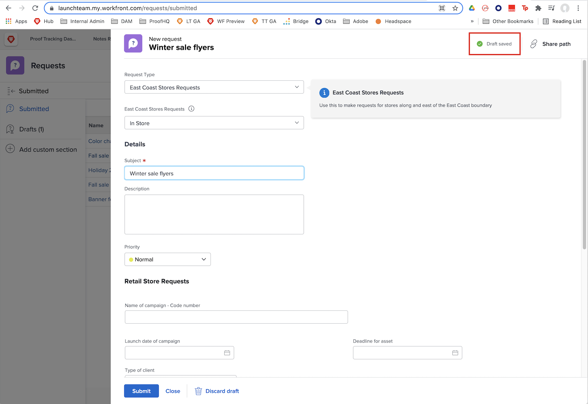
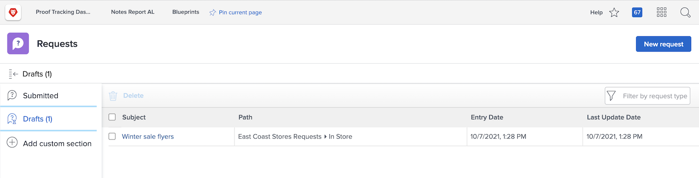

# Vragenrijen begrijpen

In deze video leert u:

* Een aanvraag verzenden via een [!DNL  Workfront] aanvraagwachtrij
* Hoe de verzoekrijen worden gestructureerd

>[!VIDEO](https://video.tv.adobe.com/v/335220/?quality=12&learn=on)

## Concepten automatisch aanvragen

Wanneer u een aanvraagformulier invult, slaat [!DNL Workfront] automatisch een concept op nadat u het veld [!UICONTROL Subject] hebt ingevuld. Dit betekent dat u geen gegevens kwijtraakt als u weg moet navigeren van het [!UICONTROL Requests] gebied om iets anders te doen of als u halverwege uw verzoek moet pauzeren om meer informatie te verzamelen.

Er wordt een indicatie weergegeven dat het concept boven in het venster is opgeslagen. [!DNL Workfront] slaat een concept van uw verzoek op, zelfs als de vereiste velden nog niet zijn ingevuld.

Wanneer u klaar bent om de aanvraag te verzenden, zoekt u deze op het tabblad [!UICONTROL Drafts] . Klik op de naam om het te openen en het formulier in te vullen. Klik vervolgens op [!UICONTROL Submit Request] wanneer u klaar bent.

## Uw beurt

Neem even de tijd om de informatie te bekijken die je zojuist hebt gepresenteerd.

**Vraag:** Hoe doe u een verzoek in Workfront? Geef de stappen in volgorde weer.

* Kies het type aanvraag dat u moet maken
* Klik op Aanvraag verzenden
* Vul de gegevens op het formulier in
* Klik op Nieuwe aanvraag
* Ga naar het aanvraaggebied

**Antwoord:** navigeer aan het verzoekgebied > klik Nieuw Verzoek > kies het verzoektype u moet maken > Vul de informatie op de vorm > klikt voorleggen verzoek in

**Vraag:** Een verzoek is echt..

**Antwoord:** Kwestie

<!---
You can also access request drafts from the [!UICONTROL Select a Request Type] menu at the top of the window. Select an option from the [!UICONTROL Recent Drafts] section, or start a new request by picking a queue from the [!UICONTROL New Requests] section. Fill everything out like normal, then submit the request.

<!---
image
--->

<!---
Let's take a minute to review the information you were just presented.

How do you make a request in Workfront? List the steps in order.
Choose the request type you need to make
Click Submit request
Fill out the information on the form
Click "New Request"
Navigate to the request area

Answer: Navigate to the request area>Click New Request>Choose the request type you need to make>Fill out the information on the form>Click Submit request

A request is really an......

Answer: Issue
--->
