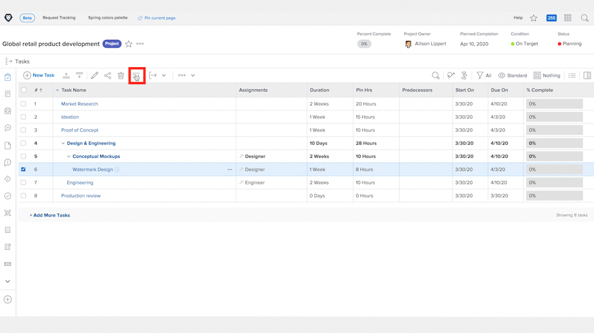

# Bovenliggende taken begrijpen

In deze video leert u:

* Hoe de taken in a gestructureerd zijn [!DNL Workfront] project

>[!VIDEO](https://video.tv.adobe.com/v/335087/?quality=12&learn=on)

## Een taak wijzigen in een subtaak en opnieuw

De **inspringen** en **uitspringen** De knoppen worden gebruikt om een taak te wijzigen in een subtaak of van een subtaak in een niet-subtaak.

Selecteren &quot;[!UICONTROL Watermark Design]&quot; en klik op de knop **inspringen** knop. &quot;[!UICONTROL Watermark Design]&quot; wordt een subtaak onder &quot;[!UICONTROL Conceptual Mockups]&quot;, dat een bovenliggende taak wordt.

Selecteren &quot;[!UICONTROL Watermark Design]&quot; als het een subtaak is en op de knop **uitspringen** knop. &quot;[!UICONTROL Watermark Design]&quot; wordt een regelmatige taak op hetzelfde niveau als &quot;[!UICONTROL Conceptual Mockups]&quot;.

