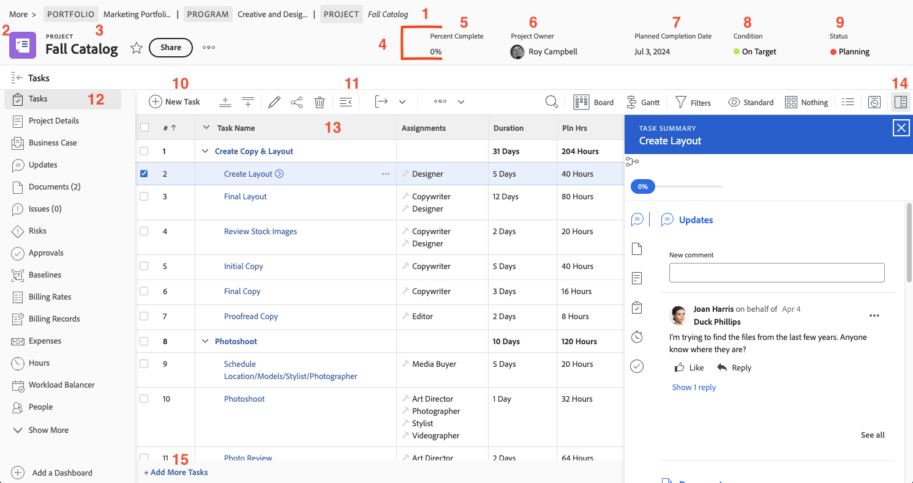

# Navigeren door de projectpagina

In deze video leert u:

* De details van het project bekijken
* Welke informatie in de takenlijst toont
* Waar kan ik documenten uploaden?
* De updategeschiedenis weergeven

>[!VIDEO](https://video.tv.adobe.com/v/3449732/?quality=12&learn=on&enablevpops=1&captions=dut)

## Belangrijke onderdelen van de projectpagina

De projectpagina is gevuld met vele eigenschappen om u te helpen uw werk leiden. Werk met uw systeembeheerder als er een optie is u nodig hebt maar niet in uw geval van [!DNL Workfront] ziet. Hier volgen enkele van de hoofdfuncties voor projectpagina&#39;s.

1. **spoor Breadcrumb:** navigeer door het programma en de portefeuillehiërarchie achter het project.
2. **het type van Objecten:** het tonen van het objecten type op de het landen pagina helpt u identificeren wat u in [!DNL Workfront] bekijkt. De term &#39;project&#39; kan door de systeembeheerder van [!DNL Workfront] worden aangepast.
3. **naam van het Project:** De naam van het project dat u bekijkt. Klik op de naam om deze te bewerken.
4. **kopbal van het Project:** Standaardinformatie die op alle projectpagina&#39;s beschikbaar is.
5. **[!UICONTROL Percent complete]:** dit werkt automatisch bij, gebaseerd op de taken die in het project worden voltooid.
6. **[!UICONTROL Project Owner]:** Bij de meeste organisaties, is dit de projectmanager. Dit is de persoon die verantwoordelijk is voor het beheer van het project in [!DNL Workfront] en voor de voltooiing ervan.
7. **[!UICONTROL Planned Completion Date]:** de geplande voltooiingsdatum van het project wordt geplaatst door de projectmanager door de projectchronologie.
8. **[!UICONTROL Condition]:** [!UICONTROL Condition] is een visuele weergave van hoe het project vordert. [!DNL Workfront] kan [!UICONTROL Condition] automatisch configureren op basis van de voortgangsstatus van de taken in het project. Of [!UICONTROL Condition] kan handmatig worden ingesteld via de projectdetails.
9. **[!UICONTROL Status]:** [!UICONTROL Status] geeft aan waar het project zich in het proces bevindt: wordt het project nog gepland, wordt het project in uitvoering of is het project voltooid.
10. **[!UICONTROL New Task]:** klik om een taak in het project tot stand te brengen. De taak wordt onder aan de lijst gegenereerd.
11. **[!UICONTROL Export]:** Exporteer de takenlijst of geselecteerde taken naar een bestand met door tabs of werkbladen gescheiden waarden.
12. **Linker paneelmenu:** navigeer aan verschillende informatie over het project met het linkerpaneel. Klik op het taakpictogram bovenaan om het deelvenster samen te vouwen als u meer ruimte op het scherm nodig hebt. Sleep de pictogrammen zodat de volgorde u helpt efficiënt te werken. De opties die u ziet, worden ingesteld door de systeembeheerder van [!DNL Workfront] .
13. **lijst van de Taak:** de taaklijst toont alle taken die omhoog uw projectplan maken. De informatie die zichtbaar is over elke taak wordt bepaald door de geselecteerde weergave.
14. **Samenvattingspaneel:** het samenvattingspaneel verstrekt een snel onderzoek naar informatie over de geselecteerde taak. Klik op het pictogram van het deelvenster Samenvatting om het te openen of te sluiten.
15. **voeg Meer Taken toe** klik hier om een andere taak aan de bodem van de taaklijst toe te voegen gebruikend gealigneerd geef uit.

## Aanbevolen zelfstudies over dit onderwerp

* [Inzicht in maken van basisprojecten](/help/manage-work/projects/understand-basic-project-creation.md)
* [Leer vier manieren om een project te maken](/help/manage-work/projects/understand-other-ways-to-create-projects.md)
* [De projectdetails invullen](/help/manage-work/projects/fill-in-the-project-details.md)
