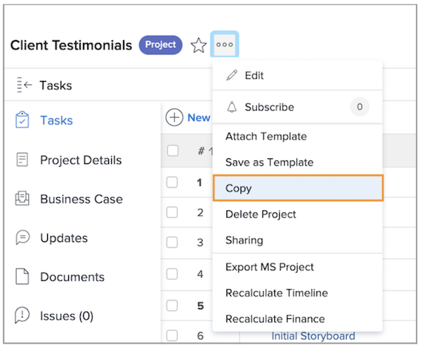

# Een bestaand project kopiëren

Soms, in plaats van het gebruiken van een malplaatje om een project tot stand te brengen, moet u enkel een project voor een ander eenmalig gebruik kopiëren. Hiervoor hebt u een standaardlicentie nodig, met Bewerken en Toegang tot projecten maken.

Navigeer naar het project dat u wilt kopiëren en klik op het menu met drie punten naast de projectnaam. Selecteer vervolgens Kopiëren.

In het venster Project kopiëren kunt u de titel en status wijzigen en een verscheidenheid aan gegevens wissen die aan het project zijn gekoppeld, zoals toewijzingen, documenten en aangepaste gegevens.

Als u Toewijzingen wissen selecteert of de status instelt op Planning, voorkomt u dat het gekopieerde project de taaktoewijzingsmeldingen direct na het kopiëren verzendt.

## Aanbevolen zelfstudies over dit onderwerp

* [Een project rechtstreeks vanuit een sjabloon maken](/help/manage-work/create-and-manage-project-templates/create-a-project-directly-from-a-template.md)
* [Werken met taken](/help/manage-work/tasks/work-with-tasks.md)
* [Taken toewijzen vanuit het projectplan](/help/manage-work/tasks/assign-tasks-from-the-project-plan.md)
