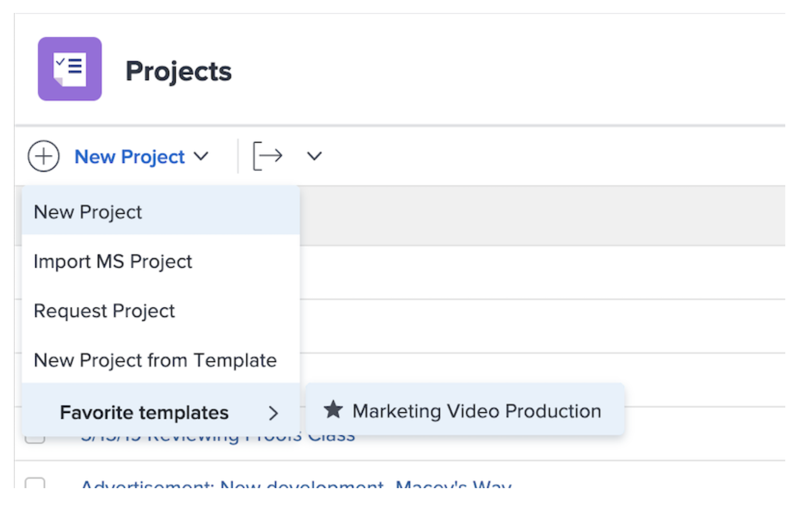

# Een project rechtstreeks vanuit een sjabloon maken

Als u toevallig aan een malplaatje werkt en een project moet tot stand brengen gebruikend dat malplaatje, klik het 3 punt menu naast de malplaatjenaam. Selecteer vervolgens Project maken.

In het venster Details kunt u de instellingen van het nieuwe project wijzigen.

>[!NOTE]
>
>Als u een project wilt maken met deze methode, hebt u toegang nodig tot het gedeelte Sjablonen van Workfront. Als u tot malplaatjes niet kunt toegang hebben, kunt u een malplaatje nog gebruiken om een project van het gebied van Projecten tot stand te brengen of wanneer het omzetten van een kwestie/een taak.

>[!TIP]
>
>Als er een sjabloon is die u vaak gebruikt, maakt u deze een favoriet! U zult het malplaatje zien in het Nieuwe menu van het Project, naast het verschijnt onder het menu van Favorieten in de navigatiebar.

