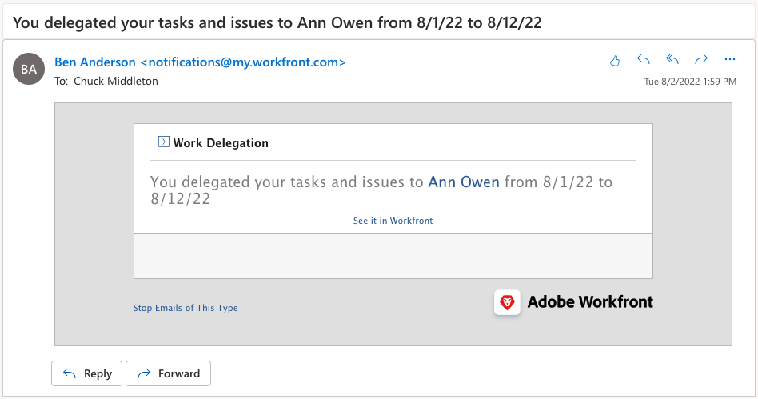

# Taken, problemen en goedkeuringen delegeren

Leer hoe u goedkeuringen voor projecten, taken, problemen en tijdschema&#39;s kunt delegeren aan een andere Workfront-gebruiker. Leer ook hoe te om taak te delegeren en taken uit te geven.

## Goedkeuringen delegeren

Leer hoe te om goedkeuringen voor projecten, taken, kwesties, en chronologie aan een andere gebruiker te delegeren.

In deze video leert u hoe u:

* Goedkeuringen toewijzen aan iemand anders
* Einde van de delegatieperiode
* Gedelegeerde goedkeuringen zoeken

>[!VIDEO](https://video.tv.adobe.com/v/336094/?quality=12&learn=on)

<!---
learn more URLS
Delegate approval request
--->

## Taken en uitgaven delegeren

U kunt de taken en de kwesties delegeren die aan u aan andere gebruikers worden toegewezen wanneer u van plan bent om uit het bureau te zijn.

### Het inschakelen van taken en het delegeren van taken

Alvorens het kan worden gebruikt, moeten de taak en de uitgiftedelegatie door een groep of systeembeheerder worden toegelaten. Dit gebeurt in [!UICONTROL Setup > Project Preferences > Tasks & Issues > Delegation] . Als u dit inschakelt, kunnen alle gebruikers met een Revisie- of hogere licentie hun toegewezen taken en problemen delegeren.

![ Schermafbeelding die [!UICONTROL Setup] voorkeur voor delegatie ](assets/delegation-1.png) toont

### Hoe te om taak te delegeren en taken uit te geven

Navigeer naar [!UICONTROL Home] en klik op [!UICONTROL Delegate] en geef vervolgens de gebruiker op waaraan u al uw toegewezen taken gedelegeerd en het datumbereik. U kunt elke gebruiker aanwijzen met een licentie voor Revisie of hoger.

![ Screenshot die het delegatielusje in [!UICONTROL Home]](assets/delegation-2.png) toont

### Hoe te om te weten te komen of is een taak of een kwestie gedelegeerd

U kunt zien wanneer taken of problemen zijn gedelegeerd in [!UICONTROL Home] of in de taak- of probleemweergave.

![ Screenshot die gedelegeerde taak in [!UICONTROL Home]](assets/delegation-4.png) toont

### E-mailmeldingen die van toepassing zijn op gedelegeerde werkzaamheden

Uw groep of systeembeheerder kan e-mailmeldingen inschakelen die u laten weten wanneer u uw taken en problemen hebt gedelegeerd en wanneer de taken en problemen van iemand aan u zijn gedelegeerd.

![ Schermafbeelding die [!UICONTROL Setup] opties van het e-mailbericht voor delegatie tonen ](assets/delegation-5.png)

