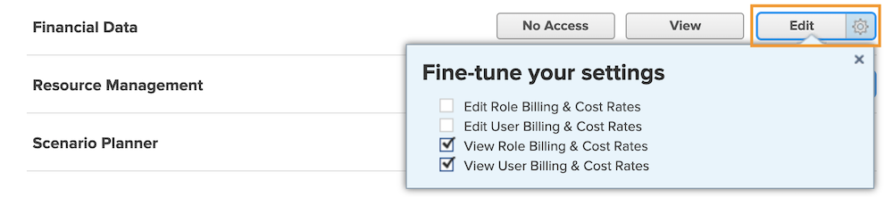

# Begrijp financiële toegang

Als uw organisatie financiële gegevens vastlegt met [!DNL Workfront] als systeembeheerder, is het uw verantwoordelijkheid om te beschermen en te beheren wie toegang heeft om die informatie te bekijken en te bewerken.

Er zijn twee dingen nodig voor een gebruiker om financiële informatie te bekijken of te bewerken:

1. Toegangsrechten moeten zijn ingeschakeld in de [!UICONTROL Access Level] .
2. Toestemming om deze toegangsrechten te gebruiken moet per object worden verleend.

Een gebruiker kan bijvoorbeeld rechten krijgen om financiële gegevens in zijn toegangsniveau te bekijken, maar hij kan alleen financiële gegevens bekijken over een taak die met hem wordt gedeeld en hij kan financieel worden bekeken in het delen van die taak.

Het is dus mogelijk dat een gebruiker met [!UICONTROL Access Level] -rechten financiële gegevens kan bekijken voor bepaalde objecten en niet voor andere, afhankelijk van de individuele opties voor delen van die objecten. Nochtans kan geen gebruiker financiële gegevens over om het even welk voorwerp bekijken tenzij zij het recht hebben die aan hen in hun [!UICONTROL Access Level] wordt gegeven.

## [!UICONTROL Access Level] instellingen

Globale toegang tot financiële gegevens wordt eerst verleend door het type [!DNL Workfront] licentie.

**[!UICONTROL Plan]-licenties kunnen:**

* Factureringsrecords beheren
* Rol- en kostenfacturering beheren en bekijken
* Facturering van gebruikers beheren en de kosten bekijken
* Kosten beheren
* Financiën weergeven en bewerken

**[!UICONTROL Work]-licenties kunnen:**

* Kosten beheren
* Financiën weergeven

**[!UICONTROL Review]-licenties kunnen:**

* Financiën weergeven

**de Toestemmingen kunnen door [!UICONTROL Access Level] worden gewijzigd. De drie opties voor financiële gegevenstoegang zijn:**

* [!UICONTROL No Access] — De gebruiker kan geen financiële informatie zien.
* [!UICONTROL View] — De gebruiker kan de informatie controleren en delen.
* [!UICONTROL Edit] — De gebruiker kan de gegevens maken, bewerken, verwijderen en delen. (Alleen beschikbaar voor een abonnement.)

Het is belangrijk om te weten dat de opties [!UICONTROL View] en [!UICONTROL Edit] aanvullende instellingen hebben voor een [!UICONTROL Plan] -licentie. Klik op de knop [!UICONTROL View] voor de volgende opties:

**[!UICONTROL View]**

* Rol- en kostenfacturering weergeven
* Facturering van gebruikers en kostentarieven weergeven

**[!UICONTROL Edit]**

Deze twee opties zijn beschikbaar onder de optie [!UICONTROL Edit] , samen met:

* Rollenfacturering en kostentarieven bewerken
* Facturering van gebruikers en kostentarieven bewerken

>[!NOTE]
>
>Een gebruiker met toegang om uitgaven toe te voegen kan ook de uitgaven bekijken die zij, evenals uitgaven toevoegen door hun directe rapporten toevoegen.
