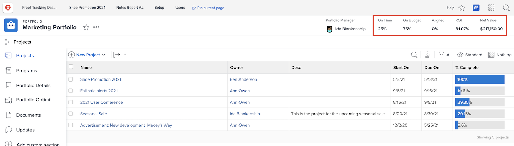

# Overzicht van portefeuilles

Managers hebben vaak de lastige taak om uit te zoeken welke projecten hun bedrijf het best zouden helpen zijn doelstellingen en doelstellingen te bereiken. Dat betekent dat een huidig of potentieel project beoordeeld moet worden op basis van criteria die voor die doelstellingen van belang zijn. Deze criteria kunnen onder meer betrekking hebben op het aantal benodigde middelen, de kosten van het project ten opzichte van wat het zal meebrengen en/of het aantal risico&#39;s. Op basis van deze informatie kunnen managers beslissen welke projecten het eerst moeten worden uitgevoerd en welke op de achtergrond kunnen worden gezet.

Het is niet al te moeilijk om projecten te bedenken en te plannen. Het is een proces waaraan de meeste managers gewend zijn. De echte strijd gaat over het vergelijken van projecten met elkaar. Het is tijdrovend om een lange en gedetailleerde lijst van projecten door te nemen. Dat is waar portfolio&#39;s in [!DNL  Workfront] kan helpen.

## Wat is een portfolio?

Een portefeuille is een inzameling van projecten die voor de zelfde middelen, begroting, programma, en prioriteit voltooien. Een marketingbureau kan bijvoorbeeld een portfolio gebruiken om alle projecten voor een bepaalde klant te groeperen.

Ga naar de **[!UICONTROL Portfolios]** van de [!UICONTROL Main Menu]klikt u vervolgens op de naam van een portfolio om het te openen.

U kunt de **[!UICONTROL New Project]** om eenvoudig een bestaand project aan het portfolio toe te voegen. U kunt ook rechtstreeks in het portfolio een nieuw project maken.

![Een afbeelding van het vervolgkeuzemenu voor het dialoogvenster [!UICONTROL New Project] knop](assets/01-portfolio-management3.png)

Zodra de projecten de portefeuille worden toegevoegd, kunt u de summiere informatie in de paginakopbal gebruiken om een mening op hoog niveau te krijgen van hoe de inzameling van projecten, of positief of negatief, aan de algemene doelstellingen bijdragen.

U kunt ook het hulpprogramma voor het optimaliseren van portfolio&#39;s gebruiken om prioriteiten toe te wijzen aan projecten die de algemene strategische doelstellingen ondersteunen.

## Toegang tot portfolio&#39;s

Als u met portfolio&#39;s wilt werken, moet u een licentie voor een abonnement toewijzen in [!DNL Workfront] en hebt een toegangsniveau toegewezen dat u toestemmingen geeft om met portefeuilles te werken.

Wanneer een portfolio wordt gemaakt, heeft alleen de maker of manager van het portfolio toegang tot dit portfolio. U kunt toegang tot het portfolio geven door het te delen. Dit geeft ook toegang tot de programma&#39;s en projecten die binnen de portefeuille worden gecreeerd.

Open het portfolio en klik op het menu met drie punten. Selecteer vervolgens **[!UICONTROL Sharing]**. Voeg de individuen, de teams, de baanrollen, de groepen, of de bedrijven toe die toegang zouden moeten hebben. Dan bepaal welk type van toegang elk zou moeten hebben-leiden of mening.

![Een afbeelding van de [!UICONTROL Sharing] in een [!DNL Workfront] portfolio](assets/04-portfolio-management11.png)

<!--
Pro-tips graphic
If a user can’t access a specific portfolio, make sure it’s shared with them. The Workfront access level determines that a user can access portfolios in general, but sharing makes sure they can see specific portfolios. 
-->

<!--
Learn more graphic and links to documentation articles
* Portfolio overview   
* Create a portfolio 
* Create and manage portfolios 
* Navigate within a portfolio 
* Share a portfolio   
-->
