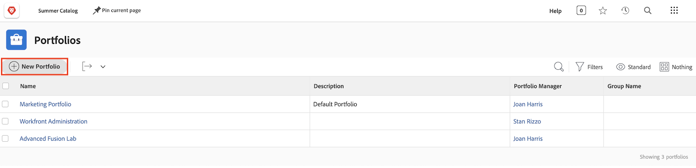

# Portefeuilles begrijpen

Managers hebben vaak de lastige taak om uit te zoeken welke projecten hun bedrijf het best zouden helpen zijn doelstellingen en doelstellingen te bereiken. Dat betekent dat een huidig of potentieel project beoordeeld moet worden op basis van criteria die voor die doelstellingen van belang zijn. Deze criteria kunnen onder meer betrekking hebben op het aantal benodigde middelen, de kosten van het project ten opzichte van wat het zal meebrengen, en het inzicht in de risico&#39;s. Op basis van deze informatie kunnen beheerders beslissen welke projecten moeten worden uitgevoerd en wanneer.

Het denken van en het plannen van projecten is niet te moeilijk taak-het is een proces de meeste managers worden gebruikt aan. De echte strijd gaat over het vergelijken van projecten met elkaar. Het is tijdrovend om een lange en gedetailleerde lijst van projecten door te nemen. Dat is waar portfolio&#39;s in Workfront kunnen helpen.

## Wat is een portfolio?

Een portefeuille is een inzameling van projecten die voor de zelfde middelen, begroting, programma, en prioriteit voltooien. Een marketingbureau kan bijvoorbeeld een portfolio gebruiken om alle projecten voor een bepaalde klant te groeperen.

Ga naar de **[!UICONTROL Portfolios]** van de [!UICONTROL Main Menu]klikt u vervolgens op de naam van een portfolio om het te openen.

U kunt de **[!UICONTROL New Project]** om eenvoudig een bestaand project aan het portfolio toe te voegen. U kunt ook rechtstreeks in het portfolio een nieuw project maken.

![Een afbeelding van het vervolgkeuzemenu voor het dialoogvenster [!UICONTROL New Project] knop](assets/01-portfolio-management3.png)

Zodra de projecten aan de portefeuille worden toegevoegd, kunt u de summiere informatie in de paginakopbal gebruiken om een mening op hoog niveau te krijgen van hoe deze inzameling van projecten, of positief of negatief, aan de algemene doelstellingen van de portefeuille bijdragen.

U kunt het programma voor het optimaliseren van portfolio&#39;s gebruiken (ook bekend als [!UICONTROL Portfolio Optimizer]) om projecten prioriteit te geven op basis van de nettowaarde, uitlijning, kosten, risico en rendement.

## Toegang tot portfolio&#39;s

Om met portefeuilles te werken, moet u een vergunning van het Plan in Workfront worden toegewezen en een toegangsniveau hebben dat u toestemmingen geeft om met portefeuilles te werken.

Wanneer een portfolio wordt gemaakt, heeft alleen de maker of manager van het portfolio toegang tot dit portfolio. U kunt anderen toegang tot het portfolio geven door het te delen. Dit geeft ook toegang tot alle programma&#39;s en projecten binnen de portefeuille.

Open het portfolio en klik op het menu met drie punten. Selecteer vervolgens **[!UICONTROL Sharing]**. Voeg de individuen, de teams, de baanrollen, de groepen, of de bedrijven toe die toegang zouden moeten hebben. Dan bepaal welk type van toegang elk zou moeten hebben-leiden of mening.

![Een afbeelding van de [!UICONTROL Sharing] in een [!DNL Workfront] portfolio](assets/04-portfolio-management11.png)

## Een portfolio maken

Klik op **[!UICONTROL Portfolios]** in het hoofdmenu.

Klik in het gebied Portfolio&#39;s op **[!UICONTROL New Portfolio]**.

Geef een naam op voor het portfolio en klik op **[!UICONTROL New Project]** om een project aan de portefeuille toe te voegen. U kunt op verschillende manieren een nieuw project maken, net als bij de **[!UICONTROL Projects]** gebied. Elk nieuw project dat u vanaf hier maakt, behoort tot dit portfolio. U kunt ook klikken op **[!UICONTROL Existing Project]** om een of meer bestaande projecten in een lijst te selecteren.

## Een programma maken binnen een portfolio

Selecteer de **[!UICONTROL Programs]** tab, klik vervolgens op **[!UICONTROL New Program]** om een nieuw programma in dit portfolio te maken of klik op **[!UICONTROL Existing Program]** bestaande programma&#39;s uit andere portfolio&#39;s te stelen.

<!--
Pro-tips graphic
If a user can't access a specific portfolio, make sure it's shared with them. The Workfront access level determines that a user can access portfolios in general, but sharing makes sure they can see specific portfolios. 
-->

<!--
Learn more graphic and links to documentation articles
* Portfolio overview   
* Create a portfolio 
* Create and manage portfolios 
* Navigate within a portfolio 
* Share a portfolio   
-->
