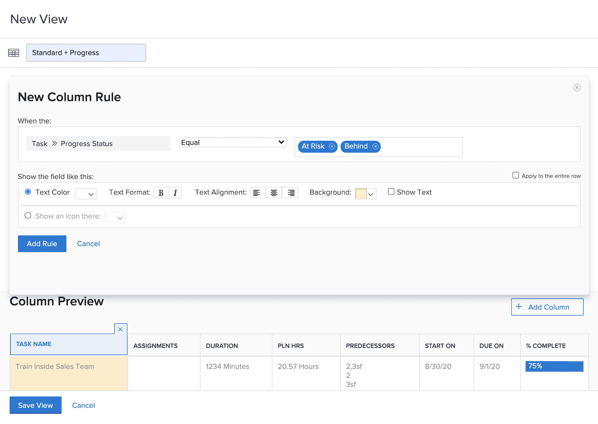

# Standaardvoorwaardelijke opmaak toevoegen aan een weergaveactiviteit

Praktijk die basis voorwaardelijke formatteren aan meningen, met geleidelijke instructies toevoegt.

## Samenvatting

Voorwaardelijke opmaak maken:

1. Kies de kolom waar u de opmaak wilt weergeven
1. Bepaal onder welke voorwaarden de opmaak moet worden gewijzigd
1. Bepaal welk type opmaakwijziging het beste werkt

   * achtergrondkleur
   * tekstkleur
   * vervangende tekst
   * een pictogram tonen

## Activiteit 1: Voorwaardelijke opmaak toevoegen aan een weergave

Maak een taakweergave met de naam &quot;Standard + Progress&quot; door de bestaande standaardweergave te gebruiken en deze voorwaardelijke opmaak toe te voegen aan de kolom [!UICONTROL Name] .

1. Voeg een kolomregel toe die de achtergrond van het veld rood zal maken wanneer de voortgangsstatus van de taak te laat is.
1. Voeg een kolomregel toe die de achtergrond van het veld geel maakt wanneer de vorderingsstatus Achter of Op risico is.

Dit zal u vlekken problemen taken zonder de kolom voor vooruitgangsstatus als deel van uw mening te omvatten.

## Antwoord 1

 tot stand te brengen

1. Ga in een takenlijstrapport naar de vervolgkeuzelijst **[!UICONTROL View]** en selecteer **[!UICONTROL New View]** .
1. Geef de weergave de naam Standaard + Voortgang.
1. Gebruik de opgegeven standaardkolommen.
1. Selecteer de kolom [!UICONTROL Task Name] . Dit is de kolom waarop u de voorwaardelijke opmaak wilt toepassen. De kolom wordt dus rood of geel weergegeven als de status van de voortgang van de taak niet op tijd is.
1. Klik op **[!UICONTROL Advanced Options]** in de rechterbovenhoek van het venster van de rapportbuilder.
1. Klik op **[!UICONTROL Add a Rule for this Column]**.
1. Start de kolomlijn door [!UICONTROL Task] > [!UICONTROL Name] boven in het venster te wijzigen in [!UICONTROL Task] > [!UICONTROL Progress Status] . Klik op het pictogram **[!UICONTROL X]** naast [!UICONTROL Task] > [!UICONTROL Name] om het pictogram uit het veld te verwijderen.
1. Typ &quot;progress&quot; in het veld en selecteer vervolgens [!UICONTROL Progress Status] onder de [!UICONTROL Task] -veldbron.
1. Selecteer **[!UICONTROL Late]** in het veld rechts van de kwalificatie [!UICONTROL Equal] .
1. Kies een achtergrond van rood in de [!UICONTROL Text Color] rij.
1. Klik op **[!UICONTROL Add Rule]** om de kolomlijn op te slaan.
1. Klik nogmaals op **[!UICONTROL Add Column Rule]** om een andere regel toe te voegen.
1. Net als voorheen verwijdert u [!UICONTROL Task] > [!UICONTROL Name] uit het veld Criteria. Vervang het door [!UICONTROL Progress Status] onder de [!UICONTROL Task] -veldbron.
1. Selecteer zowel [!UICONTROL At Risk] als [!UICONTROL Behind] in het veld rechts van de gelijkmarkering.
1. Kies een achtergrond van geel in de [!UICONTROL Text Color] rij.
1. Klik op **[!UICONTROL Add Rule]** om de kolomlijn op te slaan.
1. Klik op **[!UICONTROL Save View]** om de weergave op te slaan.
