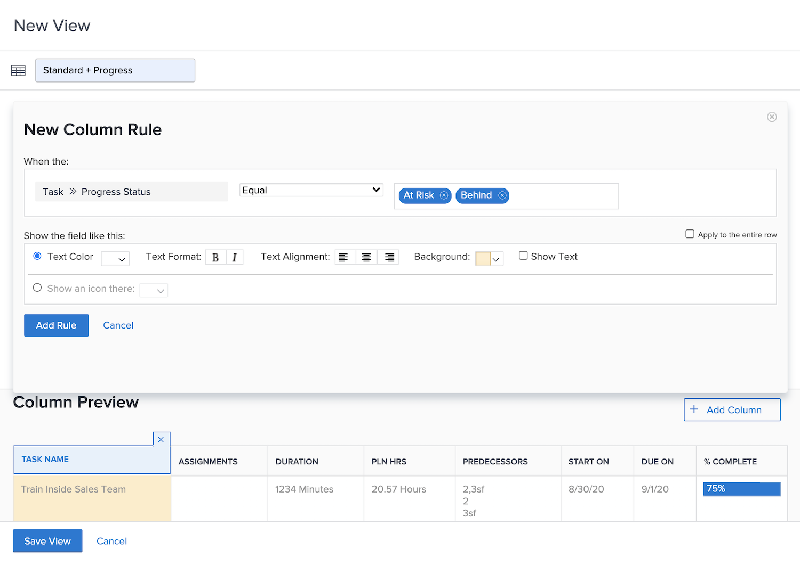

# Standaardvoorwaardelijke opmaak toevoegen aan een weergave

Voorwaardelijke opmaak gebeurt door kolomregels te maken. Met kolomregels kunt u een kolom op een specifieke manier opmaken op basis van criteria die u instelt.

In deze video leert u:

* Wat voorwaardelijke opmaak is in een weergave
* Voorwaardelijke opmaak maken en wijzigen

>[!VIDEO](https://video.tv.adobe.com/v/335149/?quality=12&learn=on)

## Samenvatting

Voorwaardelijke opmaak maken:

1. Kies de kolom waar u de opmaak wilt weergeven
1. Bepaal onder welke voorwaarden de opmaak moet worden gewijzigd
1. Bepaal welk type opmaakwijziging het beste werkt

   * achtergrondkleur
   * tekstkleur
   * vervangende tekst
   * pictogram tonen

## Activiteit: Voorwaardelijke opmaak toevoegen aan een weergave

Maak een taakweergave met de naam &quot;Standard + Progress&quot; door de bestaande standaardweergave te gebruiken en deze voorwaardelijke opmaak toe te voegen aan het dialoogvenster [!UICONTROL Name] kolom.

1. Voeg een kolomregel toe die de achtergrond van het veld rood zal maken wanneer de voortgangsstatus van de taak te laat is.
1. Voeg een kolomregel toe die de achtergrond van het veld geel maakt wanneer de vorderingsstatus Achter of Op risico is.

Dit zal u vlekken problemen taken zonder de kolom voor vooruitgangsstatus als deel van uw mening te omvatten.

## Antwoord

1. Ga in een rapport van de taaklijst naar **[!UICONTROL View]** vervolgkeuzelijst en selecteert u **[!UICONTROL New View]**.
1. Geef de weergave de naam Standaard + Voortgang.
1. Gebruik de opgegeven standaardkolommen.
1. Selecteer [!UICONTROL Task Name] kolom. Dit is de kolom waarop u de voorwaardelijke opmaak wilt toepassen. De kolom wordt dus rood of geel weergegeven als de status van de voortgang van de taak niet op tijd is.
1. Klikken **[!UICONTROL Advanced Options]** bij de hoger-juiste hoek van het venster van de rapportbouwer.
1. Klik op **[!UICONTROL Add a Rule for this Column]**.
1. Begin de kolomregel door te veranderen [!UICONTROL Task] > [!UICONTROL Name] boven aan het venster naar [!UICONTROL Task] > [!UICONTROL Progress Status]. Klik op de knop **[!UICONTROL X]** pictogram naast [!UICONTROL Task] > [!UICONTROL Name] om deze uit het veld te verwijderen.
1. Typ &quot;progress&quot; in het veld en selecteer vervolgens [!UICONTROL Progress Status] onder de [!UICONTROL Task] veldbron.
1. Selecteren **[!UICONTROL Late]** in het veld rechts van [!UICONTROL Equal] kwalificatie.
1. Kies een rode achtergrond in het dialoogvenster [!UICONTROL Text Color] rij.
1. Klikken **[!UICONTROL Add Rule]** om de kolomregel op te slaan.
1. Klik nu op **[!UICONTROL Add Column Rule]** nogmaals om een andere regel toe te voegen.
1. Net als voorheen verwijderen [!UICONTROL Task] > [!UICONTROL Name] in het veld Criteria. Vervangen door [!UICONTROL Progress Status] onder de [!UICONTROL Task] veldbron.
1. Beide selecteren [!UICONTROL At Risk] en [!UICONTROL Behind] in het veld rechts van de Gelijke kwalificatie.
1. Kies een achtergrond van geel in het dialoogvenster [!UICONTROL Text Color] rij.
1. Klikken **[!UICONTROL Add Rule]** om de kolomregel op te slaan.
1. Klikken **[!UICONTROL Save View]** om de weergave op te slaan.
