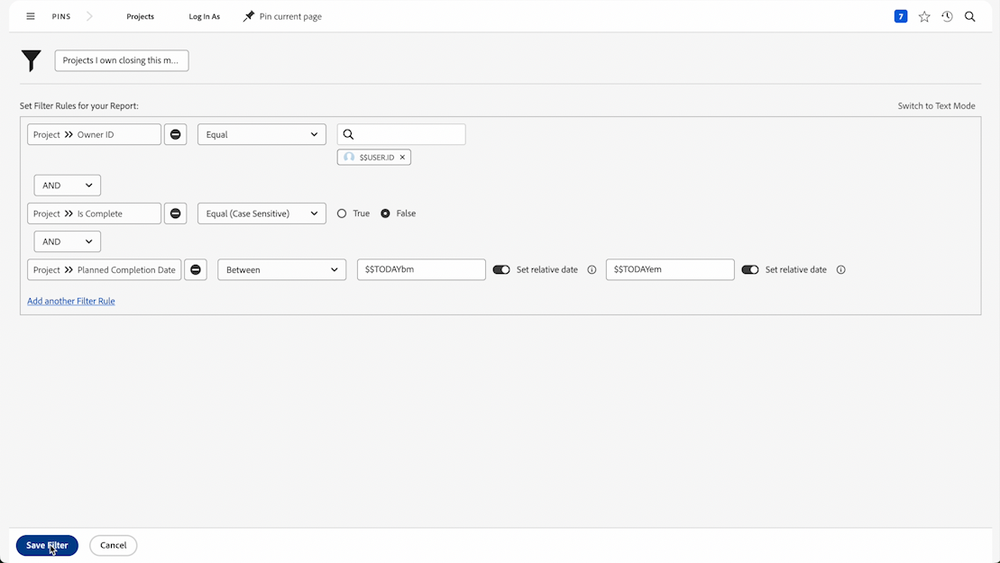

# Basisfilteractiviteiten maken

## Activiteit 1 - Alle projecten in de marketingportefeuille

In deze activiteit zult u een projectfilter genoemd &quot;Alle projecten in de portefeuille van de Marketing&quot;in de [!UICONTROL Legacy filter] ervaring creëren. Dit toont u alle projecten in de portefeuille genoemd &quot;Marketing Portfolio&quot;ongeacht hun status.

Hieronder vindt u stapsgewijze instructies.

## Antwoord op Activiteit 1

 tot stand te brengen

1. Navigeer naar het [!UICONTROL Projects] -gebied vanuit [!UICONTROL Main Menu] . Dit toont u een lijst van projecten.
1. Klik op het menu **[!UICONTROL Filter]** en selecteer [!UICONTROL Legacy Filters] als dit nog niet het geval is.
1. Selecteer **[!UICONTROL New Filter]**.
1. Geef het filter de naam &quot;Alle projecten in het marketingportfolio&quot;.
1. Klik op **[!UICONTROL Add Filter Rule]**.
1. Klik op **selecteer een gebied** gebied en begin de woorden &quot;[!UICONTROL portfolio name] te typen.&quot; Selecteer vervolgens [!UICONTROL Name] onder de veldbron van [!UICONTROL Portfolio] .
1. Laat de operator [!UICONTROL Equal] ongewijzigd.
1. Typ &quot;[!UICONTROL marketing]&quot; in het zoekveld.
1. Selecteer [!UICONTROL Marketing Portfolio] ervan uitgaande dat u een portfolio met die naam hebt waarop u wilt filteren. Als u niet gewoon de functie voor het vooruitgaan van tekst gebruikt om het gewenste portfolio te zoeken.
1. Klik op **[!UICONTROL Save Filter]**.

## Activiteit 2 - Projecten waarvan ik eigenaar ben en die deze maand aflopen

In deze video maakt u een projectfilter met de naam &quot;Projecten waarvan ik eigenaar ben en die deze maand afsluiten&quot; in de [!UICONTROL Legacy filter] -ervaring. Als u veel projecten in de gaten houdt, kunt u met dit filter inzoomen op de projecten die binnenkort gesloten zullen worden.

Hieronder vindt u stapsgewijze instructies.

>[!VIDEO](https://video.tv.adobe.com/v/336807/?quality=12&learn=on&enablevpops=1)

## Antwoord op Activiteit 2

 tot stand te brengen

1. Navigeer naar het [!UICONTROL Projects] -gebied vanuit [!UICONTROL Main Menu] . Dit toont u een lijst van projecten.
1. Klik op het menu **[!UICONTROL Filter]** en selecteer [!UICONTROL Legacy Filters] als dit nog niet het geval is.
1. Selecteer **[!UICONTROL New Filter]**.
1. Geef uw filter de naam &quot;Projecten waarvan ik eigenaar ben en die deze maand worden gesloten&quot;.
1. Klik op **[!UICONTROL Add Filter Rule]**.
1. Klik op **selecteer een gebied** gebied en begin het woord &quot;Eigenaar.&quot; te typen Klik nu op Eigenaar-id onder het veld [!UICONTROL Project] .
1. Laat de operator [!UICONTROL Equal] ongewijzigd.
1. Typ ‘$’ in het zoekveld.
1. Selecteer [!UICONTROL $$USER.ID] . Dit is de vervanging voor het programma geopende gebruiker.
1. Klik op een andere filterregel toevoegen.
1. Klik op **selecteer een gebied** gebied en begin het woord &quot;is Volledig.&quot;te typen Klik nu op &quot;Is voltooid&quot; onder de veldbron van [!UICONTROL Project] .
1. Laat de operator [!UICONTROL Equal] ongewijzigd.
1. Selecteer &quot;Onwaar&quot;.
1. Klik op nogmaals een filterregel toevoegen.
1. Klik op **selecteer een gebied** gebied en begin het woord &quot;Geplant.&quot; te typen Klik nu op &quot;Geplande aanmaakdatum&quot; onder de veldbron van [!UICONTROL Project] .
1. Wijzig de operator [!UICONTROL Equal] in [!UICONTROL This Month] .
1. Klik op **[!UICONTROL Save Filter]**.
