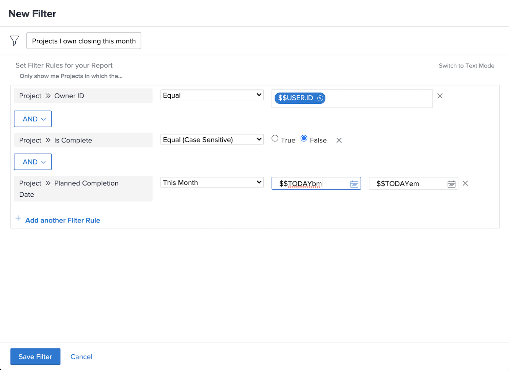

# Basisfilteractiviteiten maken

## Activiteit 1 - Alle projecten in de marketingportefeuille

In deze activiteit zult u een projectfilter creëren genoemd &quot;Alle projecten in de portefeuille van de Marketing&quot;in [!UICONTROL Legacy filter] ervaring. Dit zal u alle projecten in de portefeuille genoemd &quot;Portfolio van de Marketing&quot;ongeacht hun status tonen.

Hieronder vindt u stapsgewijze instructies.

### Antwoord op Activiteit 1

1. Ga naar de [!UICONTROL Projects] gebied van de [!UICONTROL Main Menu]. Dit toont u een lijst van projecten.
1. Klik op de knop **[!UICONTROL Filter]** en selecteert u [!UICONTROL Legacy Filters].
1. Selecteren **[!UICONTROL New Filter]**.
1. Geef het filter de naam &quot;Alle projecten in het marketingportfolio&quot;.
1. Klik op **[!UICONTROL Add Filter Rule]**.
1. In de [!UICONTROL Start typing field name] veld, typ &quot;[!UICONTROL portfolio name]&quot;. Selecteer vervolgens [!UICONTROL Name] onder de [!UICONTROL Portfolio] veldbron.
1. Laat de [!UICONTROL Equal] -operator zoals deze is.
1. Typ &quot;[!UICONTROL marketing]&quot; in de [!UICONTROL Start typing name] veld.
1. Selecteren [!UICONTROL Marketing Portfolio] er wordt aangenomen dat u een portfolio met die naam hebt waarop u wilt filteren. Als u niet gewoon de functie voor het vooruitgaan van tekst gebruikt om het gewenste portfolio te zoeken.
1. Klik op **[!UICONTROL Save Filter]**.

## Activiteit 2 - Projecten waarvan ik eigenaar ben en die deze maand aflopen

In deze video maakt u een projectfilter met de naam &quot;Projecten waarvan ik eigenaar ben en die deze maand worden gesloten&quot; in het dialoogvenster [!UICONTROL Legacy filter] ervaring. Als u veel projecten in de gaten houdt, kunt u met dit filter inzoomen op de projecten die binnenkort gesloten zullen worden.

Hieronder vindt u stapsgewijze instructies.

>[!VIDEO](https://video.tv.adobe.com/v/336807/?quality=12&learn=on)

### Antwoord op Activiteit 2

1. Ga naar de [!UICONTROL Projects] gebied van de [!UICONTROL Main Menu]. Dit toont u een lijst van projecten.
1. Klik op de knop **[!UICONTROL Filter]** en selecteert u [!UICONTROL Legacy Filters].
1. Selecteren **[!UICONTROL New Filter]**.
1. Geef uw filter de naam &quot;Projecten waarvan ik eigenaar ben en die deze maand worden gesloten&quot;.
1. Klik op **[!UICONTROL Add Filter Rule]**.
1. In de [!UICONTROL Start typing field name] veld, typ &quot;owner&quot;. Selecteer vervolgens [!UICONTROL Owner ID] onder de [!UICONTROL Project] veldbron.
1. Laat de [!UICONTROL Equal] -operator zoals deze is.
1. Typ ‘$’ in het dialoogvenster [!UICONTROL Start typing name] veld.
1. Selecteren [!UICONTROL $$USER.ID]. Dit is de vervanging voor het programma geopende gebruiker.
1. Klikken [!UICONTROL Add Filter Rule] opnieuw.
1. In de [!UICONTROL Start typing field name] veld, begin met typen &quot;Is voltooid&quot;. Selecteer vervolgens [!UICONTROL Is Complete] onder het veld Project.
1. Laat de [!UICONTROL Equal] -operator zoals deze is.
1. Selecteer &quot;Onwaar&quot;.
1. Klikken [!UICONTROL Add Filter Rule] opnieuw.
1. In de [!UICONTROL Start typing field name] veldtype &quot;geplande&quot;, selecteer vervolgens [!UICONTROL Planned Completion Date] onder de [!UICONTROL Project] veldbron.
1. Wijzig de [!UICONTROL Equal] operator to [!UICONTROL This Month].
1. Klik op **[!UICONTROL Save Filter]**.
