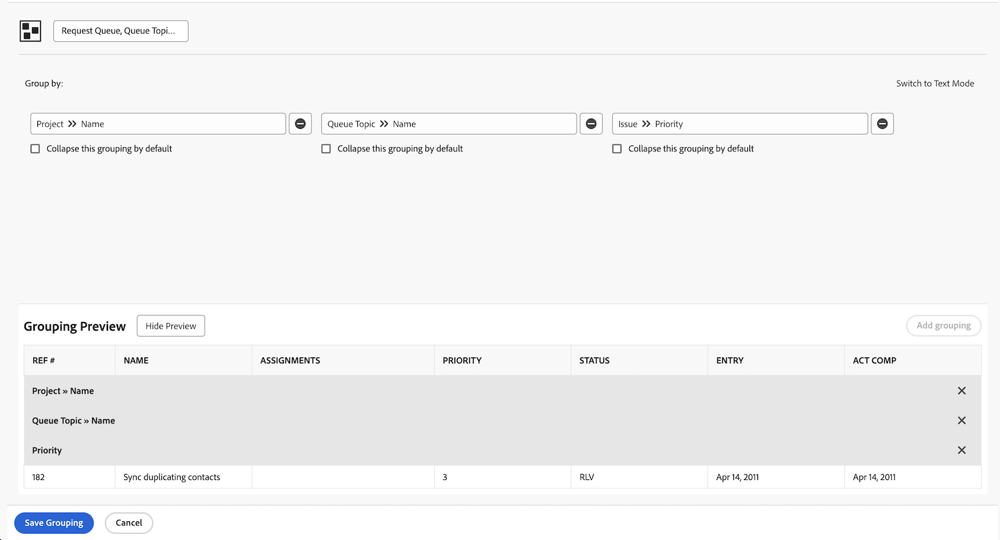

# Een basisgroep maken

In deze video wordt uitgelegd hoe u groepen in Workfront kunt maken en beheren om projectlijsten op effectieve wijze te ordenen. &#x200B; Groepen zijn een van de drie belangrijkste rapportelementen, naast filters en weergaven, en ze helpen resultaten te organiseren op basis van gedeelde informatie. &#x200B;
Deze zelfstudie biedt praktische stappen voor het organiseren van projectlijsten om dagelijks werk en samenwerking te stroomlijnen. &#x200B;

>[!VIDEO](https://video.tv.adobe.com/v/335147/?quality=12&learn=on&enablevpops=0)

## Toetsen

* **Doel van Groepen:** Groepen zijn een zeer belangrijk rapporteringselement in Workfront die projectlijsten organiseren die op gedeelde informatie, zoals voltooiingsdata, portefeuilles, of programma&#39;s worden gebaseerd. &#x200B;
* **Creërend Groepen:** u kunt douanegroepen met maximaal drie niveaus van criteria tot stand brengen. &#x200B; Projecten kunnen bijvoorbeeld eerst worden gegroepeerd op portfolio en vervolgens op programma voor een betere organisatie. &#x200B;
* **het uitgeven en het Opslaan Groepen:** Ingebouwde groeperingen kunnen niet worden beschreven, maar u kunt sparen uitgeeft als nieuwe groepering. &#x200B; Aangepaste groepen moeten duidelijke, beschrijvende namen hebben, zodat ze gemakkelijk kunnen worden geïdentificeerd. &#x200B;
* **het Delen van Groepen:** Groepen kunnen met andere gebruikers worden gedeeld, met standaard &quot;mening&quot;toestemmingen die hen toestaan om de groepering te gebruiken en te delen maar het niet uit te geven. U kunt de machtigingen voor &quot; &#x200B; beheren &quot; bewerken en verwijderen. &#x200B;
* **het Verwijderen van Groepen:** het schrappen van een groepering u creeerde zal het uit de lijsten van gebruikers ook verwijderen u het met deelde. &#x200B; Gedeelde groepen worden weergegeven onder de sectie &quot;Gedeeld met mij&quot; voor andere gebruikers. &#x200B;

## Activiteiten voor basisgroepering maken

### Activiteit 1: Een basisgroep maken

Creeer een kwestie groeperen die in een rapport zal worden gebruikt om verzoeken te volgen die door een verzoekrij komen. Deze groepering zal het gemakkelijk maken om gelijkaardige types van kwesties/verzoeken te zien die door hun prioriteit worden gegroepeerd. Noem de groepering &quot;de Rij van het Verzoek, het Onderwerp van de Rij, Prioriteit.&quot;

Groepeer het probleemrapport op basis van:

1. De naam van de verzoekrij (dit zal de projectnaam zijn)
1. Het rijonderwerp
1. De prioriteit van het verzoek

### Antwoord 1

 te creëren

1. Ga in een uitgiftenlijstrapport naar het menu **[!UICONTROL Grouping]** en selecteer **[!UICONTROL New Grouping]** .
1. Geef uw groepering de naam &quot;Request Queue, Queue Topic, Priority.&quot;
1. Klik op **[!UICONTROL Add Grouping]**.
1. In het veld [!UICONTROL Group by] . Typ &quot;projectnaam&quot; en selecteer vervolgens **[!UICONTROL Name]** onder de bron van het veld Project.
1. Klik op **[!UICONTROL Add another Grouping]**, typ &quot;queue&quot; en selecteer **[!UICONTROL Name]** onder de veldbron van [!UICONTROL Queue Topic] .
1. Klik op **[!UICONTROL Add another Grouping]**, typ &quot;priority&quot; en selecteer **[!UICONTROL Priority]** onder de [!UICONTROL Issue] -veldbron.
1. Klikken **[!UICONTROL Save Grouping]**
