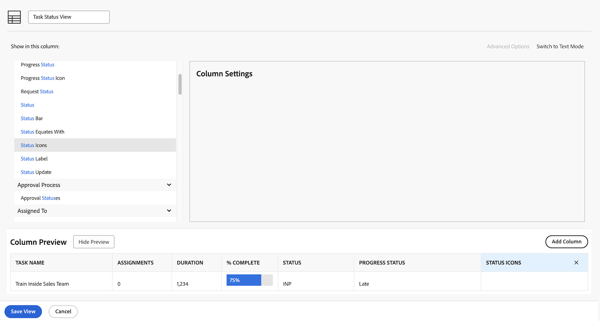
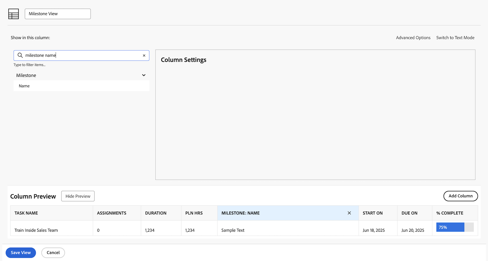
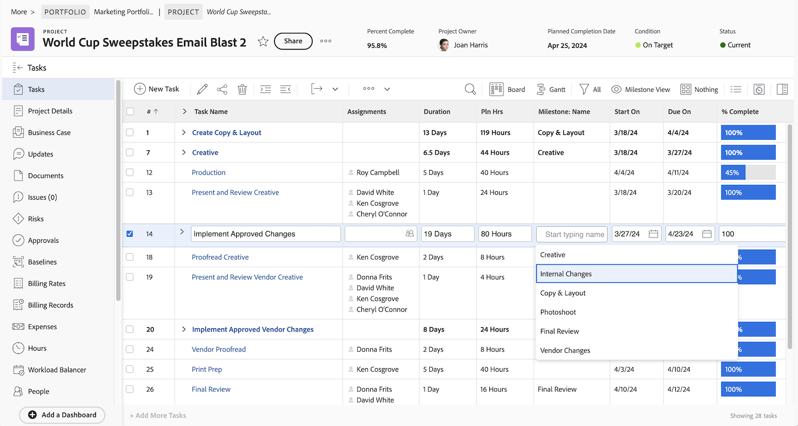
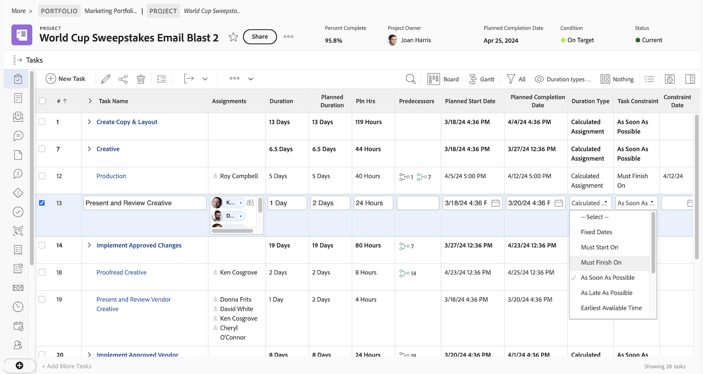

# Een basisweergave maken

In de video wordt uitgelegd hoe u in Workfront weergaven kunt maken en aanpassen om specifieke informatie weer te geven over items in een lijst, zoals projecten, taken, problemen en documenten. &#x200B; Met weergaven kunnen gebruikers details zien zoals naam, beschrijving, status en andere velden die relevant zijn voor de items. &#x200B;

De video benadrukt de flexibiliteit van weergaven in Workfront en biedt stapsgewijze instructies voor het maken, aanpassen en beheren van deze weergaven.

>[!VIDEO](https://video.tv.adobe.com/v/3450244/?quality=12&learn=on&captions=dut)

## Toetsen

* **het Aanpassen van Mening**: De gebruikers kunnen bestaande meningen uitgeven of nieuwe degenen creëren door, kolommen toe te voegen te verwijderen of te herschikken om specifieke informatie, zoals projectstatus of budget te tonen.
* **Inline het Uitgeven**: Sommige gebieden in een lijstmening kunnen direct worden bijgewerkt zonder individuele punten te openen, makend het sneller om veranderingen aan te brengen. &#x200B;
* **Creërend Weergaven van Kras**: De gebruikers kunnen meningen ontwerpen om aan specifieke behoeften, zoals het volgen van projectgezondheid te voldoen, door relevante kolommen zoals begroting, daadwerkelijke kosten, en vooruitgangsstatus toe te voegen. &#x200B;
* **het Delen en het Leiden Weergaven**: De meningen van de douane kunnen met teamleden voor samenwerking worden gedeeld of worden verwijderd wanneer zij niet meer nodig zijn.

## Activiteiten voor een basisweergave maken

### Activiteit 1: Een taakstatusweergave maken

Als projectmanager, teamleider, of middelmanager, wilt u bijhouden hoe het taakwerk vordert. In deze weergave ziet u verschillende statusindicatoren voor een taak, allemaal in één rij van de lijst of het rapport.

Maak een taakweergave met de naam &quot;Taakstatusweergave&quot; met de volgende kolommen:

* [!UICONTROL Task Name]
* [!UICONTROL Assignments]
* [!UICONTROL Duration]
* [!UICONTROL Percent Complete]
* [!UICONTROL Status]
* [!UICONTROL Progress Status]
* [!UICONTROL Status Icons]

### Antwoord 1

1. Ga in een takenlijstrapport naar de vervolgkeuzelijst **[!UICONTROL View]** en selecteer **[!UICONTROL New View]** .
1. Geef de weergave de naam &#39;Taakstatusweergave&#39;.
1. Verwijder de volgende kolommen: [!UICONTROL Pln Hrs], [!UICONTROL Predecessors], [!UICONTROL Start On] en [!UICONTROL Due On] .
1. Klik op **[!UICONTROL Add Column]**.
1. Typ in het veld [!UICONTROL Show in this column] &quot;status&quot; en selecteer &quot;Status&quot; onder de veldbron van [!UICONTROL Task] .
1. Klik nogmaals op **[!UICONTROL Add Column]** .
1. Typ in het veld [!UICONTROL Show in this column] &quot;status&quot; en selecteer &quot;Voortgangsstatus&quot; onder de veldbron van [!UICONTROL Task] .
1. Klik nogmaals op **[!UICONTROL Add Column]** .
1. Typ in het veld [!UICONTROL Show in this column] &quot;status&quot; en selecteer vervolgens &quot;Statuspictogrammen&quot; onder de bron van het taakveld.
1. Klik op **[!UICONTROL Save]**.

Houd de muisaanwijzer boven elk pictogram in de kolom [!UICONTROL Status Icons] om te zien wat de pictogrammen vertegenwoordigen. Als ze grijs zijn, betekent dit dat de taak geen notities, documenten, goedkeuringsprocedures, enzovoort bevat. Als een pictogram in kleur verschijnt, is er minstens één van dat punt verbonden aan de taak. U kunt op de notitie- of documentpictogrammen klikken om naar dat item te gaan.

### Activiteit 2: Een mijlpaalweergave maken

Als u mijlpalen gebruikt, is deze mening de gemakkelijkste manier om mijlpalen door naam in uw taaklijst te zien, en hen toe te voegen of te verwijderen uit een taak gebruikend in-lijn uitgeven.

Maak een taakweergave met de naam &quot;Weergave van mijlpaal&quot; met de volgende kolommen:

* [!UICONTROL Task Name]
* [!UICONTROL Assignments]
* [!UICONTROL Duration]
* [!UICONTROL Pln Hrs]
* [!UICONTROL Milestone: Name]
* [!UICONTROL Start On]
* [!UICONTROL Due On]
* [!UICONTROL Percent Complete]

### Antwoord 2

 te creëren

1. Ga in een lijst met projecttaken naar de vervolgkeuzelijst **[!UICONTROL View]** en selecteer **[!UICONTROL New View]** .
1. Geef uw weergave de naam &#39;Weergave van mijlpaal&#39;.
1. Klik op de kolom [!UICONTROL Predecessors] om deze te selecteren.
1. Klik in het veld [!UICONTROL Show in this column] op het pictogram &quot;min&quot; in het veld [!UICONTROL Task >> Predecessors] , typ &quot;[!UICONTROL milestone name]&quot; en klik op &quot;[!UICONTROL Name]&quot; in de lijst.
1. Klik op **[!UICONTROL Save]**.

### Activiteit 3: Een type duur en een weergave met taakbeperkingen maken

Deze mening zal u toestaan om alle duurtypes en taakbeperkingen in uw project te onderzoeken en uit te geven.

Creeer een taakmening genoemd &quot;de types van Duur en de mening van taakbeperkingen&quot;met de volgende kolommen:

* [!UICONTROL Task Name]
* [!UICONTROL Assignments]
* [!UICONTROL Duration]
* [!UICONTROL Planned Duration]
* [!UICONTROL Pln Hrs]
* [!UICONTROL Predecessors]
* [!UICONTROL Start On]
* [!UICONTROL Due On]
* [!UICONTROL Duration Type]
* [!UICONTROL Task Constraint]
* [!UICONTROL Constraint Date]

Wijzig [!UICONTROL Field Format] in de kolommen [!UICONTROL Start On] en [!UICONTROL Due On] om zowel de datum als de tijd weer te geven.

### Antwoord 3

1. Ga in een lijst met projecttaken naar de vervolgkeuzelijst **[!UICONTROL View]** en selecteer **[!UICONTROL New View]** .
1. Geef de weergave de naam &quot;Weergave Duur en taakbeperkingen&quot;.
1. Verwijder de kolom [!UICONTROL % Complete] .
1. Klik op **[!UICONTROL Add Column]**.
1. Typ in het veld [!UICONTROL Show in this column] [!UICONTROL "duration"] en selecteer [!UICONTROL "Planned Duration"] onder de veldbron van [!UICONTROL Task] .
1. Verplaats deze kolom tussen de kolommen [!UICONTROL Duration] en [!UICONTROL Pln Hrs] .
1. Klik nogmaals op **[!UICONTROL Add Column]** .
1. Typ in het veld [!UICONTROL Show in this column] [!UICONTROL "duration type"] en selecteer [!UICONTROL "Duration Type"] onder de veldbron van [!UICONTROL Task] .
1. Klik nogmaals op **[!UICONTROL Add Column]** .
1. Typ in het veld [!UICONTROL Show in this column] [!UICONTROL "constraint"] en selecteer [!UICONTROL "Task Constraint"] onder de bron van het taakveld.
1. Klik nogmaals op **[!UICONTROL Add Column]** .
1. Typ in het veld [!UICONTROL Show in this column] [!UICONTROL "constraint"] en selecteer [!UICONTROL "Constraint Date"] onder de bron van het taakveld.
1. Selecteer de kolom [!UICONTROL Start On] en klik op [!UICONTROL Advanced Options] .
1. Selecteer onder de vervolgkeuzelijst [!UICONTROL Field Format] de optie [!UICONTROL "10/17/60 3:00 AM"] .
1. Selecteer de kolom [!UICONTROL Due On] en klik op [!UICONTROL Advanced Options] .
1. Selecteer onder de vervolgkeuzelijst [!UICONTROL Field Format] de optie [!UICONTROL "10/17/60 3:00 AM"] .
1. Klik op **[!UICONTROL Save]**.

### Activiteit 4: Een actieve statusweergave van een projectsjabloon maken

Iedereen die projectmalplaatjes beheert zal het zien van de actieve status (Waar of Onwaar) van elke malplaatje in een lijst waarderen. Nog beter - het veld is online bewerkbaar!

Creeer een mening van het projectmalplaatje genoemd &quot;Standaard+actieve status&quot;met de volgende kolommen:

* [!UICONTROL Name]
* [!UICONTROL Owner]
* [!UICONTROL Duration]
* [!UICONTROL Planned Hours]
* [!UICONTROL Planned Cost]
* [!UICONTROL Flags]
* [!UICONTROL Group Name]
* [!UICONTROL Is Active]

### Antwoord 4

1. Ga in een lijst met projectsjablonen naar de vervolgkeuzelijst **[!UICONTROL View]** en selecteer **[!UICONTROL New View]** .
1. Geef de weergave de naam Standaard+actieve status.
1. Klik op **[!UICONTROL Add Column]**.
1. Typ in het veld [!UICONTROL Show in this column] &quot;is&quot; en selecteer &quot;Is actief&quot; onder de veldbron van [!UICONTROL Template] .
1. Klik op **[!UICONTROL Save View]**.
