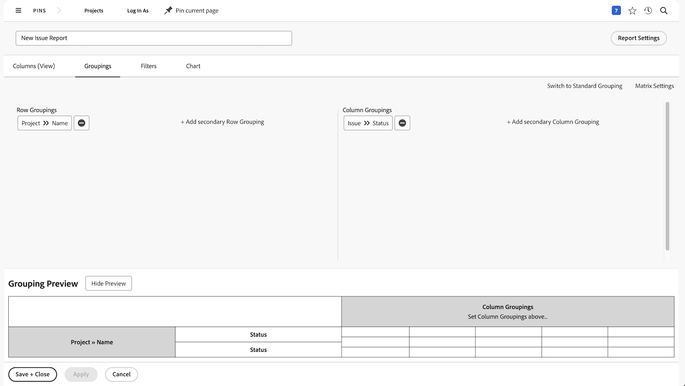

# Een matrixrapport maken

In deze video leert u:

* Wanneer een matrixrapport nuttig kan zijn
* En hoe te om een matrixrapport te creëren

>[!VIDEO](https://video.tv.adobe.com/v/335156/?quality=12&learn=on&enablevpops)

## Activiteit: Een matrixrapport maken

Creeer een matrixrapport dat toont hoeveel verzoeken er in elke status zijn, die door verzoekrij wordt gesorteerd. Zo krijgt u een snel overzicht van de hoeveelheid werk die binnenkomt en hoe goed u het bijhoudt.

U wilt dat de aanvraagrijen op de rijgroepen verschijnen. De status wordt weergegeven als kolomgroepen. Geef uw rapport de naam &quot;Verzoeken op status en Wachtrij aanvragen&quot;.

## Antwoord

1. Selecteer **[!UICONTROL Reports]** in het menu **[!UICONTROL Main Menu]** .
1. Klik op de optie **[!UICONTROL New Report]** en selecteer **[!UICONTROL Issue]** .
1. Ga naar de tab **[!UICONTROL Groupings]** en klik op **[!UICONTROL Switch to Matrix Grouping]** .
1. Selecteer voor [!UICONTROL Row Groupings] **[!UICONTROL Project]** > **[!UICONTROL Name]** .
1. Selecteer voor [!UICONTROL Column Grouping] **[!UICONTROL Issue]** > **[!UICONTROL Status]** .

   

1. Ga naar de tab **[!UICONTROL Filters]** .
1. Om ervoor te zorgen u slechts verzoeken in actieve verzoekrijen ziet, voeg de volgende filterregels toe:

   * [!UICONTROL Project] > [!UICONTROL Status Equates With] > [!UICONTROL Equal] > [!UICONTROL Current]
   * [!UICONTROL Queue Definition] > [!UICONTROL Is Public] > [!UICONTROL Not Equal] > [!UICONTROL None] (zo weten we dat een project in feite een aanvraagwachtrij is, waarbij de Wachtrijdefinitie wordt toegewezen aan een van de openbare opties.)

1. Klik op **[!UICONTROL Save + Close]** . Wanneer ertoe aangezet voor een rapportnaam, typ in &quot;Verzoeken door Status en de Rij van het Verzoek.&quot;

   
