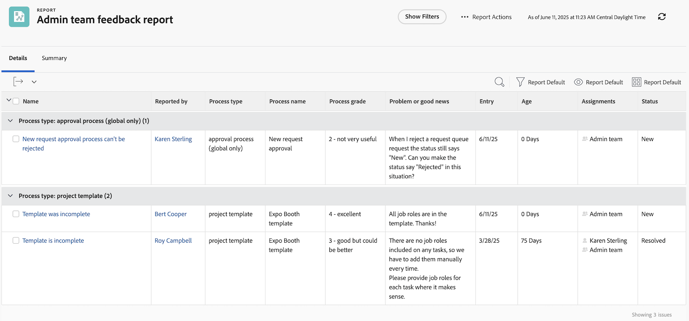
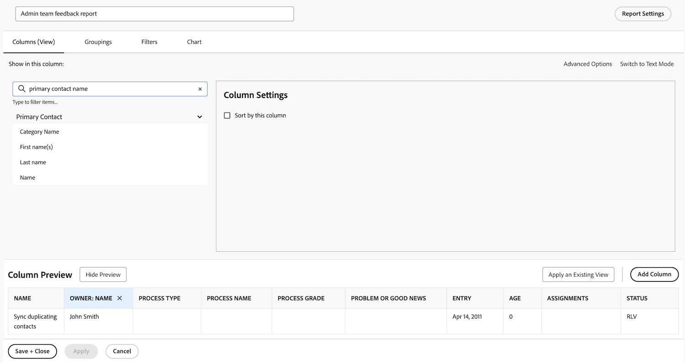

# Een taakrapport maken

In deze video leert u:

* Hoe te om een taakrapport met een complex filter te creëren
* Hoe te de rapporten vinden u creeert

>[!VIDEO](https://video.tv.adobe.com/v/335154/?quality=12&learn=on)

## Activiteiten van &quot;Een taakrapport maken&quot;

>[!TIP]
>
>Breek uit uw spatulas en het mengen bakken en ben bereid om &quot;recepten&quot;in onze [ Klant van Adobe Workfront te proberen die Cookbook ](/help/assets/workfront-customer-reporting-cookbook.pdf) meldt. Binnen zult u geleidelijke instructies voor 10 rapporten vinden, klaar voor u om in uw milieu vandaag te slaan.
>We hebben favoriete rapporten verzameld van klanten en ze samengebracht in een hanteerbaar, gemakkelijk verteerbaar, kookboek dat je kunt meenemen en uittesten in je eigen Workfront-keuken.
>Deze 10 rapporten komen van klanten die enkel zoals u zijn. Wij zijn de ongelooflijke klanten die een van hun favoriete rapporten hebben gedeeld, enorm dankbaar dat ze zich over verschillende sectoren, afdelingen, teams, posities en allemaal in verschillende bedrijven hebben verspreid. Sommige rapporten zijn eenvoudig (maar ongelooflijk nuttig), en sommige zijn complexer om uw rapportering naar het volgende niveau te brengen.

### Activiteit 1: Een notitierapport maken met aanwijzingen

Maak een notitierapport dat u kunt gebruiken om te zoeken naar gebruikersnotities (opmerkingen of updates) of systeemnotities op basis van de inhoud van de notitie, de auteur, de ingangsdatum, de projectnaam of het type audit. Geef het rapport &quot;Note Search&quot; een naam.

Wanneer het gebruiken van de herinnering van de Tekst van de Nota, zal dit rapport binnen updateverbindingen zoeken om het even welke snel te halen die aan de criteria voldoen die in de herinneringen worden gespecificeerd. Wanneer u het rapport in werking stelt, te hoeven u niet om elke herinnering in te vullen, enkel degenen u om geeft. De lege waarden worden automatisch genegeerd.

De weergave moet kolommen bevatten voor:

* Notititie
* Tekst controleren
* Invoerdatum
* Eigenaar: Naam
* Type controle
* Taaknaam
* Naam van uitgave

Laat het filtertabblad leeg.

Groep op projectnaam.

Neem vragen op voor het volgende:

* Tekst controleren
* Notititie
* Naam eigenaar
* Invoerdatum
* Projectnaam
* Type controle

### Antwoord 1

1. Selecteer **[!UICONTROL Reports]** in het menu **[!UICONTROL Main Menu]** .
1. Klik op het menu **[!UICONTROL New Report]** en selecteer **[!UICONTROL Note]** .
1. In **[!UICONTROL Columns (View)]** stelt u de kolommen zo in dat deze het volgende bevatten:

    te leiden

   * [!UICONTROL Note] > [!UICONTROL Note Text]
   * [!UICONTROL Note] > [!UICONTROL Audit Text]
   * [!UICONTROL Note] > [!UICONTROL Entry Date]
   * [!UICONTROL Owner] > [!UICONTROL Name]
   * [!UICONTROL Note] > [!UICONTROL Audit Type]
   * [!UICONTROL Task] > [!UICONTROL Name]
   * [!UICONTROL Issue] > [!UICONTROL Name]

1. Selecteer de kolom **[!UICONTROL Entry Date]** en wijzig **[!UICONTROL Sort to Descending]** .
1. Stel op het tabblad **[!UICONTROL Groupings]** het rapport in op groeperen met [!UICONTROL Project] > [!UICONTROL Name] .

    tot stand te brengen

1. Laat [!UICONTROL Filters] leeg.
1. Open **[!UICONTROL Report Settings]** en noem het rapport &quot;Notitie zoeken&quot;.
1. Plaats in het veld [!UICONTROL Description] iets als &#39;&#39;Zoeken naar systeem- of gebruikersnotities op basis van het geselecteerde audittype en andere aanwijzingen. De nota&#39;s van het systeem verschijnen in de kolom van de Tekst van de Controle en de nota&#39;s van de Gebruiker verschijnen in de kolom van de Tekst van de Nota.&quot;

   

1. Selecteer **[!UICONTROL Details Tab]** zodat deze wordt weergegeven wanneer het rapport wordt geladen.
1. Plaats het rapport om 200 punten te tonen wanneer het rapport op een dashboard wordt omvat.
1. Klik op **[!UICONTROL Report Prompts]** en voeg het volgende toe:

   

   * [!UICONTROL Note] > [!UICONTROL Audit Text]
   * [!UICONTROL Note] > [!UICONTROL Note Text]
   * [!UICONTROL Owner] > [!UICONTROL Name]
   * [!UICONTROL Note] > [!UICONTROL Entry Date]
   * [!UICONTROL Project] > [!UICONTROL Name]
   * [!UICONTROL Note] > [!UICONTROL Audit Type]

1. Schakel het selectievakje in voor **[!UICONTROL Show Prompts in Dashboards]** .
1. Sla uw rapport op en sluit het.

### Activiteit 2: Een feedbackrapport voor een beheerder maken

Dit is een uitgifterapport waarin alle problemen worden weergegeven uit een wachtrij voor feedbackverzoeken die voor systeembeheerders is gemaakt. U kunt zien hoe te om deze verzoekrij in te creëren [ creeer een systeem admin terugkoppelt verzoekrij ](https://experienceleague.adobe.com/docs/workfront-learn/tutorials-workfront/manage-work/request-queues/create-a-system-admin-feedback-request-queue.html?lang=nl-NL) leerprogramma.

Dit rapport gebruikt ook een aangepast formulier. Leren hoe te om een douanevorm tot stand te brengen, zie [ creeer en deel een douanevorm ](https://experienceleague.adobe.com/docs/workfront-learn/tutorials-workfront/custom-data/custom-forms/custom-forms-creating-and-sharing-a-custom-form.html?lang=nl-NL) leerprogramma.

Dit aangepaste formulier moet als volgt worden gemaakt:

Naam: feedback van beheerproces

1. Procestype (vervolgkeuzelijst)
   * toegangsniveaus
   * goedkeuringsproces (alleen algemeen)
   * e-mailberichten
   * lay-outsjabloon
   * mijlpad
   * projectsjabloon
   * herinneringsmeldingen
   * aanvraagwachtrij
1. Procesnaam (tekstveld met één regel)
1. Proceskwaliteit (vervolgkeuzelijst)
   * 1 - totaal nutteloos
   * 2 - niet erg nuttig
   * 3 - goed, maar beter
   * 4 - uitstekend
1. Probleem of goed nieuws (alineatekstveld)

Creeer een kwestie rapport genoemd **Admin team terugkoppelt rapport**.

De weergave moet de volgende kolommen hebben:

* Issue: Name
* Primaire contactpersoon: Naam
* Probleem: procestype
* Probleem: procesnaam
* Probleem: proceskwaliteit
* Probleem: probleem of goed nieuws
* Uitgifte: Datum van binnenkomst
* Uitgave: Leeftijd
* Probleem: toewijzingen
* Uitgave: status

Groeperen op procestype.

Filter op identiteitskaart van het project van de verzoekrij waar terugkoppelt kwesties verblijven.

 terug

### Antwoord 2

1. Selecteer **[!UICONTROL Reports]** in het menu **[!UICONTROL Main Menu]** .
1. Klik op het menu **[!UICONTROL New Report]** en selecteer **[!UICONTROL Issue]** .
1. In **[!UICONTROL Columns (View)]** stelt u de kolommen zo in dat deze het volgende bevatten:

    te leiden

   * [!UICONTROL Issue] > [!UICONTROL Name]
   * [!UICONTROL Primary Contact] > [!UICONTROL Name]
      * Opmerking: dit wordt weergegeven met &quot;Eigenaar:Naam&quot; als kolomlabel. U kunt dit in &quot;Gerapporteerd door&quot;veranderen door op Geavanceerde Opties te klikken en &quot;Gerapporteerd door&quot;in het **gebied van het Etiket van de Kolom van de 0&rbrace; Douane te typen.**
   * [!UICONTROL Issue] > [!UICONTROL Process type]
   * [!UICONTROL Issue] > [!UICONTROL Process name]
   * [!UICONTROL Issue] > [!UICONTROL Process grade]
   * [!UICONTROL Issue] > [!UICONTROL Problem or good news]
   * [!UICONTROL Issue] > [!UICONTROL Entry date]
   * [!UICONTROL Issue] > [!UICONTROL Age]
   * [!UICONTROL Issue] > [!UICONTROL Assignments]
   * [!UICONTROL Issue] > [!UICONTROL Status]

1. Selecteer de kolom **[!UICONTROL Entry Date]** en wijzig **[!UICONTROL Sort to Descending]** .
1. Stel op het tabblad **[!UICONTROL Groupings]** het rapport in op groeperen met **[!UICONTROL Issue]>[!UICONTROL Process type]** .

   

1. Voeg op het tabblad **[!UICONTROL Filters]** een filter voor **[!UICONTROL Issue]>[!UICONTROL Project ID]** toe om het gelijk te maken met het project voor de aanvraagwachtrij waar de feedbackproblemen zich bevinden.

   

1. Sla uw rapport op en sluit het.
