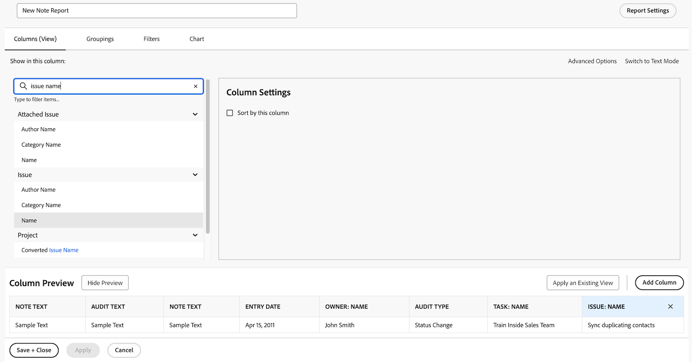

# Een taakrapport maken

In deze video leert u:

* Hoe te om een taakrapport met een complex filter te creëren
* Hoe te om de rapporten te vinden u creeert

>[!VIDEO](https://video.tv.adobe.com/v/335154/?quality=12)

## Activiteit: Een notitierapport met aanwijzingen maken

Maak een notitierapport dat u kunt gebruiken om te zoeken naar gebruikersnotities (opmerkingen of updates) of systeemnotities op basis van de inhoud van de notitie, de auteur, de ingangsdatum, de projectnaam of het type audit. Geef het rapport &quot;Note Search&quot; een naam.

Wanneer het gebruiken van de herinnering van de Tekst van de Nota, zal dit rapport binnen updateverbindingen zoeken om het even welke snel te halen die aan de criteria voldoen die in de herinneringen worden gespecificeerd. Wanneer u het rapport uitvoert, hoeft u niet elke vraag in te vullen, alleen de vragen die u belangrijk vindt. De lege waarden worden automatisch genegeerd.

De weergave moet kolommen bevatten voor:

* Notitie
* Tekst controleren
* Invoerdatum
* Eigenaar: Naam
* Type controle
* Taaknaam
* Naam van uitgave

Laat het filtertabblad leeg.

Groep op projectnaam.

Neem vragen op voor het volgende:

* Tekst controleren
* Notitie
* Naam eigenaar
* Invoerdatum
* Projectnaam
* Type controle

## Antwoord

1. Selecteren **[!UICONTROL Reports]** van de **[!UICONTROL Main Menu]**.
1. Klik op de knop **[!UICONTROL New Report]** en selecteert u **[!UICONTROL Note]**.
1. In **[!UICONTROL Columns (View)]** Stel uw kolommen zo in dat deze bevatten:

   

   * [!UICONTROL Note] > [!UICONTROL Note Text]
   * [!UICONTROL Note] > [!UICONTROL Audit Text]
   * [!UICONTROL Note] > [!UICONTROL Entry Date]
   * [!UICONTROL Owner] > [!UICONTROL Name]
   * [!UICONTROL Note] > [!UICONTROL Audit Type]
   * [!UICONTROL Task] > [!UICONTROL Name]
   * [!UICONTROL Issue] > [!UICONTROL Name]

1. Selecteer **[!UICONTROL Entry Date]** en wijzigt u de **[!UICONTROL Sort to Descending]**.
1. In de **[!UICONTROL Groupings]** tab, stel het rapport in op groeperen op [!UICONTROL Project] > [!UICONTROL Name].

   

1. Verlaten [!UICONTROL Filters] leeg.
1. Openen **[!UICONTROL Report Settings]** en noem het rapport &quot;Notitie zoeken&quot;.
1. In de [!UICONTROL Description] veld, zet iets als &quot;Zoeken naar systeem- of gebruikersnotities op basis van het geselecteerde type controle en andere aanwijzingen. De nota&#39;s van het systeem verschijnen in de kolom van de Tekst van de Controle en de nota&#39;s van de Gebruiker verschijnen in de kolom van de Tekst van de Nota.&quot;

   

1. Selecteren **[!UICONTROL Details Tab]** zodat het toont wanneer het rapport laadt.
1. Plaats het rapport om 200 punten te tonen wanneer het rapport op een dashboard wordt omvat.
1. Klikken **[!UICONTROL Report Prompts]** en toevoegen:

   

   * [!UICONTROL Note] > [!UICONTROL Audit Text]
   * [!UICONTROL Note] > [!UICONTROL Note Text]
   * [!UICONTROL Owner] > [!UICONTROL Name]
   * [!UICONTROL Note] > [!UICONTROL Entry Date]
   * [!UICONTROL Project] > [!UICONTROL Name]
   * [!UICONTROL Note] > [!UICONTROL Audit Type]

1. Schakel het selectievakje in voor **[!UICONTROL Show Prompts in Dashboards]**.
1. Sla uw rapport op en sluit het.
