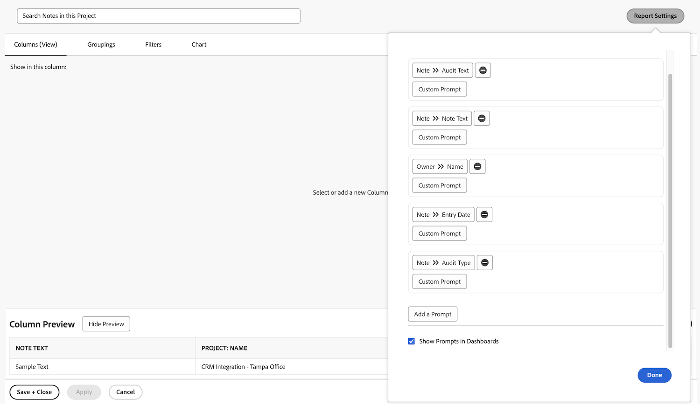

# Dashboards maken

De video biedt een uitgebreide gids voor het begrijpen en gebruiken van dashboards in Workfront.
&#x200B;Hierin wordt uitgelegd dat een dashboard een verzameling rapporten is waarmee gebruikers gerelateerde gegevens op één locatie kunnen ordenen en weergeven.

>[!VIDEO](https://video.tv.adobe.com/v/335157/?quality=12&learn=on&enablevpops=0)

## Toetsen

* **dashboards in Workfront:** A dashboard is een inzameling van rapporten die gebruikers toestaat om verwante gegevens, zoals projecten, taken, en kwesties, in één gecentraliseerde mening te organiseren en te tonen. &#x200B;
* **Creërend Dashboards:** De dashboards kunnen worden aangepast door een lay-out te selecteren, rapporten, douanecalendars, of externe pagina&#39;s toe te voegen, en hen te rangschikken voor optimale vertoning. &#x200B; Gebruikers kunnen ook aanpassen welke kolommen naast elkaar worden weergegeven in rapporten in het dashboard. &#x200B;
* **die tot Dashboards toegang hebben:** De dashboards kunnen onder &quot;Mijn Dashboards,&quot;&quot;Gedeelde Dashboards,&quot;of &quot;Alle Dashboards&quot;in het gebied van Dashboards worden gevonden. &#x200B; Veelgebruikte dashboards kunnen worden vastgezet of aan favorieten voor snelle toegang worden toegevoegd. &#x200B;
* **het Delen van Dashboards:** De dashboards kunnen met andere gebruikers van Workfront, met inbegrip van alle rapporten binnen het dashboard, via het menu van de Acties van het Dashboard worden gedeeld. &#x200B;
* **het Afdrukken Dashboards:** De dashboards kunnen direct van het menu van de Acties van het Dashboard worden gedrukt, makend het gemakkelijk om fysieke exemplaren van de gegevens te delen. &#x200B;

## Activiteiten voor &#39;dashboard maken&#39;

### Activiteit 1: Een dashboard maken

Maak een [!UICONTROL dashboard] met slechts één rapport erin: &quot;Zoeknotities in dit project&quot;. Dit is nuttig om snel om het even welke update te vinden die op een project wordt gemaakt, zelfs als er duizenden updates zijn door te zoeken. Hiermee zoekt u naar updateverbindingen om snel updates te extraheren die voldoen aan de criteria die u opgeeft in de aanwijzingen.

Maak dit rapport door een kopie te maken van het rapport &#39;Zoeknotities&#39; dat u hebt gemaakt in de activiteit &#39;Een notitierapport maken&#39;. Hebt u het nog niet gemaakt? Klik hier om de activiteit in [&#x200B; te zien creeer een 1&rbrace; leerprogramma van het taakrapport &lbrace;.](https://experienceleague.adobe.com/en/docs/workfront-learn/tutorials-workfront/reporting/basic-reporting/create-a-task-report#activity-1-create-a-note-report-with-prompts)

* Verwijder de herinnering van de Naam van het Project uit het exemplaar en noem het rapport &quot;Nota&#39;s van het Onderzoek in Dit Project.&quot;anders
* Geef de naam [!UICONTROL Dashboard] &quot;Zoeknotities&quot;.
* Ga naar een openingspagina voor projecten en maak een aangepaste sectie voor een [!UICONTROL dashboard] .
* Merk op dat wanneer u naar nota&#39;s in uw douanesectie zoekt het slechts nota&#39;s zal tonen bevat binnen het project u momenteel in bent.

### Antwoord 1

1. Voer het rapport uit dat u hebt gemaakt in de activiteit Een notitierapport maken. Hebt u het nog niet gemaakt? Klik hier om de activiteit in [&#x200B; te zien creeer een 1&rbrace; leerprogramma van het taakrapport &lbrace;.](https://experienceleague.adobe.com/en/docs/workfront-learn/tutorials-workfront/reporting/basic-reporting/create-a-task-report#activity-1-create-a-note-report-with-prompts)
1. Klik op **[!UICONTROL Report Actions]** en selecteer **[!UICONTROL Copy]** . [!DNL Workfront] maakt een nieuw rapport met de naam &quot;Notitie zoeken (kopiëren)&quot;.
1. Ga naar **[!UICONTROL Report Actions]** en selecteer **[!UICONTROL Edit]** . Klik op **[!UICONTROL Report Settings]** en wijzig de naam in &quot;Notities zoeken in dit project&quot;.
1. Klik op [!UICONTROL Report Prompts] en verwijder de aanwijzing [!UICONTROL Project] > [!UICONTROL Name] uit de lijst.

    te creëren

1. Schakel het selectievakje **[!UICONTROL Show Prompts in Dashboard]** in.
1. Klik op **[!UICONTROL Done]** en vervolgens op **[!UICONTROL Save + Close]** . U bekijkt nu het [!UICONTROL Prompts] scherm van het rapport.

   Vervolgens gebruikt u een sneltoets om een nieuw dashboard te maken en dit rapport hieraan toe te voegen.

1. Klik op **[!UICONTROL Report Actions]** en selecteer **[!UICONTROL Add to Classic Dashboard]** > **[!UICONTROL New Dashboard]**.
1. Sleep het rapport &#39;Zoeknotities in dit project&#39; naar het deelvenster **[!UICONTROL Layout]** .
1. U ziet dat de naam van het rapport de naam van het dashboard wordt. Bewerk de naam alleen in &quot;Notities zoeken&quot;.

    te creëren

1. Klik op **[!UICONTROL Save + Close]**.

   Voeg nu het dashboard aan een projectpagina toe.

    te creëren

1. Ga naar elk project. Klik in het menu van het linkerdeelvenster op de knop **[!UICONTROL Add a Dashboard]** .
1. Typ in het veld **[!UICONTROL Choose a dashboard]** de optie &#39;Notities zoeken&#39; en selecteer de optie [!UICONTROL dashboard] in de lijst.
1. Typ in het veld **[!UICONTROL Quick link name]** de tekst &quot;Zoeknotities&quot;.
1. Klik op **[!UICONTROL Add]**.
1. Zoek in het linkerdeelvenstermenu de zoeknotities onderaan. Klik op de stippen links van de naam en sleep deze naar rechts onder Updates.
