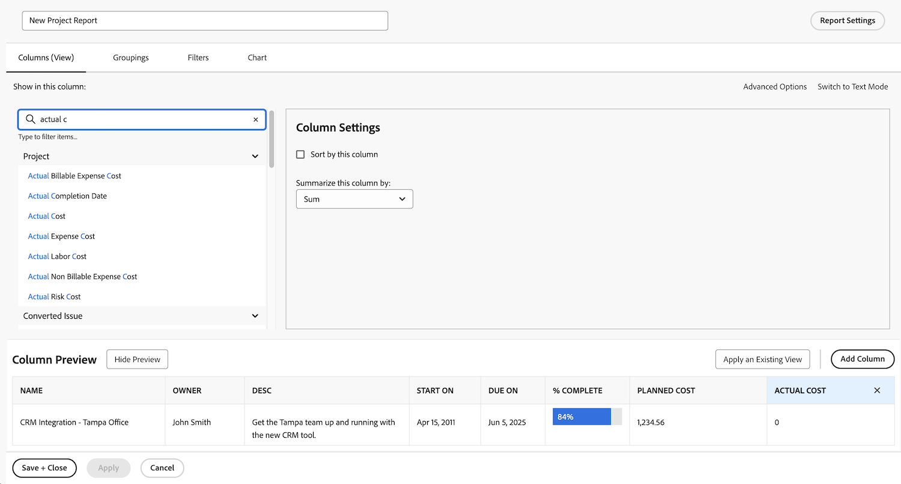
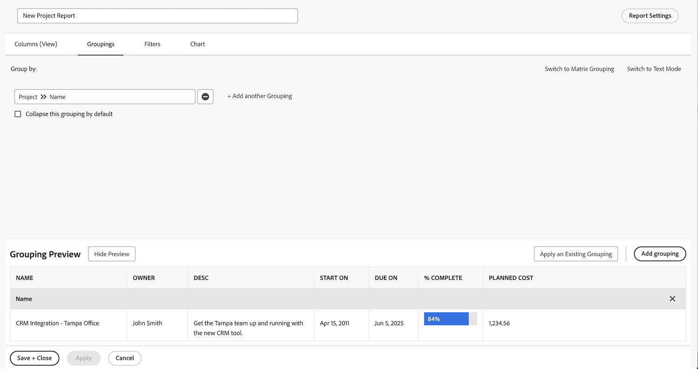
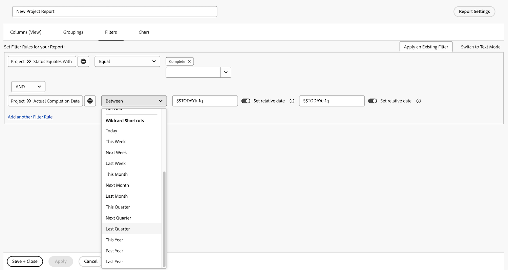
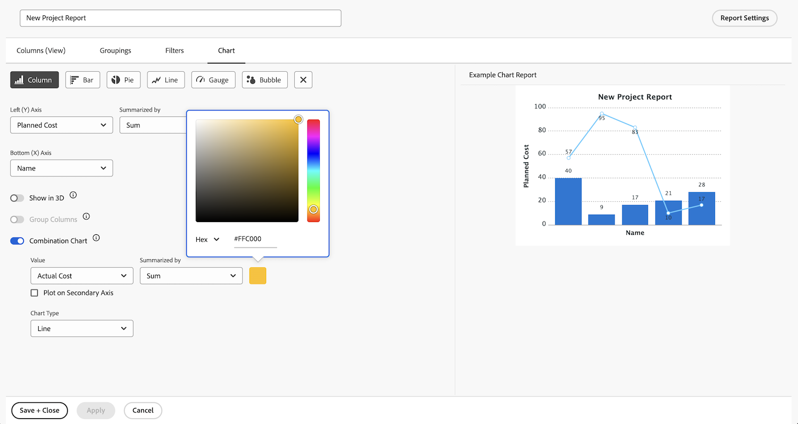

# Rapporten maken met grafieken

In deze video leert u:

* Hoe grafieken de visualisatie van gegevens kunnen verbeteren
* Workfront-grafiekgereedschappen gebruiken

>[!VIDEO](https://video.tv.adobe.com/v/335155/?quality=12&learn=on)

## Rapporten maken met grafiekactiviteiten

[ klik hier ](/help/assets/create-reports-with-charts-activities.pdf) om een PDF van deze pagina te downloaden.

### Activiteit 1: Een grafiek toevoegen aan een rapport

Het einde van het kwartaal nadert en u wilt zien hoe recent voltooide projecten zich aan hun budget hebben gekleed. Maak een rapport met de geplande kosten ten opzichte van de werkelijke kosten voor projecten. U wilt alleen projecten zien die in het laatste kwartaal zijn voltooid. Voeg een kleurengrafiek van de combinatiekolom toe gebruikend douanekleuren.

### Antwoord 1

1. Selecteer **[!UICONTROL Reports]** in het menu **[!UICONTROL Main Menu]** .
1. Klik op het menu **[!UICONTROL New Report]** en selecteer **[!UICONTROL Project]** .
1. Klik op het tabblad **[!UICONTROL Columns (View)]** op **[!UICONTROL Add Column]** .
1. Selecteer [!UICONTROL Project] > [!UICONTROL Planned Cost] en vat deze kolom samen met **[!UICONTROL Sum]** .
1. Klik nogmaals op **[!UICONTROL Add Column]** .
1. Selecteer [!UICONTROL Project] > [!UICONTROL Actual Cost] en vat deze kolom samen met **[!UICONTROL Sum]** .

   

1. Stel op het tabblad **[!UICONTROL Groupings]** het rapport in op groeperen met [!UICONTROL Project] > [!UICONTROL Name] .

   

1. Voeg op het tabblad **[!UICONTROL Filters]** twee filterregels toe:

   * [!UICONTROL Project] > [!UICONTROL Status Equates With] > [!UICONTROL Complete]
   * [!UICONTROL Project] >[!UICONTROL  Actual Completion Date] > [!UICONTROL Last Quarter]

   

1. Kies op het tabblad **[!UICONTROL Chart]** de optie **[!UICONTROL Column]** voor het diagramtype.
1. Kies voor de [!UICONTROL Left (Y) Axis] de optie [!UICONTROL Project] > [!UICONTROL Planned Cost] .
1. Kies voor de [!UICONTROL Bottom (X) Axis] de optie [!UICONTROL Project] > [!UICONTROL Name] .
1. Klik op de knop **[!UICONTROL Combination Chart]** en selecteer [!UICONTROL Project] > [!UICONTROL Actual Cost] in het veld **[!UICONTROL Value]** .
1. Klik op de pijl naast het kleurvak om de [!UICONTROL Actual Cost] -kleur te wijzigen. Selecteer een van de kleuren die wordt weergegeven of klik op het vak in de rechterbenedenhoek om het kleurenpalet weer te geven.
1. Klik op **[!UICONTROL Save + Close]** . Wanneer ertoe aangezet voor een rapportnaam, noem het &quot;Gepland vs Ware Kosten door Project Voltooid Laatste Kwartaal.&quot;

   
