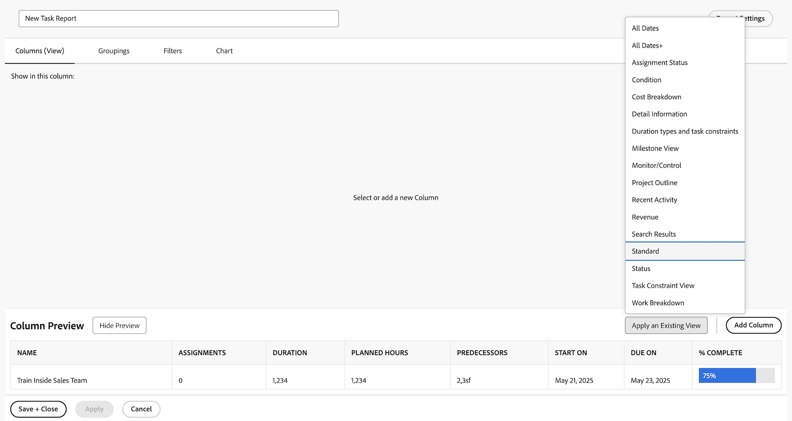
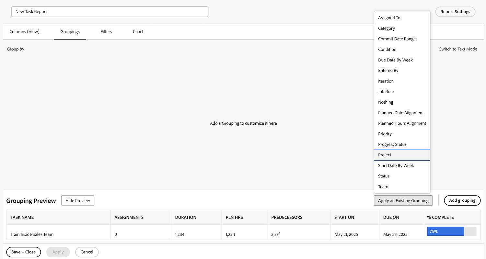
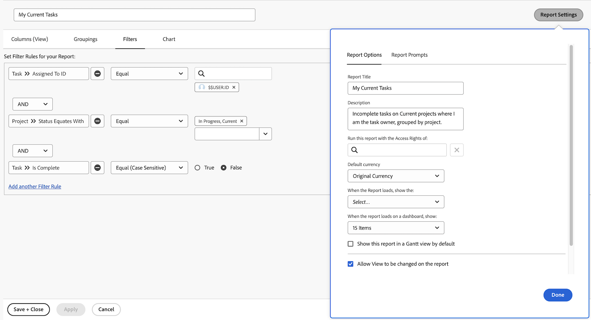

# Eenvoudige rapportactiviteiten maken

Praktijk die eenvoudige rapporten, met geleidelijke instructies creeert.

## Activiteit 1: Een eenvoudig taakrapport maken

U wilt al uw actieve taken in één enkel rapport volgen. Creeer een rapport van de Taak genoemd &quot;Mijn Huidige Taken&quot;gebruikend het volgende:

* Kolommen (weergave) = Standaard
* Groepen = Project
* Filter = Mijn huidige taken
* Beschrijving = Onvolledige taken op Huidige projecten waar ik de taakeigenaar ben, gegroepeerd door project.

## Antwoord 1

1. Ga naar de **[!UICONTROL Main Menu]** en selecteer **[!UICONTROL Reports]** .
1. Klik op de vervolgkeuzelijst **[!UICONTROL New Report]** en selecteer **[!UICONTROL Task Report]** .
1. Klik in [!UICONTROL Columns (View)] op het menu **[!UICONTROL Apply an Existing View]** en selecteer **[!UICONTROL Standard]** .

    te creëren

1. Klik op het tabblad **[!UICONTROL Groupings]** op het menu **[!UICONTROL Apply an Existing Grouping]** en selecteer **[!UICONTROL Project]** .

    tot stand te brengen

1. Klik op het tabblad **[!UICONTROL Filters]** op het menu **[!UICONTROL Apply an Existing Filter]** en selecteer Mijn huidige taken.

    tot stand te brengen

1. Open **[!UICONTROL Report Settings]** en noem het rapport &quot;Mijn Huidige Taken.&quot;
1. Voer in het veld Beschrijving &quot;Niet voltooid&quot; in
taken voor lopende projecten waar ik de taak ben
eigenaar, gegroepeerd op project.&quot;

   

1. Sla uw rapport op en sluit het.
