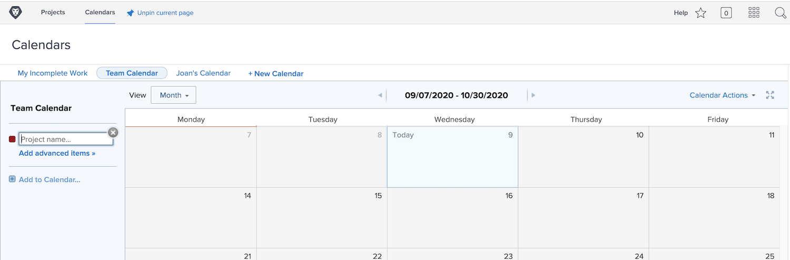
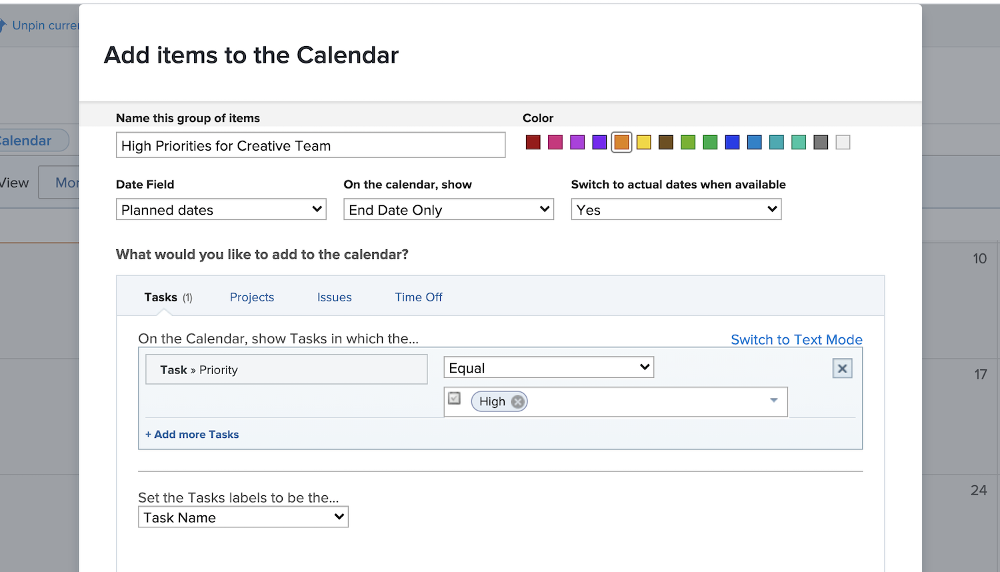
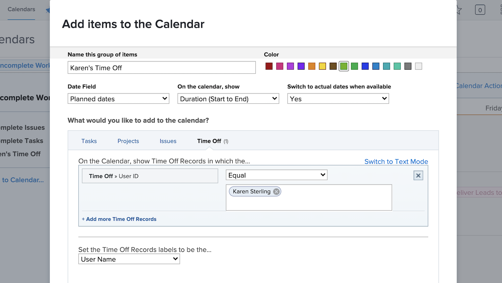

# Een aangepaste kalender maken

In deze sectie leert u hoe u:

* Een nieuwe kalender maken
* Een kalendergroep maken
* Werkitems toevoegen aan de kalendergroep
* Een tijd van een kalender maken

Hier is hoe u uw eigen aangepaste kalender kunt maken.

## Voeg eerst een nieuwe kalender toe

1. Van de **[!UICONTROL Main Menu]**, selecteert u de **[!UICONTROL Calendars]** gebied.
1. Klik op de knop **[!UICONTROL New Calendar]** optie.
1. Typ een naam voor de kalender en druk op **[!UICONTROL Return]**.

## Voeg vervolgens een kalendergroep toe

1. Om punten met betrekking tot een specifiek project te tonen, ga de projectnaam in [!UICONTROL grouping] veld (alle taken met betrekking tot dat project worden weergegeven).
1. Of klik op de knop **[!UICONTROL Add advanced items]** optie om werkitems van diverse projecten in het systeem op te nemen.

## Ten derde, voeg het werkpunten aan de kalendergroep toe

1. Geef de groepering een naam die aangeeft wat er wordt weergegeven.
1. Selecteer een kleuraanduiding voor de groep.
1. Selecteer welk datumtype u wilt gebruiken—[!UICONTROL Projected dates], [!UICONTROL Planned dates], of [!UICONTROL Custom]. ([!UICONTROL Custom] datumvelden zijn datumvelden die zijn opgenomen op [!UICONTROL custom forms].)
1. Selecteer welke datums u in de kalender wilt weergeven—[!UICONTROL End Date Only], [!UICONTROL Start Date Only], of [!UICONTROL Duration (Start to End)].
1. Als u wilt weergeven [!UICONTROL Actual dates] als die informatie beschikbaar is, selecteert u Ja in het menu. Selecteer Nee als u altijd het geselecteerde datumtype wilt ([!UICONTROL Projected], [!UICONTROL Planned], of [!UICONTROL Custom]) weer te geven.
1. Selecteer het type objectgegevens dat u wilt weergeven in de kalender—[!UICONTROL Tasks], [!UICONTROL Projects], [!UICONTROL Issues], of [!UICONTROL Time Off].
1. Stel de filters in om de gewenste informatie weer te geven.
1. Klik op **[!UICONTROL Save]**.

>[!NOTE]
>
>U kunt extra groepen toevoegen aan een bestaande kalender met de optie Toevoegen aan kalender.

## Een kalender maken met persoonlijke tijd uit

[!DNL Workfront] biedt een manier waarop u de tijd kunt opgeven met de persoonlijke time-off functie in uw gebruikersprofiel. Hiermee wordt aan projectmanagers gemeld dat u niet beschikbaar bent en kunnen geplande voltooiingsdatums indien nodig automatisch of handmatig worden aangepast.

In het gebied van de Kalender, kunt u een kalendermening tot stand brengen die deze tijd van ingangen toont.

Een kalender maken voor een bepaalde persoon:

1. Klikken **[!UICONTROL Add to Calendar]** in het linkerdeelvenster.
1. Klik op **[!UICONTROL Add advanced items]**.
1. Geef de groepering een naam die aangeeft wat er wordt weergegeven.
1. Selecteer een kleuraanduiding voor de groep.
1. Stel de [!UICONTROL Date Field] tot [!UICONTROL Planned dates].
1. Selecteer welke datums u in de kalender wilt weergeven—[!UICONTROL Duration].
1. Negeren hoe de informatie wordt weergegeven als de werkelijke datums niet beschikbaar zijn. Dit is niet van toepassing.
1. Selecteren [!UICONTROL Time Off] voor het type informatie dat u wilt zien.
1. Stel voor het filter de gebruikersnaam in op de naam van het teamlid.
1. Klik op **[!UICONTROL Save]**.

