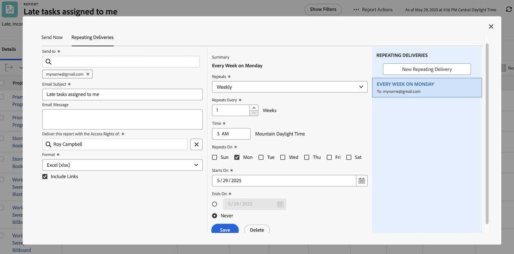

# Rapporten effectief verzenden en delen

In deze video leert u:

* Hoe te om rapporten naar gebruikers, teams, of om het even welk e-mailadres te verzenden
* Hoe te om rapporten met iedereen te delen
* Wat de ontvangers kunnen zien en doen met een Workfront-rapport

>[!VIDEO](https://video.tv.adobe.com/v/335158/?quality=12&learn=on&enablevpops=0)

## Toetsen

* **verzendt Rapporten naar Externe Gebruikers:** u kunt rapporten naar gebruikers verzenden niet-Workfront door hun e-mailadressen in te gaan, die het gemakkelijk maken om gegevens buiten uw organisatie te delen. &#x200B;
* **Zichtbaarheid van het Controle van de Rechten van de Toegang:** de mening van de ontvanger van het rapport hangt van de toegangsrechten af u plaatst, die gegevensveiligheid en aangewezen zicht verzekeren. &#x200B;
* **Herhalende Levering voor Momentopnamen:** Geplande leveringen verstrekken bevroren momentopnamen van gegevens op specifieke tijden, nuttig voor het volgen van tendensen en het handhaven van een geschiedenis van projectgegevens. &#x200B;
* **het Delen van Rapporten met Teams:** de Rapporten kunnen met individuen, teams, of baanrollen worden gedeeld, die of mening verlenen of rechten beheren. &#x200B; De gedeelde rapporten verschijnen in de gebruikers &quot;Gedeeld met me&quot;sectie. &#x200B;
* **Openbaar en systeem-breed delen:** de rapporten kunnen via openbare verbindingen voor externe gebruikers worden gedeeld of zichtbaar voor alle gebruikers van Workfront worden gemaakt, die flexibiliteit in gegevens het delen aanbieden.

## Activiteiten van &quot;rapporten verzenden en delen&quot;

### Activiteit 1: Een rapport verzenden

Verzend elke maandag om 5.00 uur een rapport als spreadsheet van Excel. Dit is een goede manier om wekelijkse rapporten automatisch te verzamelen die u kunt later gebruiken om tendensen te zien.

### Antwoord 1

1. Geef een rapport weer dat u hebt gemaakt en kies **[!UICONTROL Send Report]** in het menu **[!UICONTROL Report Actions]** .
1. Klik op de tab **[!UICONTROL Repeating Deliveries]** .
1. Plaats uw e-mailadres in het veld **[!UICONTROL Send to]** .
1. Geef een e-mailonderwerp op.
1. Wijzig de indeling in Excel.
1. Stel **[!UICONTROL Repeats]** in op [!UICONTROL Weekly] .
1. Stel de waarde [!UICONTROL Time] in op 5 uur.
1. Stel [!UICONTROL Repeats On] in op maandag.
1. Klik op **[!UICONTROL Save]**.

>[!NOTE]
>
>Let op uw nieuwe herhaalde levering in het deelvenster [!UICONTROL Repeating Deliveries] aan de rechterkant. U kunt meerdere leveringen voor een rapport instellen en deze worden hier weergegeven.

**DELETE A LEVERING**

Selecteer de levering die u net hebt gemaakt en klik op Verwijderen (naast de knop **[!UICONTROL Save]** ).
