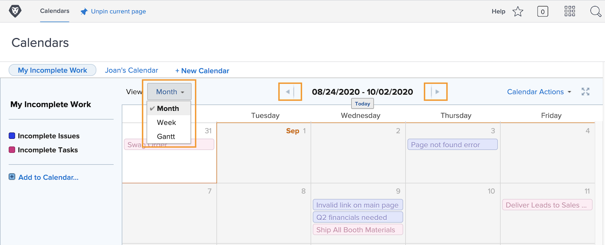
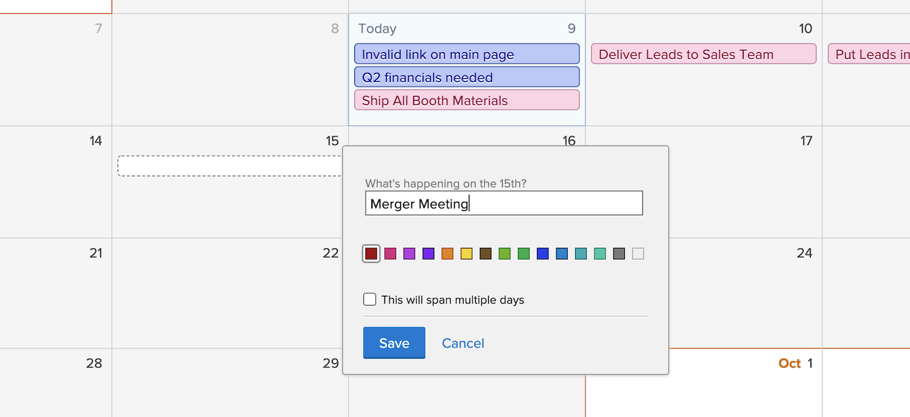

# De kalenderinterface begrijpen

In deze sectie leert u meer over:

* Kalendergroepen
* Kalenderweergaven
* Menu Kalenderhandelingen
* En hoe u een ad-hocagendapunt maakt

Voordat u uw eigen aangepaste kalenders maakt, bekijkt u eerst welke basisfuncties beschikbaar zijn voor aangepaste kalenders.

## Kalendergroepen

Eén kalender kan worden ingedeeld in afzonderlijke werkitemgroepen. Elke groepering kan worden in- en uitgeschakeld, zodat gebruikers zich kunnen concentreren op de werkitems die op elk moment het belangrijkst zijn.

## Kalenderweergaven

De kalender kan worden weergegeven in maand, week of [!UICONTROL Gantt] gebruiken. Gebruik de schuifbalk aan de zijkant of de pijlen aan de bovenkant om door de kalender te bladeren. De [!UICONTROL Gantt] de mening laat u uw werk van een verschillend perspectief zien. Zoek de weergave die het beste voor u werkt.

![Een afbeelding van het kalenderscherm in het deelvenster [!UICONTROL Gantt] weergave](assets/calendar-1-1bb.png)

## [!UICONTROL Calendar Actions] menu

Net als andere werkitems hebben kalenders een [!UICONTROL Actions] menu, waarmee u weekends op een kalender kunt weergeven. een kalender te verwijderen of te kopiëren; een kalender delen met individuele Workfront-gebruikers, systeembreed of met externe gebruikers; en voeg de kalender toe aan uw [!UICONTROL Favorites] -menu.

![Een afbeelding van de [!UICONTROL Calendar Actions] scherm](assets/calendar-1-1c.png)

## Modus Volledig scherm

U kunt de kalender op volledig scherm weergeven door op het pictogram voor volledig scherm te klikken. Klik nogmaals om terug te keren naar de oorspronkelijke grootte.

## Samenvattingsinformatie

Selecteer een item in de kalender om samenvattingsdetails van dat item weer te geven, zoals naam, oorsprong project, status, toewijzing, status van de voortgang en vervaldatum.

## Ad-hocgebeurtenissen

Dubbelklik om ad-hocgebeurtenissen te maken in een kalender die uw schema of andere werkitems vertegenwoordigen.

>[!NOTE]
>
>Als u een ad-hocgebeurtenis maakt, wordt GEEN taak in Workfront gemaakt.

