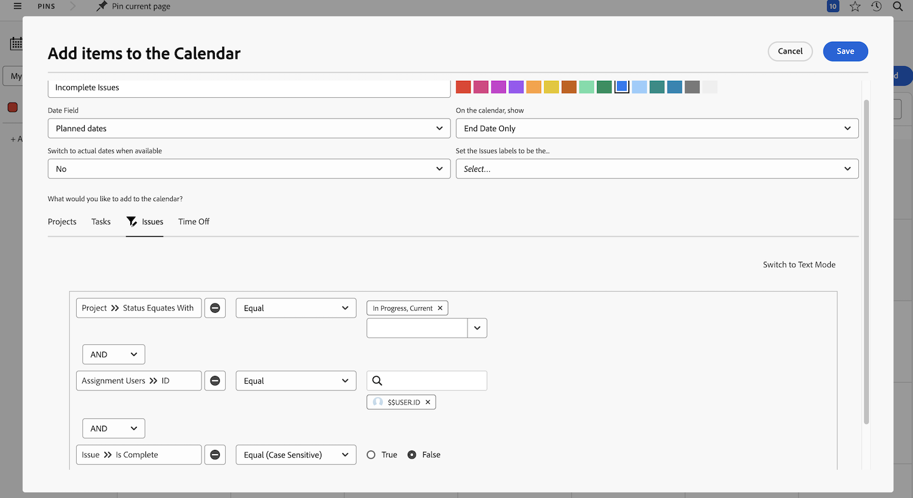
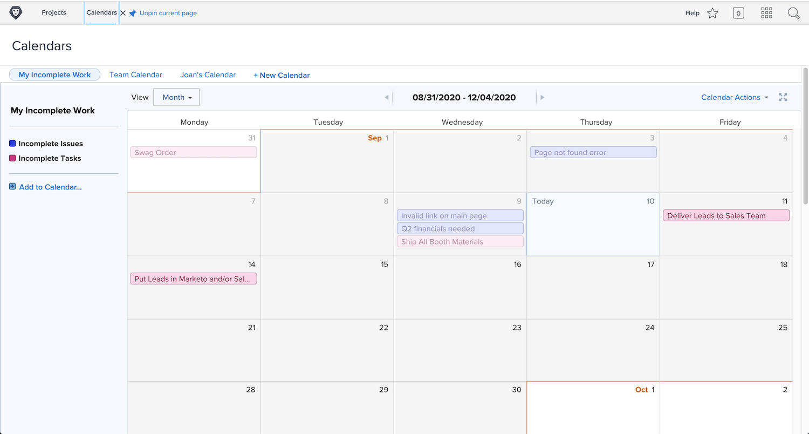

# Uw beurt om een kalenderrapport te creëren

In deze activiteit zult u ervaring op het creëren van uw eigen kalender krijgen.

## Activiteit: Een kalender maken

Maak een klantkalender met de naam &quot;Mijn onvolledige werk&quot;.

Omvat een kalendergroep genoemd &quot;Onvolledige Taken&quot;tonend alle onvolledige die taken aan u op Huidige projecten worden toegewezen.

Selecteer rood als kleur voor deze items.

Neem een andere kalendergroep op met de naam &quot;Onvolledige problemen&quot;, waarin alle onvolledige problemen worden weergegeven die aan u zijn toegewezen voor huidige projecten. Selecteer blauw als kleur voor deze items.

## Antwoord

1. Navigeer naar het gebied Kalenders in het menu Main.
1. Klik op de knop Nieuwe kalender en geef de kalender de naam &quot;Mijn onvolledige werk&quot;.
1. Klik onder de eerste groep op Geavanceerde items toevoegen.
1. In Add punten aan het kalendervenster dat omhoog springt, noem de groep &quot;Onvolledige Taken.&quot;
1. Selecteer rood als kleur.
1. Wijzig het datumveld in Geplande datums.
1. Stel de optie Op in de kalender in en geef het veld alleen op Einddatum weer.
1. Stel de optie Overschakelen naar werkelijke datums in als het veld beschikbaar is in op Nee.

   

1. In wat wilt u toevoegen aan de kalender? selecteert u Taken.
1. Voeg drie filterregels toe:

   * Project > Status is gelijk aan > Gelijk > Huidig
   * Toewijzingsgebruikers > ID > Gelijk > $$USER.ID
   * Taak > Is voltooid > Gelijk > Onwaar

1. Klik op Opslaan.

   

1. Maak een tweede groep door op Toevoegen aan kalender te klikken.
1. Klik onder deze groep op Geavanceerde items toevoegen.
1. In Add punten aan het kalendervenster dat omhoog opduikt, noem de groep &quot;Onvolledige Kwesties.&quot;
1. Selecteer blauw als kleur.
1. Wijzig het datumveld in Geplande datums.
1. Stel de optie Op in de kalender in en geef het veld alleen op Einddatum weer.
1. Stel de optie Overschakelen naar werkelijke datums in als het veld beschikbaar is in op Nee.
1. In wat wilt u toevoegen aan de kalender? selecteert u Problemen.
1. Voeg de volgende drie filterregels toe:

   * Project > Status is gelijk aan > Gelijk > Huidig
   * Toewijzingsgebruikers > ID > Gelijk > $$USER.ID
   * Issue > Is Complete > Equal > False

1. Klik op Opslaan.

   

Omdat u $$USER.ID in de filters gebruikte, kunt u deze kalender met anderen delen en zullen zij hun eigen onvolledige taken en kwesties zien.
