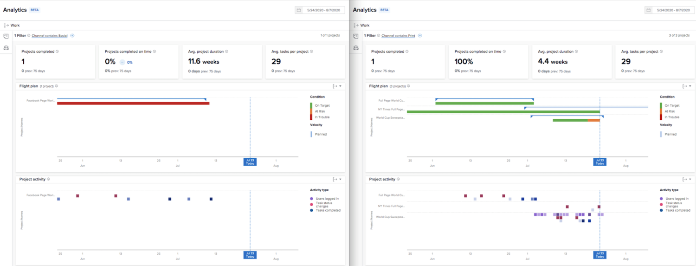

# KPI&#39;s begrijpen in [!UICONTROL Enhanced Analytics]

In deze video leert u:

* Hoe te om waarde van de KPI gegevens te krijgen

>[!VIDEO](https://video.tv.adobe.com/v/335046/?quality=12)

## KPI&#39;s vergelijken

KPIs verstrekt niet alleen waardevolle informatie voor wat in het heden gebeurt, maar zij geven gebruikers de macht om veranderingen in activiteit in tijd of het verschil tussen portefeuilles, programma&#39;s, projecteigenaars, of een ander gebruikt filter te vergelijken.

U kunt bijvoorbeeld analyses in twee browsertabbladen opnemen om KPI&#39;s te vergelijken.
