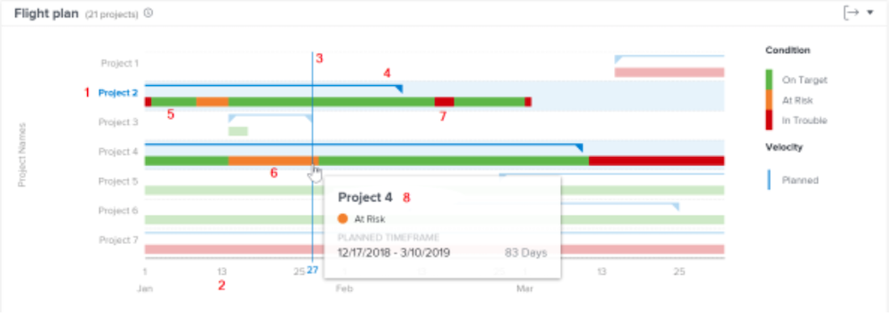
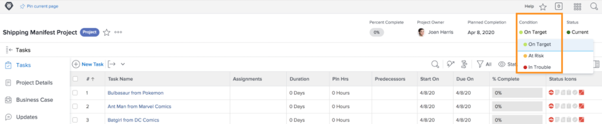

# Werken met navigatie- en revisieprojecten in [!UICONTROL Enhanced Analytics]

In deze video leert u:

* Hoe te om de grafiek van het vliegplan te lezen

>[!VIDEO](https://video.tv.adobe.com/v/335047/?quality=12&learn=on)

## Vluchtschema

Op het diagram ziet u:

1. De namen van projecten staan links.
1. Datums worden onderaan weergegeven.
1. De verticale blauwe lijn geeft de specifieke datum weer waarop de muis wordt geplaatst.
1. Horizontale blauwe lijnen geven de geplande begin- en einddatum van het project aan.
1. De groene lijnen wijzen erop het project op Doel is is.
1. Oranje lijnen geven aan dat het project risico loopt.
1. De rode lijnen wijzen op het project in Problemen is.

Aan de hand van deze informatie over uw projecten kunt u bepalen:

* Welke gebeurtenissen een project verlengen na de geplande afsluitdatum.
* Wanneer een project op kwesties begint te lopen.
* Hoeveel projecten zijn er in dezelfde periode open?
* Hoeveel projecten zijn actief.
* Welke projecten hebben extra aandacht of steun nodig.

## Voorwaarde is gebaseerd op de vorderingsstatus

De projectvoorwaarde is een visuele weergave van hoe het project vordert. Workfront bepaalt de voorwaarde die op vooruitgangsstatus van taken binnen het project wordt gebaseerd.

De voorwaarde van een project kan worden geplaatst:

* **Handmatig**, door gebruikers met toegang om het project te beheren, wanneer het de voorwaardetype van het project aan hand wordt geplaatst. Dit staat u toe om de voorwaarde van het project onafhankelijk van de kritieke weg te plaatsen.
* **Automatisch**, door Workfront, wanneer het voorwaardetype van het project aan de Status van de Voortgang wordt geplaatst.

Workfront raadt u aan het voorwaardetype in te stellen op Progress Status zodat u een duidelijke indicatie hebt van de werkelijke voortgang van het project, op basis van de voortgang van uw taken.

Wanneer ingesteld op Voortgangsstatus, kan de projectvoorwaarde:

* **Op doel**—Wanneer de vooruitgangsstatus van de laatste taak op de kritieke weg op Tijd is, zal de voorwaarde van het project op Doel zijn. Het project is op schema om op schema te eindigen.
* **Risico**—Wanneer de vooruitgangsstatus van de laatste taak op de kritieke weg Achter of Op Risico is, dan is de voorwaarde van het project Op Risico. Het project is op schema om laat te eindigen maar is nog niet laat.
* **In problemen**—Wanneer de vooruitgangsstatus van de laatste taak op de kritieke weg te laat is, dan is de voorwaarde van het project in Problemen. De vervaldatum ligt in het verleden en het project is nu te laat.

>[!NOTE]
>
>De voorwaarden kunnen voor uw milieu worden aangepast, zodat kunt u meer dan drie opties vinden of de namen kunnen verschillend zijn dan hierboven. Raadpleeg het artikel voor informatie over het aanpassen van voorwaarden [Een aangepaste voorwaarde maken of bewerken](https://experienceleague.adobe.com/docs/workfront/using/administration-and-setup/customize/custom-conditions/create-edit-custom-conditions.html?lang=en).
