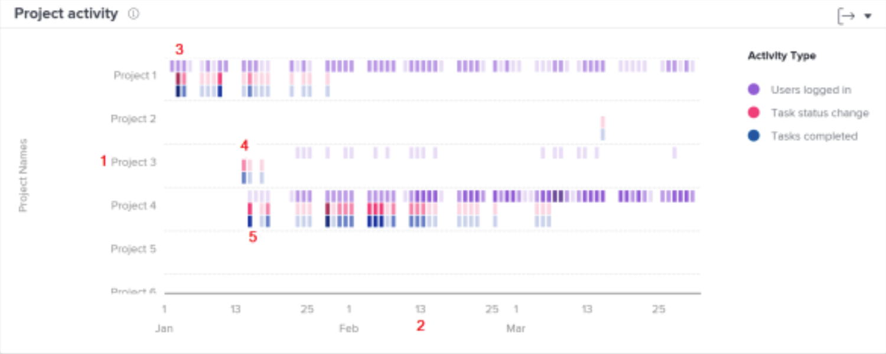

# Begrijp navigeren en het herzien projectactiviteit

In deze video leert u:

* Hoe te om projecten te vergelijken die op gebruikers worden gebaseerd het programma werden geopend, veranderingen van de taakstatus, en voltooide taken

>[!VIDEO](https://video.tv.adobe.com/v/335049/?quality=12&learn=on)

## Projectwerk vergelijken

Het de activiteitendiagram van het Project staat u toe om project activiteiten-gebruikers te begrijpen en te vergelijken die, veranderingen van de taakstatus, en taken worden geregistreerd-tegen andere projecten in Workfront worden voltooid. Projectactiviteiten worden in verschillende kleuren weergegeven om de activiteiten over een bepaalde periode samen te vatten.

Aan de hand van deze informatie kunt u bepalen:

* De activiteit op een specifiek project.
* De activiteit van één project in vergelijking met andere projecten.
* Welke gebruikers werken aan een project en met welke frequentie.

Op het diagram kunt u zien:

1. De namen van projecten op de linkerzijde.
1. Datums worden onderaan weergegeven.
1. De paarse dozen tonen dat de gebruikers aan het project dat op die dag worden aangemeld, met een donkerdere schaduw die op een hoger aantal gebruikers het programma openen wijzen.
1. De roze vakjes tonen dat de gebruikers de status van een taak voor het project op die dag veranderden, met een donkerdere schaduw die op een hoger aantal taakstatussen wijzen die veranderen.
1. De blauwe vakjes tonen aan dat de gebruikers een taak voor het project voltooiden, met een donkerdere schaduw die op een hoger aantal taken wijzen die worden voltooid.
