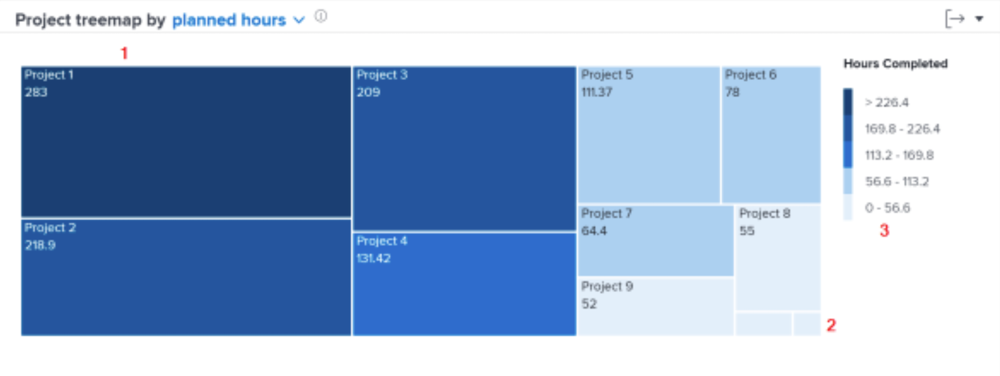

# Dieper naar de navigatie

In deze video leert u:

* Hoe snel te zien hoeveel tijd de arbeiders aan elk project wijden

>[!VIDEO](https://video.tv.adobe.com/v/335050/?quality=12&learn=on)

## Revisietijd besteed aan projecten

Met de projectreemap kunt u begrijpen hoeveel tijd gebruikers aan een project hebben besteed. Vakken zijn projecten. De grootte van de doos toont hoeveel tijd aan het project in vergelijking met andere projecten werd besteed. Hoe groter de doos, des te meer tijd besteed.

Aan de hand van deze informatie kunt u bepalen:

* De prioriteit van zaken die tijdens de geselecteerde datumwaaier worden gewerkt.
* Waaraan gebruikers tijd besteden.
* Als gebruikers zich richten op de juiste zaken.
* Hoeveel de reikwijdte van een project veranderde in die periode wanneer een specifiek project wordt geselecteerd.

Op het diagram kunt u zien:

1. Projecten in de gefilterde tijd die meer uren hebben voltooid worden voorgesteld door grotere dozen en een donkerblauwe kleur.
1. Projecten in de gefilterde tijd die minder uren hebben voltooid, worden weergegeven met kleinere vakken en een lichtblauwe kleur.
1. De legenda rechts van het diagram toont het bereik van voltooide uren voor elke kleur blauw.
