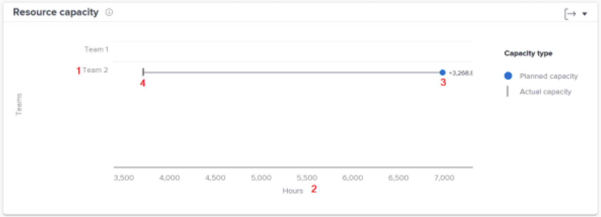

# Begrijp de grafiek van de middelcapaciteit

Het capaciteitsplan van het Middel toont het aantal geplande uren die aan een huisteam binnen de gefilterde tijdspanne in vergelijking met het totale beschikbare uren van het team worden toegewezen.

Deze vergelijking kan u helpen bepalen als u niet genoeg werk aan het team toewijst of als zij last van een zware werkbelasting kunnen ervaren. Klik een teamnaam en een de capaciteitsgrafiek van het Team verschijnt, tonend meer details over de capaciteit van het team voor de gefilterde tijdspanne.

Aan de hand van deze informatie kunt u bepalen:

* Als een huisteam werd oververdeeld of onderverdeeld.
* Welke huisteams beschikbaar voor het werk zijn.

In het diagram ziet u de volgende belangrijke details:

1. De namen van het team van het Huis zijn op de linkerzijde.
1. De uren staan aan de onderkant. Dit is de x-as van de grafiek en berekent naar het bereik van uren dat in de bovenstaande teams wordt weergegeven.
1. De cirkel toont het aantal geplande uren die aan het huisteam worden toegewezen.
1. De verticale lijn toont het totale aantal uren beschikbaar voor het huisteam.

## Hoe te om de grafiek te gebruiken

U moet filters toevoegen en een datumbereik selecteren om gegevens weer te geven op de grafieken in het dialoogvenster [!UICONTROL Enhanced analytics] gebied Workfront. Als u eerder filters hebt toegevoegd, zijn deze actief totdat u ze verwijdert.

Op de capaciteitskaart van het Middel, kunt u:

* Houd de muisaanwijzer boven de teamlijn van het thuisteam om te zien hoeveel uren er nog gepland zijn, hoeveel uren het thuisteam gepland heeft om te voltooien en hoeveel uren er zijn gewerkt (aangeduid als over, onder of op capaciteit).
* Exporteer de diagramgegevens met de knop Exporteren in de rechterbovenhoek van het diagram.
* Klik de naam van het huisteam om de de capaciteitsgrafiek van het Team te openen. Het zoemen binnen aan een kleiner tijdskader op de grafiek van de capaciteit van het Team werkt de gegevens bij die op de grafiek van de capaciteit van het Middel verschijnen.
