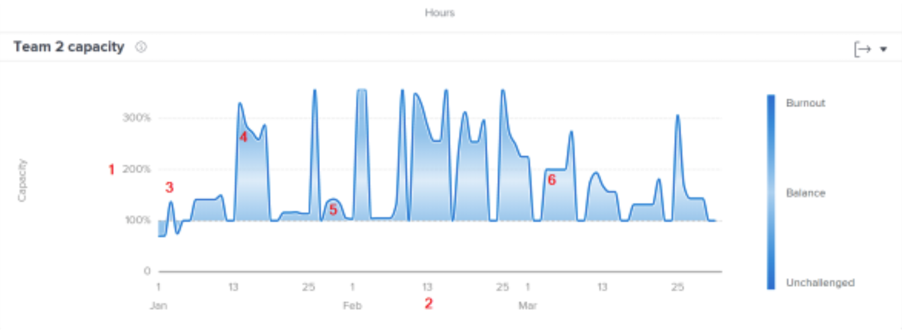
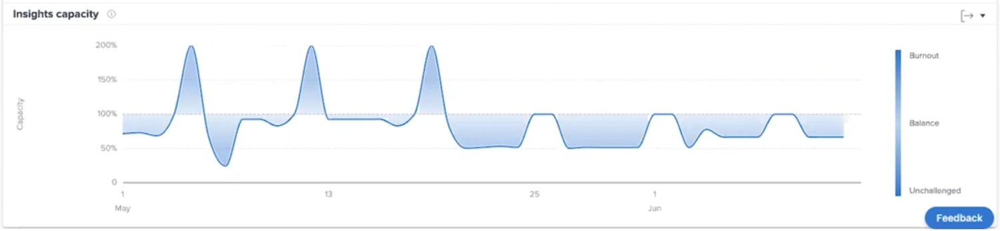

# Inzicht in teamcapaciteit

De de capaciteitgrafiek van het Team toont wanneer een huisteam over-toegewezen of onderverdeeld was. De grafiek toont het volume van het werk dat aan het huisteam op een bepaalde dag wordt toegewezen en wijst een donkerdere blauwe kleur toe wanneer zij zich in brand steken of niet worden uitgedaagd. Een lichtere, transparantere kleur geeft aan dat de werkbelasting evenwichtiger is.

Aan de hand van deze informatie kunt u bepalen:

* Wanneer het huisteam over-toegewezen of onderverdeeld was.
* Als het team van herkomst dagelijks over- of onderverdeeld is.
* Hoe consistent de werklast van een thuisteam is van dag tot dag.
* Als u capaciteitsproblemen maakt met nieuw werk.

Op het diagram kunt u zien:

1. Het percentage van de capaciteit van het huisteam is op de linkerzijde.
1. Datums onderaan komen uit het geselecteerde datumbereik.
1. De donkerdere blauwe vulkleur geeft aan dat het thuisteam last heeft van uitbarsting (4) of dat deze kleur onbetwist is.
1. De lichtere of meer transparante blauwe kleur geeft aan dat de werklast van het team van de thuiscomputer in evenwicht is

## Hoe te om de grafiek te gebruiken

Als u gegevens wilt weergeven in de diagrammen in het gedeelte Personen van het gedeelte Analyse, moet u filters toevoegen en een datumbereik selecteren. Als u al eerder filters hebt toegevoegd, zijn deze actief totdat u ze verwijdert.

Op de de capaciteitsgrafiek van het Team, kunt u:

* Houd de cursor boven een punt op het diagram om de datumlijn te zien.
* Houd de muisaanwijzer over een punt op de gespecificeerde lijn om de geplande uren en geplande uren voor de opgegeven datum te zien, alsmede het capaciteitspercentage en of het thuisteam op dat moment over, onder of op capaciteit was.
* U kunt inzoomen op datums door met de muis over een bepaald punt van het project te klikken en te slepen. (Met deze handeling worden alle andere grafieken bijgewerkt zodat u kunt inzoomen op hetzelfde datumbereik.)
* Exporteer de diagramgegevens met de knop Exporteren in de rechterbovenhoek van het diagram.
