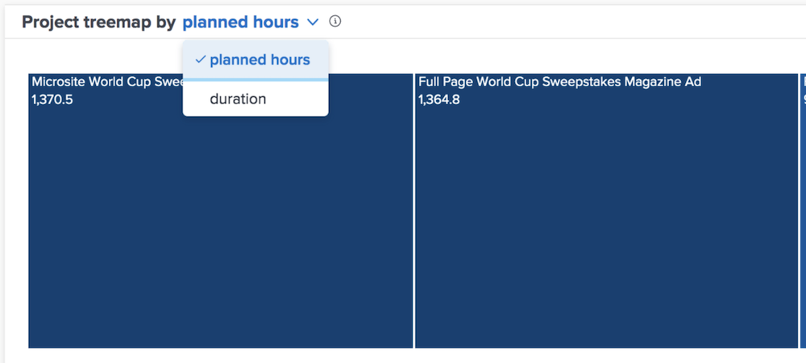

# Begrijp de geplande uren en duurmeningen in [!UICONTROL Enhanced Analytics]

In de grafieken van de Verbranding en van de Verspreiding van het Project, kunt u de informatie door geplande uren of duur bekijken, afhankelijk van wat u nauwkeuriger voor uw milieu van Workfront acht.

Geplande uren is de standaardinstelling. Als u naar de duur overschakelt, blijft deze wel behouden wanneer u weg navigeert [!DNL Analytics] en kom terug en tussen Workfront logins.
