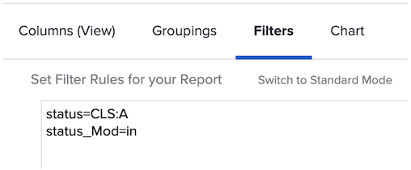

# Basismodus voor filters begrijpen

>[!IMPORTANT]
>
>Vereisten:
>
>* Rapporteringselementen begrijpen
>* Rapportonderdelen begrijpen
>* Een basisfilter maken


In deze video leert u:

* Welke tekstmodus is ingesteld
* Wat kamelendoosje is
* Een standaardtekstmodus voor &quot;plug-and-play&quot; die u in rapportfilters kunt gebruiken

>[!VIDEO](https://video.tv.adobe.com/v/336820/?quality=12)

In de volgende tekstmodus worden taken uitgesloten waarvoor een gebruiker heeft aangegeven dat deze is uitgevoerd met Mijn onderdeel. U hoeft alleen maar een taakfilter te maken, filterregels toe te voegen en vervolgens over te schakelen naar de tekstmodus en de code hieronder te plakken na elke tekstmodus die u in het filter ziet.

```
EXISTS:1:$$OBJCODE=ASSGN  
EXISTS:1:taskID=FIELD:ID  
EXISTS:1:status=DN  
EXISTS:1:status_Mod=notin  
EXISTS:1:assignedToID=$$USER.ID 
```

## Extra filters voor de plug-in- en afspeelmodus

### Taak - toon me alle taken die mijn goedkeuring wachten

```
approvalProcessID_Mod=notblank
currentUserApproversMM:ID=$$USER.ID
currentUserApproversMM:ID_Mod=in
currentUserApproversMM_Join=allowingnull
```

### Taak - Toon me alle taken die ik heb goedgekeurd

Maak een taakrapport met de gewenste filters en ga vervolgens naar het tabblad Filter en klik op Overschakelen naar tekstmodus. Voeg deze code toe aan wat er al is:

```
approvalProcessID_Mod=notblank
approverStatuses:approvedByID=$$USER.ID
approverStatuses:approvedByID_Mod=in
```

### Taak - toon me alle taken die minstens één dwars-projectvoorganger hebben

```
predecessorsMM:ID_Mod=notblank
predecessorsMM:projectID=FIELD:projectID
predecessorsMM:projectID_Mod=ne
```

### Taak - Toon me alle taken die ik aan anderen heb toegewezen

Maak een taakrapport met de gewenste filters en ga vervolgens naar het tabblad Filter en klik op Overschakelen naar tekstmodus. Voeg deze code toe aan wat er al is:

```
EXISTS:1:$$OBJCODE=ASSGN
EXISTS:1:taskID=FIELD:ID
EXISTS:1:assignedByID=$$USER.ID
```

Dit zal u alle taken tonen waar de het programma geopende gebruiker minstens één van de huidige toegewezen. Als de toegewezen personen door meerdere personen zijn toegewezen, wordt alleen de naam van de eerste persoon die iemand heeft toegewezen, weergegeven als &quot;Gevraagd door&quot; op de bestemmingspagina.

## Activiteit: Vragen over de tekstmodus

1. Hoe zou u de camelcase voor het gebied met de naam &quot;ingegaan door identiteitskaart&quot;schrijven?
1. Maak in een Issue-rapport een filter om problemen weer te geven die zijn gemarkeerd als gesloten maar die nog moeten worden goedgekeurd.

### Antwoorden

1. Het hoofdlettergebruik voor de kameel voor het veld &quot;Door id ingevoerd&quot; moet als volgt worden geschreven:
1. De tekstwijze zou als dit in de filter van het voorwaardenrapport moeten kijken:

   
