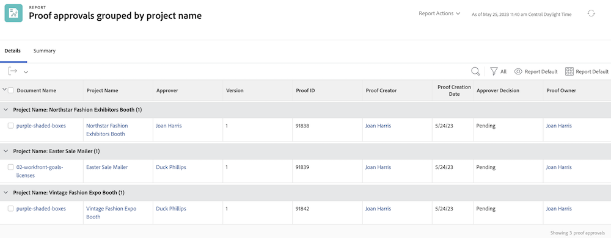

# Basistekstmodus voor groepen begrijpen

>[!PREREQUISITES]
>
>* [Informatie over rapporteringselementen](https://experienceleague.adobe.com/docs/workfront-learn/tutorials-workfront/reporting/basic-reporting/reporting-elements.html?lang=en)
>* [Rapportonderdelen begrijpen](https://experienceleague.adobe.com/docs/workfront-learn/tutorials-workfront/reporting/basic-reporting/reporting-components.html?lang=en)
>* [Een basisgroep maken](https://experienceleague.adobe.com/docs/workfront-learn/tutorials-workfront/reporting/basic-reporting/create-a-basic-grouping.html?lang=en)


>[!TIP]
>
>* Voor een beter begrip van de tekstmodus raden we u aan de opgenomen webinar-gebeurtenis te bekijken [Vraag de expert - Inleiding aan de Rapportering van de Wijze van de Tekst](https://experienceleague.adobe.com/docs/workfront-events/events/reporting-and-dashboards/introduction-to-text-mode-reporting.html?lang=en), wat een uur lang is.
>* Als u nog meer wilt weten over de tekstmodus, raden we u aan de [Geavanceerde rapportage](https://experienceleague.adobe.com/docs/workfront-learn/tutorials-workfront/reporting/advanced-reporting/welcome-to-advanced-reporting.html?lang=en) zelfstudies, die samen 5,5 uur lang zijn.
>* Klik hier voor toegang [[!UICONTROL API Explorer]](https://developer.adobe.com/workfront/api-explorer/)

In deze video leert u:

* Welke tekstmodus is ingesteld
* Wat kamelendoosje is
* De standaardtekstmodus &quot;Plug and Play&quot; die u in de groepen kunt gebruiken

>[!VIDEO](https://video.tv.adobe.com/v/3410641/?quality=12&learn=on)

## Taak - 4 ouders groeperen

In de volgende tekstmodus worden taken gegroepeerd op maximaal vier niveaus van bovenliggende items en blijven bovenliggende items die niet bestaan leeg.

```
textmode=true
group.0.name=Parents
group.0.valueexpression=CONCAT({parent}.{parent}.{parent}.{parent}.{name},IF(ISBLANK({parent}.{parent}.{parent}.{parent}.{name}),"",", "),{parent}.{parent}.{parent}.{name},IF(ISBLANK({parent}.{parent}.{parent}.{name}),"",", "),{parent}.{parent}.{name},IF(ISBLANK({parent}.{parent}.{name}),"",", "),IF(ISBLANK({parent}.{name}),"No parent",{parent}.{name}))
group.0.linkedname=parent
group.0.namekeyargkey.0=parent
group.0.namekeyargkey.1=name
group.0.valueformat=string
```


## Taak - Percentage volledige groepering

In de volgende tekstmodus worden taken gegroepeerd op basis van het percentage dat is voltooid. Taken worden gegroepeerd in een van de volgende categorieën:

* 0%
* 1% tot 25%
* 26% tot 50%
* 51% tot 75%
* 76% tot 99%
* 100%

```
group.0.linkedname=direct
group.0.namekey=percentComplete
group.0.valueexpression=IF({percentComplete}<1,"0%",IF({percentComplete}<26,"1% to 25%",IF({percentComplete}<51,"26% to 50%",IF({percentComplete}<76,"51% to 75%",IF({percentComplete}<100,"76% to 99%",IF({percentComplete}=100,"100","***"))))))
group.0.valueformat=doubleAsString
textmode=true
```


## Taak - statusEquatesWith, dan status

In de volgende tekstmodus worden taken gegroepeerd op statusEquatesWith en vervolgens op status.

```
group.0.enumclass=com.attask.common.constants.TaskStatusEnum
group.0.enumtype=TASK
group.0.linkedname=direct
group.0.name=State
group.0.type=enum
group.0.valuefield=statusEquatesWith
group.0.valueformat=val
group.1.enumclass=com.attask.common.constants.TaskStatusEnum
group.1.enumtype=TASK
group.1.linkedname=direct
group.1.namekey=status
group.1.type=enum
group.1.valuefield=status
group.1.valueformat=val
textmode=true
```


## Goedkeuring proef - groep per projectnaam

```
group.0.valueformat=HTML
group.0.valuefield=documentVersion:document:project:name
group.0.displayname=Project Name
```




## Goedkeuring proefdrukken - Groeperen op documentnaam

```
group.0.displayname=Document Name
group.0.valuefield=documentVersion:document:name
group.0.valueformat=HTML
```


